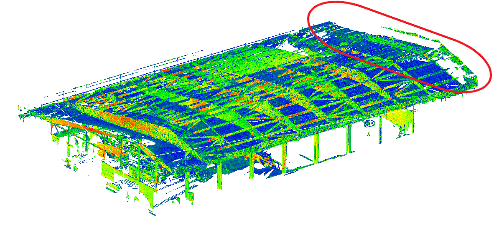
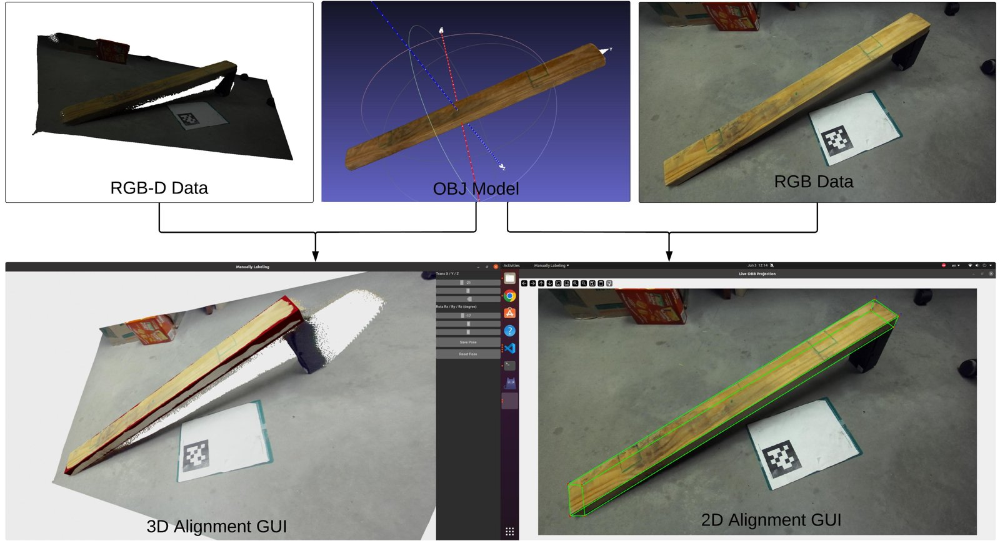
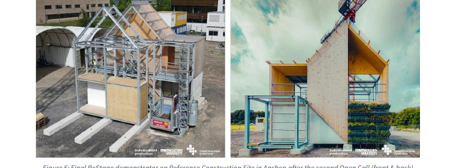
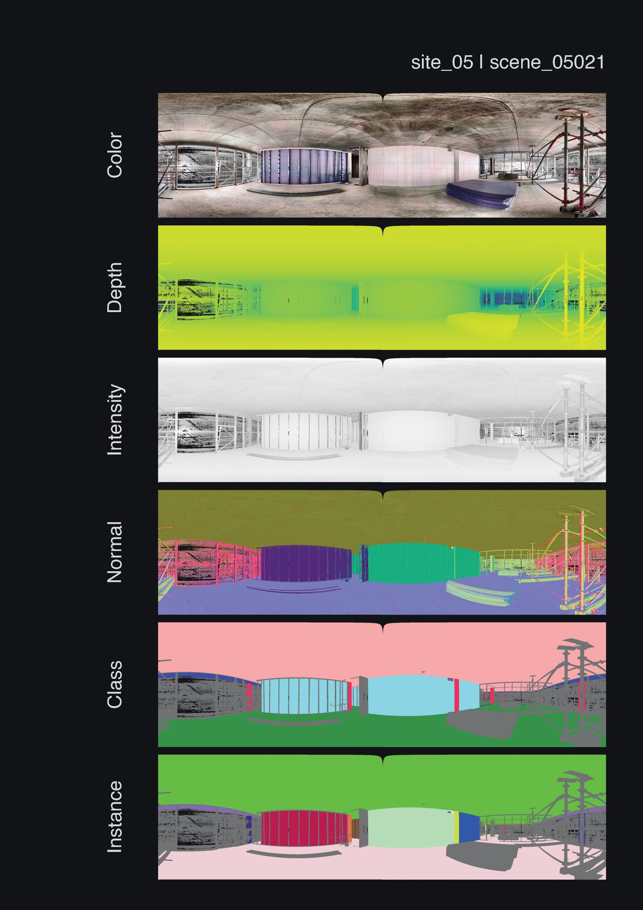
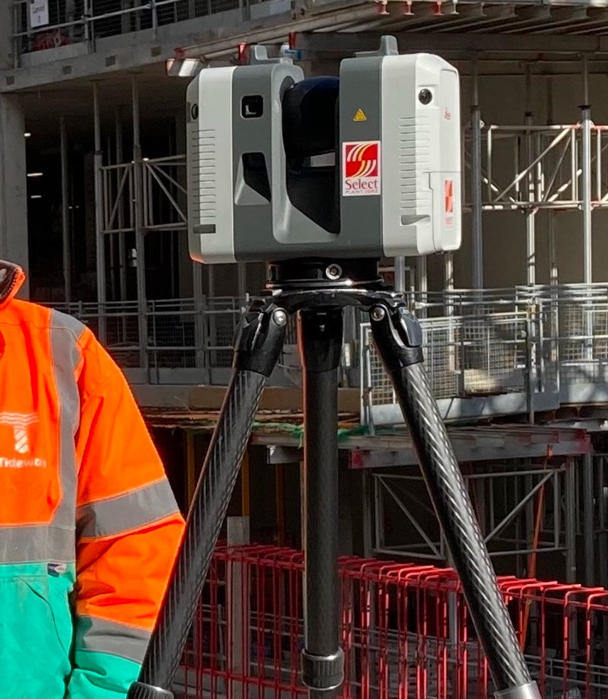

# Top 5 publicly obtainable frame-stage point clouds

Research date: **2026-09-23**. This note ranks clouds for the OpenWall stud-frame path: a residential structure at **frame stage** (wood studs, unfinished shell, exposed framing). It improves on [03-sample-datasets.md](03-sample-datasets.md). Nothing below was downloaded into this repo.

## Honest result

A public point cloud of a complete **residential light-frame house** — platform frame, exposed 2×4 stud walls, plates, and openings — was **not found**. Fewer than five true wood-frame house clouds are in the public record checked here. The five slots below are the closest obtainable sets. Ranks 3–5 are shells or mixed assemblies, not 2×4 houses, and they rank lower for that reason.

## Ranking criteria

Applied in this order:

1. Closest to a residential wood-frame stage (exposed lumber of a house, not a finished interior).
2. Usable for Open3D segmentation experiments (a format Open3D can load, or a documented conversion, and enough points to try a segmenter).
3. Open, accessible download (no approval wall if a public alternative exists).
4. Documented quality and density.
5. Labeled studs or beams when they exist.

| Rank | Catalog ID | Name | Why this slot |
| --- | --- | --- | --- |
| 1 | D9 | IntCDC timber building scans | Real timber buildings, scanned right after assembly. Not light-frame 2×4. |
| 2 | D3 | WFC-Dataset | Only public 2×4 stud clouds, with manual poses. One stud, not a house. |
| 3 | D10 | RefSite3D | Timber members in a real multi-material assembly, PLY, labels. Not a house. |
| 4 | D1 | Rohbau3D | Best labeled residential **shell**. Masonry and concrete, not 2×4. |
| 5 | D11 | ConSLAM | Survey clouds of one floor in a redevelopment that includes housing. Not wood. |

Considered and left out: ResFa (finished wood-frame facades; studs inferred, not scanned), Fiskerkapellet (finished historic log building), Nothing Stands Still (office and education fit-out, 5 cm voxels), Hilti-Oxford construction TLS (not a house; E57), ScanNet++ and BIMNet (finished interiors). See the end of this file.

---

## 1. IntCDC timber building scans (D9)

**Name.** Measurement data: Laser scanning of timber buildings. Töpler and Kuhlmann, University of Stuttgart, DaRUS, 2023. Associated with EXC IntCDC project 11, “Imperfection Measurements on Timber Members,” and the DIBt project ZP 52-5-13.194.

**License.** CC BY 4.0.

**URL / how to download.** Dataset page: https://darus.uni-stuttgart.de/dataset.xhtml?persistentId=doi:10.18419/DARUS-3304 — DOI https://doi.org/10.18419/DARUS-3304. Files are public on DaRUS; download individual LAS clouds or the whole set from that page. Do not commit them. Related report: https://doi.org/10.18419/opus-12578.

**Why it ranks.** This is the closest public match to a **wood structure at frame / assembly stage**. The record says the timber structures of 23 building projects were measured directly after assembly and alignment. Members are exposed. Several buildings also include concrete columns. It is not a US light-frame house, and the record does not say the projects are single-family dwellings.

**Sensor / format / approximate size.** Leica ScanStation P20. LAS, plus small GIF previews of the clouds. The DaRUS file listing on 2026-09-23 had 96 LAS files summing to about **223 GB** (summed here from the API listing; the authors do not print that total). Examples already noted in Table 3: `2020-KW23.las` about 1.9 GB, `2020-KW27.las` about 4.2 GB. Point spacing is **not stated** on the dataset page. Semantic stud labels are **not stated**. One example evaluation is included (2022-KW15, beam axis 4).

**Gaps vs ideal.** Wrong system for a 2×4 wall: these are timber members measured for straightness and assembly accuracy, not a platform-frame stud wall. Open3D’s file I/O table does not read LAS; convert before a segmentation experiment. No stud/beam class map for the whole clouds. Building occupancy (house vs hall) is not given.

**Visual evidence.** Official DaRUS preview of the point cloud for `2020-KW27_additonal`, which the file record describes as the additional part with timber columns. CC BY 4.0, Töpler and Kuhlmann, DaRUS.

---

## 2. WFC-Dataset (D3)

**Name.** WFC Pose Estimation Dataset. Xie and Alwisy. GitHub `yigediao/wfcdataset`. Paper: “Advancing Robotic Automation in Wood-Framed Construction Using Vision-Driven Adaptive Control,” Automation in Construction, 2026, https://doi.org/10.1016/j.autcon.2026.106858.

**License.** **Not stated.** The GitHub README has a License heading and no terms under it (checked 2026-09-23). Do not assume the paper’s publisher license covers the Dropbox files.

**URL / how to download.** https://github.com/yigediao/wfcdataset — Dropbox folder linked from that README: https://www.dropbox.com/scl/fo/sq9gz1vcgczdgz32mcfve/ALQKqFbNcodMnidMgmf6jEY?rlkey=4zgi8gigjuw58l20eh1qm69x8&dl=0. The raw zip is `raw_rgbd_datasets.zip`, **10.65 GB** (RGB, depth, PLY). Annotations are a separate 461.77 MB zip. Do not commit the zips.

**Why it ranks.** It is the only public set found of a real **2×4 inch wood stud** as a point cloud, with a manual 6D pose on every sample. That is the right member for an Open3D oriented box. It ranks under IntCDC because it is not a house and not a wall: one stud, controlled indoor light, 288 samples.

**Sensor / format / approximate size.** ZED 2i stereo camera. RGB and depth at 2208×1242, plus PLY. The README says the clouds are about 9× denser than 640×480 sets. Points per cloud: **unknown**. Labels are manual 6D poses, not semantic wall classes. Twelve orientations, three exposures, some tilt and partial occlusion.

**Gaps vs ideal.** Single stud. No plates, no stud spacing, no jobsite clutter, no room. Pose labels do not train a multi-class segmenter. License gap above.

**Visual evidence.** Figure from the dataset README (`assets/labeling_gui.jpeg`). The README caption says the top row is the RGB-D point cloud, the stud OBJ, and the RGB image, and the bottom row is the 3D alignment GUI and the 2D box overlay.

---

## 3. RefSite3D (D10)

**Name.** RefSite3D: a multi-phase, multi-scenario 3D point cloud dataset from the Reference Construction Site Aachen. Fahrendholz-Heiermann, Brell-Cokcan, Wu, Zöcklein, and others, RWTH Aachen / Construction Robotics. Zenodo, 27 May 2026. TARGET-X and DFG EXC 3115 CARE.

**License.** CC BY 4.0 (Zenodo record `cc-by-4.0`).

**URL / how to download.** https://doi.org/10.5281/zenodo.20285732 — one zip, `RefSite3D_v1.0.0.zip`, **2.2 GB** (2,172,793,209 bytes on the Zenodo API). Utility scripts: https://github.com/Individualized-Production/Construction3D-utils. Do not commit the zip.

**Why it ranks.** Progress state PM2 is recorded as concrete **plus timber** elements, and the archive has a `target_extraction_benchmark/01_timber_components/` split. Real TLS of an assembly that includes timber, in PLY, with per-point labels. It ranks under WFC and IntCDC because the object is a modular demonstrator (precast concrete, timber, steel), not a residential wood-frame house.

**Sensor / format / approximate size.** Real scans: RIEGL VZ-400i and Leica RTC360 terrestrial laser scans, plus Pix4D photogrammetry and Luma NeRF from an iPhone X. Clouds are PLY. The zip also has OBJ planning models, synthetic PLY, JSON metadata, TXT semantic labels, and JSON object-verification labels. Point spacing and points per scan: **not stated**. Semantic classes for the scene task are only `environment`, `ground`, and `target` — not stud, beam, or plate. The object-verification example cites an `IfcBeam` synthetic cloud. PM1 is concrete only; PM3 adds steel; PM5 is the complete demonstrator.

**Gaps vs ideal.** Not a house and not a 2×4 wall. Timber is one material in a concrete-and-steel module. Labels do not name studs. Some scenes are phone photogrammetry or NeRF, which are a different accuracy class from the TLS scans. Zenodo has **no point-cloud gallery still**.

**Visual evidence.** **Limited.** No public preview of the PLY was found on the Zenodo record. The still below is a crop of Figure 5 from the public TARGET-X deliverable D5.3 (dissemination level: public), “Final ReStage demonstrator on Reference Construction Site in Aachen after the second Open Call (front & back).” The report text says the left view includes an additional steel/timber unit. This is a photograph of the structure, not a render of the cloud. Source PDF: https://target-x.eu/wp-content/uploads/2025/12/TARGET-X_D5.3_REPORT-ON-LIVING-LABS-AND-TASK-ASSESSMENT.pdf.

---

## 4. Rohbau3D (D1)

**Name.** Rohbau3D: A Shell Construction Site 3D Point Cloud Dataset. Rauch, Braml, and Rauch. Scientific Data, 2025. https://doi.org/10.1038/s41597-025-05827-7. Data DOI https://doi.org/10.60776/ZWJFI4.

**License.** CC BY 4.0 on the Open Data UniBw M record reached from the data DOI (page checked 2026-09-23). The paper is also CC BY 4.0. Code license on GitHub is separate; read `LICENSE` in https://github.com/RauchLukas/Rohbau3D before shipping the scripts.

**URL / how to download.** Data browser: https://open-data.unibw.de/dataset. Recommended path from the GitHub README: clone https://github.com/RauchLukas/Rohbau3D and run `python scripts/download.py --config config/dataverse.yaml --download --extract`. Feature files can be selected (`coord`, `color`, `intensity`, `normal`, `class`, `instance`, and others). Do not commit the download.

**Why it ranks.** Best public **residential shell** for a segmentation experiment: 504 terrestrial scans, 14 sites, six of them mid-rise residential apartment blocks at shell or core-removal renovation (paper Table 1, as summarized in [03-sample-datasets.md](03-sample-datasets.md)). The current release adds point-wise semantic classes (17 foreground + background) and instance ids. It ranks under the three timber sets because the structure is masonry, concrete, and drywall, not wood studs. A third-party benchmark names Beam and Column among the classes; that name list is not in the Dataverse abstract read for this pass.

**Sensor / format / approximate size.** FARO Focus M70 (paper). Tripod TLS, colored from a later HDR photo pass. Mean about **2.34×10⁷ points per scan** (min 2.73×10⁶, max 4.28×10⁷). Mean surface density **31.7 points/cm²** (std. dev. ±15.4), from a 10 cm neighborhood. Features are NumPy arrays (`coord.npy`, `color.npy`, `class.npy`, `instance.npy`, …) plus panoramas, not one PLY. A subsample index caps a cloud at 15 million points. Total archive size in bytes: **not stated** in the paper. Scans are **not** in one site coordinate frame; each scan’s origin is the scanner.

**Gaps vs ideal.** Rohbau is concrete, brick, and drywall beams and columns, not 2×4 studs. No stud class is in the third-party name list (None, Ceiling, Slanted Ceiling, Ceiling Cutout, Floor, Wall, Drywall, Wall Cutout, Parapet, Beam, Column, Staircase, Window Cutout, Window, Door Rough Opening, Facade Element, Elevator Doors, TGA — from https://github.com/A-SHOJAEI/rohbau3d-benchmark). Treat those names as third-party until they are checked in the Dataverse metadata. Open3D can build a `PointCloud` from `coord.npy`; it will not open the NumPy layout as a file format by itself. Color and geometry are not captured at the same instant.

**Visual evidence.** `img/compendium_example.jpg` from the official Rohbau3D GitHub repository (shell-construction scenes). Paper and dataset are CC BY 4.0; this file is the repository gallery still, resized for this note.

---

## 5. ConSLAM (D11)

**Name.** ConSLAM: periodically collected real-world construction dataset for SLAM and progress monitoring. Trzeciak and others, ECCV 2022 Workshops, with a 2023 journal extension. GitHub `mac137/ConSLAM`.

**License.** GitHub `LICENCE.txt` is **academic use only**, all rights reserved, University of Cambridge, 2023. That file is attached to the code repository. A separate license for the point-cloud download was **not found** on the README.

**URL / how to download.** https://github.com/mac137/ConSLAM. The README links the files at https://ug.link/nas-polyform/filemgr/share-download/?id=0bac12bf9c6940b3b4a0dc0dd52c8a77. The README says the bag in sequence 1 is faulty. Papers: https://doi.org/10.1007/978-3-031-25082-8_21 and https://doi.org/10.1061/JCCEE5.CPENG-5212. Cambridge record: https://doi.org/10.17863/CAM.87961. Each sequence’s layout, from the paper, includes `groundtruth_scan.ply` plus RGB, NIR, lidar, and poses. Archive size: **unknown**.

**Why it ranks.** It is a real construction floor, scanned repeatedly, with a survey-grade ground-truth cloud. The site is part of one storey at Whiteley’s in London, a redevelopment into luxury retail, leisure, and a **residential** scheme (a new six- to nine-storey building behind a retained facade). That is a building under construction, which is why it fills slot 5. It is not a wood-frame house, and it has no stud or beam labels, so it sits under Rohbau3D.

**Sensor / format / approximate size.** Handheld rig: Velodyne VLP-16, Alvium U-319c RGB (2064×1544), NIR (2592×1944), IMU. Ground truth: Leica RTC360, registered by a survey team, stored as PLY (`groundtruth_scan.ply` per sequence). Four sequences, about one month apart, on the same floor. Point count and spacing: **not stated** in the sections read. VLP-16 is a 16-beam mapping lidar (see Table 1, S13); the RTC360 cloud is the one worth opening in Open3D.

**Gaps vs ideal.** Mixed-use concrete redevelopment, not exposed wood studs. No semantic labels. The public share link is a file-host URL and may rot. Code terms are academic-use only. Sequence 1’s bag is faulty. The image below is the README hardware still named `leica.jpg`, not a separately exported gallery of `groundtruth_scan.ply`.

**Visual evidence.** `media/leica.jpg` from the ConSLAM README, shown in the hardware row next to the handheld rig. The paper says ground-truth scans were collected with a Leica RTC360.

---

## Considered and not ranked

| Set | Why it is not in the five |
| --- | --- |
| ResFa (`resfa2026/ResFa` on Hugging Face) | 66 pre-1975 residential **wood-frame facades**, terrestrial LiDAR PCD, CC BY-NC 4.0. Finished exteriors. The card says stud labels are inferred, not measured. |
| Fiskerkapellet log building (DataverseNO, doi:10.18710/D2GOOJ) | Leica P40 scan of a finished historic wooden log chapel. Not frame stage. |
| Nothing Stands Still (https://www.nothing-stands-still.com/) | Interior construction and renovation of educational, scientific, and office areas. Matterport. Released clouds are voxel-downsampled to **0.05 m**. Academic, non-commercial. Too coarse for a stud edge, and not residential wood frame. |
| Hilti-Oxford 2022 construction TLS | Z+F Imager 5016 scans in E57 of construction sites and the Sheldonian Theatre. Not a house. E57 is not an Open3D reader format. |
| ScanNet++ (D4), BIMNet (D2) | Finished interiors. Useful as a negative test, not as frame-stage ground truth. |
| buildingSMART duplex (D5) | IFC design model. No cloud. |
| Polycam self-capture (D8) | Not a public dataset. Still the practical way to get our own framed walls. |

## Open3D note

`requirements.txt` pins `open3d==0.20.0`. PLY (WFC, RefSite3D, ConSLAM ground truth) is a native Open3D format. LAS (IntCDC) and Rohbau NumPy arrays need a conversion or a `PointCloud` built from coordinates. This file does not include that conversion.

## Sources

- IntCDC record and CC BY 4.0: https://darus.uni-stuttgart.de/dataset.xhtml?persistentId=doi:10.18419/DARUS-3304
- WFC README: https://github.com/yigediao/wfcdataset
- RefSite3D: https://doi.org/10.5281/zenodo.20285732
- TARGET-X D5.3 (public): https://target-x.eu/wp-content/uploads/2025/12/TARGET-X_D5.3_REPORT-ON-LIVING-LABS-AND-TASK-ASSESSMENT.pdf
- Rohbau3D paper (FARO Focus M70, density, residential subset): https://doi.org/10.1038/s41597-025-05827-7
- Rohbau3D data (CC BY 4.0): https://doi.org/10.60776/ZWJFI4
- Rohbau3D class names, third-party: https://github.com/A-SHOJAEI/rohbau3d-benchmark
- ConSLAM README and academic-use licence: https://github.com/mac137/ConSLAM
- ConSLAM paper text used for sensor, site, and `groundtruth_scan.ply`: https://doi.org/10.17863/CAM.87961
