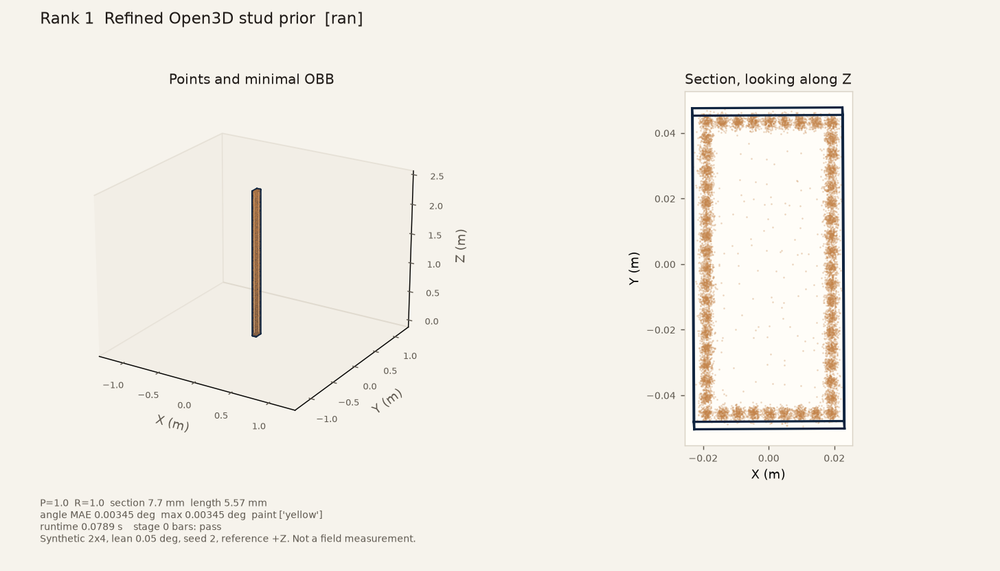
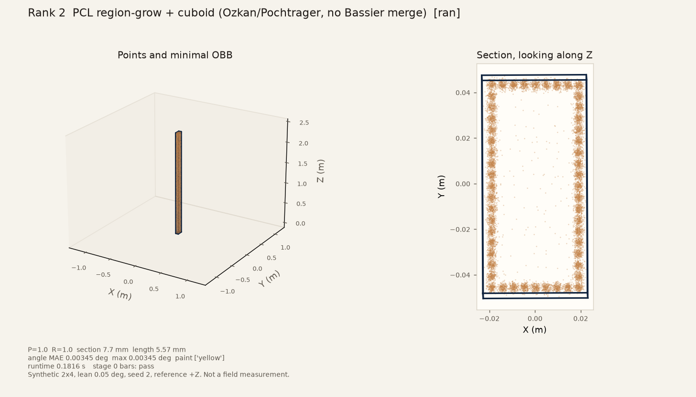
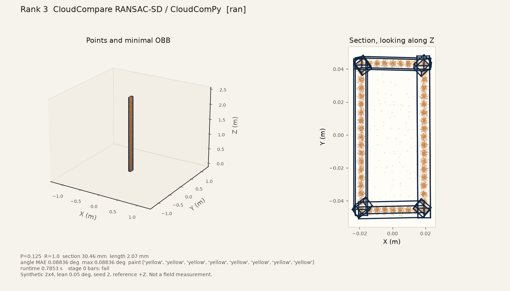
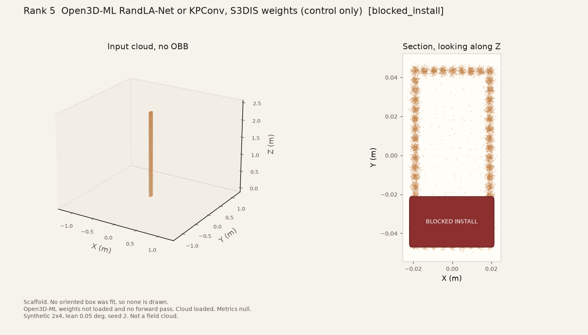
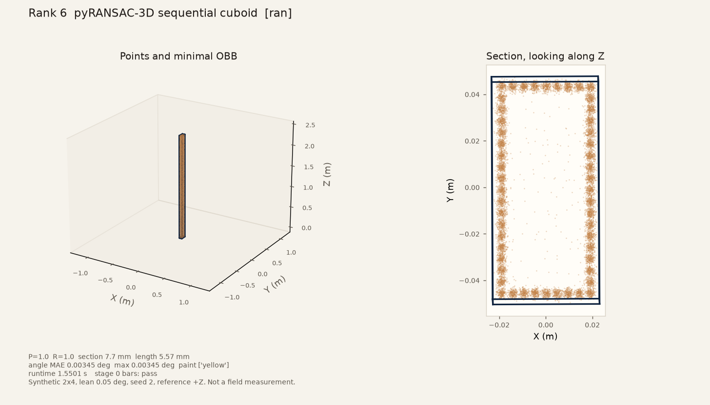

# One synthetic stud, five finders

Date (America/Los_Angeles): **2026-09-25**. This note records one Stage 0 cloud through the five ranked finders, then rank 6 (pyRANSAC-3D sequential cuboid, the doc 17 add), then stops. It is a synthetic bring-up. It is not a field measurement, not a phone-LiDAR result, and not a stage 2, stage 3, or lean-sweep result. Ranks 1–5 below are the PR #15 numbers from the Linux VM and were not re-rolled here. Rank 6 was appended with `python -m openwall_stud.contenders.pyransac3d_cuboid` on that same cloud. Ranks 4 and 5 were later attempted on Oz_PC; that pass is [18-ozpc-ranks4-5-run.md](18-ozpc-ranks4-5-run.md), and the 2026-09-25 day-table rows for `pointcept` and `open3d_ml` follow that later pass.

Machine-readable twin: [16-one-stud-five-finder-run.json](16-one-stud-five-finder-run.json).

## Scene

One call to `stage0_single_stud` in `src/openwall_stud/synthetic.py`.

| | |
| --- | --- |
| Nominal | dressed 2×4 |
| Lean | 0.05° about +X |
| Seed | 2 |
| Scene id | `stage0_2x4_lean0.050` |
| Points | 25666 |
| Spacing | 0.005 m |
| Noise | 0.001 m Gaussian |
| Angle reference | generator +Z (`gravity_z_no_floor_plane`). No floor was fit. The cloud was not rotated. |

The same arrays were passed to every finder. Device ε is unlocked, so a production color is yellow whenever a box exists.

## Stage 0 bars

From the design plan. These bars are for this generator, not a jobsite.

| Check | Bar |
| --- | --- |
| Detection | precision = 1 and recall = 1 |
| Section | max absolute error ≤ 10 mm |
| Length | max absolute error ≤ 25 mm |
| Angle | max absolute error ≤ 0.05° |
| Paint | every production color yellow |

## Result

| Rank | Stack | Status | P | R | Section mm | Length mm | Angle MAE deg | Paint | Runtime s | Stage 0 bars |
| --- | --- | --- | --- | --- | --- | --- | --- | --- | --- | --- |
| 1 | Refined Open3D stud prior | ran | 1 | 1 | 7.7 | 5.57 | 0.00345 | yellow x1 | 0.0789 | pass |
| 2 | PCL region-grow + cuboid (Ozkan/Pochtrager, no Bassier merge) | ran | 1 | 1 | 7.7 | 5.57 | 0.00345 | yellow x1 | 0.1816 | pass |
| 3 | CloudCompare RANSAC-SD / CloudComPy | ran | 0.125 | 1 | 30.46 | 2.07 | 0.08836 | yellow x8 | 0.7853 | fail |
| 4 | Pointcept PTv3 / PointGroup (hook only until labeled Stage 5) | blocked_install | — | — | — | — | — | — | — | blocked_install |
| 5 | Open3D-ML RandLA-Net or KPConv, S3DIS weights (control only) | blocked_install | — | — | — | — | — | — | — | blocked_install |
| 6 | pyRANSAC-3D sequential cuboid | ran | 1 | 1 | 7.7 | 5.57 | 0.00345 | yellow x1 | 1.5501 | pass |

Empty metric cells were not measured. `blocked_install` is not a detection miss. A detection miss would be precision or recall filled in from a finished segmentation.

## Versions

- `python`: 3.12.3
- `platform`: Linux-6.12.94+-x86_64-with-glibc2.39
- `open3d`: 0.20.0
- `numpy`: 2.4.4
- `matplotlib`: 3.11.2
- `cloudcompare`: 2.11.3-7.1build3
- `libpcl_segmentation`: 1.14.0+dfsg-1
- `g++`: g++ (Ubuntu 13.3.0-6ubuntu2~24.04.1) 13.3.0
- `nvidia_smi`: absent
- `pyransac3d`: 0.7.0

## Commands

From the repo root, with `PYTHONPATH=src` for the module entry points:

```bash
python scripts/run_one_stud_five_finders.py
python -m openwall_stud.contenders.pcl_region_grow
python -m openwall_stud.contenders.cloudcompare_ransac
python -m openwall_stud.contenders.pointcept_ptv3
python -m openwall_stud.contenders.open3d_ml_s3dis
python -m openwall_stud.contenders.pyransac3d_cuboid
```

The module commands repeat this same stud. `python scripts/run_stage0_baseline.py` is unchanged: it still scores Open3D on stages 0, 2, and 3 and writes null stubs for the other four (`--stub`). It was not the command for this note. Rank 6 is not one of those stubs. This page’s rank 6 row is from the module command above, so CloudCompare was not re-rolled.

## Finders

### Rank 1. Refined Open3D stud prior

Status: `ran`. Stage 0 bars: `pass`.

Refined Open3D DBSCAN and minimal OBB. Stage 0 reference is +Z.

Bar notes: None. The stage 0 synthetic bars passed on this cloud.




### Rank 2. PCL region-grow + cuboid (Ozkan/Pochtrager, no Bassier merge)

Status: `ran`. Stage 0 bars: `pass`.

PCL 1.14 RegionGrowing returned 1 cluster and left 133 points unassigned. No face-union step ran. Minimal OBB, axis not forced to Z.

The printed section, length, and angle match the Open3D row because both boxes cover nearly the whole stud. They are separate measurements. PCL left 133 points out, and its runtime on this process was 0.1816 s.

Bar notes: None. The stage 0 synthetic bars passed on this cloud.




### Rank 3. CloudCompare RANSAC-SD / CloudComPy

Status: `ran`. Stage 0 bars: `fail`.

CloudCompare 2.11.3-7.1build3 RANSAC-SD, one OBB per plane or cylinder primitive, primitives not merged.

Planes and cylinders were both enabled. This build's `-RANSAC` call was not given a seed, so a repeat can change the primitive count. The scorecard for this process lists 8 saved primitive clouds, all named as planes (precision 0.125). They were not merged into one stud. The matched primitive is a thin face, which is why the section bar (30.46 mm) and the angle bar (0.08836°) fail. Recall stays 1 because one of those primitives still lands within 0.15 m of the stud center.

Bar notes: detection P=0.125 R=1.0; section error 30.46 mm > 10.0; angle error 0.08836 deg > 0.05




### Rank 4. Pointcept PTv3 / PointGroup (hook only until labeled Stage 5)

Status: `blocked_install`. Metrics were not filled.

Pointcept PTv3 was not run. nvidia-smi: absent. torch importable: False. pointcept importable: False. There is no NVIDIA device in this VM, so a CUDA PTv3 / PointGroup forward pass cannot execute. Torch and Pointcept were not installed for a CPU-only import that still cannot segment. No stud-class checkpoint is in this repo. BIMStruct3D weights were not downloaded (CC BY-NC-SA 4.0; classes are wall, column, clutter, and similar, not stud). The stage 0 cloud was loaded in-process (25666 points) and no forward pass ran. Detection, geometry, angle, paint, and runtime are null.


### Rank 5. Open3D-ML RandLA-Net or KPConv, S3DIS weights (control only)

Status: `blocked_install`. Metrics were not filled.

Open3D-ML S3DIS control did not run a forward pass. Import probe: ModuleNotFoundError: No module named 'torch'. S3DIS RandLA-Net and KPConv weights were not downloaded. There is no NVIDIA GPU. The open3d pin stays 0.20.0; a separate ML extra was not installed over it. The stage 0 cloud was loaded in-process (25666 points). No label histogram was produced, and no stud box was fit from an office class. S3DIS mIoU is not copied here. Metrics are null.




### Rank 6. pyRANSAC-3D sequential cuboid

Status: `ran`. Stage 0 bars: `pass`.

pyRANSAC-3D 0.7.0 Cuboid, thresh 0.05 m, 1000 iterations, seed 2. Plate peel kept every Stage 0 point. First cuboid inliers were 25666 of 25666. Wall-swallow did not fire. Shared minimal OBB, axis not forced to Z.

The printed section, length, and angle match the Open3D and PCL rows because the cuboid inliers were the whole stud and the shared minimal OBB is the same post-step. They are separate measurements. The library’s own extents on this seed were 57.7 × 96.0 × 2444.0 mm. That coarser box is the wall-swallow check, not the scored section. Runtime on this process was 1.5501 s.

Bar notes: None. The stage 0 synthetic bars passed on this cloud.





## What this run did not do

No second lean, no stage 2 floor, no stage 3 mini wall, no SAM 2, no real scan, no SKIL reading, no weight download, and no claim that a synthetic pass is field accuracy. S3DIS mIoU and Özkan's roof-beam percentages are not stud scores and are not copied into the table above.
