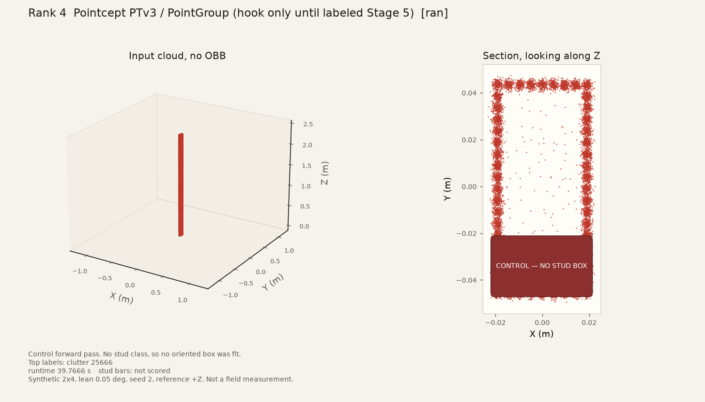
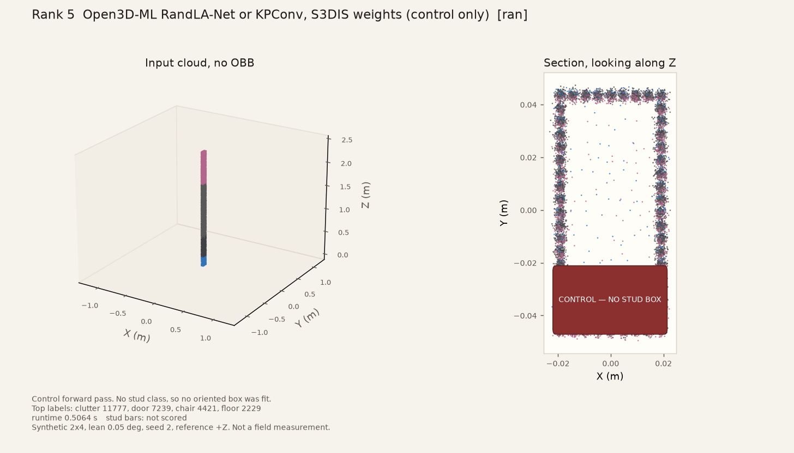

# Oz_PC ranks 4 and 5 on one synthetic stud

Date (America/Los_Angeles): **2026-09-25**. Machine: **Oz_PC**. This note records ranks 4 and 5 only, on the same Stage 0 stud as PR #15 and PR #16. It does not re-run Open3D, PCL, CloudCompare, or pyRANSAC-3D. It is not a field measurement.

Machine-readable twin: [18-ozpc-ranks4-5-run.json](18-ozpc-ranks4-5-run.json).

## Scene

One call to `stage0_single_stud` in `src/openwall_stud/synthetic.py`.

| | |
| --- | --- |
| Nominal | dressed 2×4 |
| Lean | 0.05° about +X |
| Seed | 2 |
| Scene id | `stage0_2x4_lean0.050` |
| Points | 25666 |
| Spacing | 0.005 m |
| Noise | 0.001 m Gaussian |
| Angle reference | generator +Z (`gravity_z_no_floor_plane`). No floor was fit. The cloud was not rotated. |

## GPU

`nvidia-smi`: NVIDIA GeForce RTX 4080 SUPER, 610.62, 16376 MiB

Pointcept used `.venv` (CUDA torch 2.7, the BIMStruct3D pin). Open3D-ML used `.venv-o3dml` (CUDA torch 2.13). The Windows `open3d==0.20.0` wheel imports `open3d.ml.torch` only when the torch minor version is 2.13 (`Pytorch_VERSION` is `2.13.0+cpu` in that wheel). `BUILD_CUDA_MODULE` is false there; RandLA-Net itself is PyTorch and ran on the GPU.

Rank 4 `runtime_s` includes checkpoint load, normal estimation, and the 10-pass test-time augmentation. Rank 5 `runtime_s` is `run_inference` after that checkpoint was already in memory.

## Result

Stud precision, recall, section, length, angle, and paint stay empty unless a finder actually emitted a stud box. A control histogram is not those cells. `control` means the forward pass ran and the stage 0 stud bars were not scored.

| Rank | Stack | Status | P | R | Section mm | Length mm | Angle MAE deg | Paint | Runtime s | Stage 0 bars |
| --- | --- | --- | --- | --- | --- | --- | --- | --- | --- | --- |
| 4 | Pointcept PTv3 / PointGroup (hook only until labeled Stage 5) | ran | — | — | — | — | — | — | 39.7666 | control |
| 5 | Open3D-ML RandLA-Net or KPConv, S3DIS weights (control only) | ran | — | — | — | — | — | — | 0.5064 | control |

## Versions

- `platform`: Windows-11-10.0.26200-SP0
- `python`: 3.12.10 (this report process)

## Commands

From the repo root:

```bash
.venv\Scripts\python.exe -m openwall_stud.contenders.pointcept_ptv3
.venv-o3dml\Scripts\python.exe -m openwall_stud.contenders.open3d_ml_s3dis
python scripts/run_ozpc_ranks45.py
```

`python scripts/run_one_stud_five_finders.py` was not the command for this note. Rank 6 was not re-rolled.

## Finders

### Rank 4. Pointcept PTv3 / PointGroup (hook only until labeled Stage 5)

Status: `ran`. Stud stage 0 bars: `control` (not scored). Precision, recall, section, length, angle, and paint are null on purpose.

BIMStruct3D PTv3 semantic control. No stud class (clutter, floor, ceiling, wall, column, door, window, stairs, railing, lights). Histogram recorded. No stud box and no paint.

BIMStruct3D PTv3 semantic forward pass on this one synthetic stud. Classes: clutter, floor, ceiling, wall, column, door, window, stairs, railing, lights. Stud-named classes: none. No stud box was fit and no paint color was assigned. PointGroup was not run. The generator cloud has no RGB, so color features were zeros. S3DIS or ScanNet mIoU was not copied.

| Class | Count |
| --- | --- |
| clutter | 25666 |
| floor | 0 |
| ceiling | 0 |
| wall | 0 |
| column | 0 |
| door | 0 |
| window | 0 |
| stairs | 0 |
| railing | 0 |
| lights | 0 |




### Rank 5. Open3D-ML RandLA-Net or KPConv, S3DIS weights (control only)

Status: `ran`. Stud stage 0 bars: `control` (not scored). Precision, recall, section, length, angle, and paint are null on purpose.

RandLA-Net S3DIS control. No stud class (ceiling, floor, wall, beam, column, window, door, table, chair, sofa, bookcase, board, clutter). Histogram recorded. No stud box and no paint.

Open3D-ML RandLA-Net S3DIS forward pass on this one synthetic stud. Classes: ceiling, floor, wall, beam, column, window, door, table, chair, sofa, bookcase, board, clutter. Stud-named classes: none. RGB features were zeros because the generator cloud has no color. The library's own sampler pads when the subsampled cloud is shorter than 40960 points. predict_labels length 25666 on 25666 input points. Placeholder API labels were zeros and were not treated as ground truth. No stud box was fit and no paint color was assigned. KPConv was not run. S3DIS mIoU was not copied.

| Class | Count |
| --- | --- |
| ceiling | 0 |
| floor | 2229 |
| wall | 0 |
| beam | 0 |
| column | 0 |
| window | 0 |
| door | 7239 |
| table | 0 |
| chair | 4421 |
| sofa | 0 |
| bookcase | 0 |
| board | 0 |
| clutter | 11777 |





## What this run did not do

No second lean, no stage 2 floor, no stage 3 mini wall, no SAM 2, no real scan, no SKIL reading, no PointGroup instance head, no KPConv forward pass, and no claim that a synthetic control is field accuracy. S3DIS mIoU is not a stud score and is not copied into the table above. BIMStruct3D weights (CC BY-NC-SA 4.0) and the S3DIS checkpoint stay in `data/cache/`, which is gitignored.
