# Phase 1 S1 lean sweep

Date (America/Los_Angeles): **2026-09-25**. Machine: **Oz_PC**. This note is one rigid lean on one synthetic dressed 2×4. It is the stage 0 style bring-up (S1). It is not a multi-stud wall, not a plate-fixed bow (S1b), and not a field, phone, or SKIL measurement.

**Reclassification (2026-09-26).** Rank numbers in this note stay. Live buckets are [27-four-way-tool-classification.md](27-four-way-tool-classification.md). Former bake-off rank 3 = CloudCompare, now bucket 4 (interactive GUI). The CloudCompare cards ran. They are archive measurements and are not counted as a geometry-first automated finder. Geometry-first automated on this sweep is former ranks 1, 2, and 6 only.

Machine-readable twin: [19-phase1-s1-lean-sweep.json](19-phase1-s1-lean-sweep.json).

Ranks 4 and 5 are controls. A histogram is not a stud score. Device ε is unlocked, so a production color is yellow when a box exists. This note does not paint green or red as the production call.

## Matrix

Generated by `phase1_s1_single_stud` in `src/openwall_stud/synthetic.py`. The long axis is +Z before a right-hand lean. The cloud is not rotated onto a floor or any other frame. Lean 0 runs once, with axis label `none`.

| | |
| --- | --- |
| Nominal | dressed 2×4, length 8 ft |
| Surface spacing | 0.005 m |
| Noise | Gaussian, 0.001 m, seed **2** on every scene |
| Angle reference | generator +Z (`gravity_z_no_floor_plane`) |
| Floor | none |
| Magnitudes (deg) | 0, 0.05, 0.12, 0.15, 0.30, 1.0, 4.0 |
| Axes when lean ≠ 0 | +X, −X, +Y, −Y |
| Scene count | 25 generated, 150 scorecards written of 150 finder-scene pairs |
| Points per cloud | 25666 |

Scene ids use `s1_2x4_lean{magnitude:.3f}_ax{axis}`. The zero cloud is `s1_2x4_lean0.000_axnone`. The generator check in the JSON twin records each long axis and its angle from +Z. That check refuses to start the sweep if the angle disagrees with the requested magnitude.

## Stage 0 bars

These bars are the synthetic bring-up checks. They are not a field acceptance test.

| Check | Bar |
| --- | --- |
| Detection | precision = 1 and recall = 1 |
| Section | max absolute error ≤ 10 mm |
| Length | max absolute error ≤ 25 mm |
| Angle | max absolute error ≤ 0.05° |
| Paint | yellow |

`control` means the forward pass ran and the stud bars were not scored. `blocked_install` means the cloud was built and the stack did not segment it. Both leave stud cells empty.

## Counts

| Rank | Stack | Role | Scenes | pass | fail | control | blocked_install | not_run |
| --- | --- | --- | --- | --- | --- | --- | --- | --- |
| 1 | Refined Open3D stud prior | classical | 25 | 25 | 0 | 0 | 0 | 0 |
| 2 | PCL region-grow + cuboid (Ozkan/Pochtrager, no Bassier merge) | classical | 25 | 25 | 0 | 0 | 0 | 0 |
| 3 | CloudCompare RANSAC-SD / CloudComPy | classical | 25 | 0 | 25 | 0 | 0 | 0 |
| 4 | Pointcept PTv3 / PointGroup (hook only until labeled Stage 5) | control | 25 | 0 | 0 | 25 | 0 | 0 |
| 5 | Open3D-ML RandLA-Net or KPConv, S3DIS weights (control only) | control | 25 | 0 | 0 | 25 | 0 | 0 |
| 6 | pyRANSAC-3D sequential cuboid | classical | 25 | 25 | 0 | 0 | 0 | 0 |

## Scorecard

One row is one finder on one scene. Empty cells were not measured.

| Rank | Scene | Lean deg | Axis | Status | P | R | Section mm | Length mm | Angle MAE deg | Angle max abs deg | Paint | Runtime s | Stage 0 bars |
| --- | --- | --- | --- | --- | --- | --- | --- | --- | --- | --- | --- | --- | --- |
| 1 | `s1_2x4_lean0.000_axnone` | 0 | none | ran | 1 | 1 | 7.7 | 5.57 | 0.00532 | 0.00532 | yellow x1 | 0.0499 | pass |
| 1 | `s1_2x4_lean0.050_ax+X` | 0.05 | +X | ran | 1 | 1 | 7.7 | 5.57 | 0.00345 | 0.00345 | yellow x1 | 0.0567 | pass |
| 1 | `s1_2x4_lean0.050_ax-X` | 0.05 | -X | ran | 1 | 1 | 7.7 | 5.57 | 0.00344 | 0.00344 | yellow x1 | 0.0473 | pass |
| 1 | `s1_2x4_lean0.050_ax+Y` | 0.05 | +Y | ran | 1 | 1 | 7.7 | 5.57 | 0.00419 | 0.00419 | yellow x1 | 0.0491 | pass |
| 1 | `s1_2x4_lean0.050_ax-Y` | 0.05 | -Y | ran | 1 | 1 | 7.7 | 5.57 | 0.00387 | 0.00387 | yellow x1 | 0.0454 | pass |
| 1 | `s1_2x4_lean0.120_ax+X` | 0.12 | +X | ran | 1 | 1 | 7.7 | 5.57 | 0.00314 | 0.00314 | yellow x1 | 0.0538 | pass |
| 1 | `s1_2x4_lean0.120_ax-X` | 0.12 | -X | ran | 1 | 1 | 7.7 | 5.57 | 0.00378 | 0.00378 | yellow x1 | 0.0459 | pass |
| 1 | `s1_2x4_lean0.120_ax+Y` | 0.12 | +Y | ran | 1 | 1 | 7.7 | 5.57 | 0.00419 | 0.00419 | yellow x1 | 0.0496 | pass |
| 1 | `s1_2x4_lean0.120_ax-Y` | 0.12 | -Y | ran | 1 | 1 | 7.7 | 5.57 | 0.00388 | 0.00388 | yellow x1 | 0.0489 | pass |
| 1 | `s1_2x4_lean0.150_ax+X` | 0.15 | +X | ran | 1 | 1 | 7.7 | 5.57 | 0.00303 | 0.00303 | yellow x1 | 0.0472 | pass |
| 1 | `s1_2x4_lean0.150_ax-X` | 0.15 | -X | ran | 1 | 1 | 7.7 | 5.57 | 0.00389 | 0.00389 | yellow x1 | 0.0506 | pass |
| 1 | `s1_2x4_lean0.150_ax+Y` | 0.15 | +Y | ran | 1 | 1 | 7.7 | 5.57 | 0.00421 | 0.00421 | yellow x1 | 0.0454 | pass |
| 1 | `s1_2x4_lean0.150_ax-Y` | 0.15 | -Y | ran | 1 | 1 | 7.7 | 5.57 | 0.00387 | 0.00387 | yellow x1 | 0.0562 | pass |
| 1 | `s1_2x4_lean0.300_ax+X` | 0.3 | +X | ran | 1 | 1 | 7.7 | 5.56 | 0.00251 | 0.00251 | yellow x1 | 0.0515 | pass |
| 1 | `s1_2x4_lean0.300_ax-X` | 0.3 | -X | ran | 1 | 1 | 7.7 | 5.57 | 0.0044 | 0.0044 | yellow x1 | 0.046 | pass |
| 1 | `s1_2x4_lean0.300_ax+Y` | 0.3 | +Y | ran | 1 | 1 | 7.71 | 5.56 | 0.00432 | 0.00432 | yellow x1 | 0.0537 | pass |
| 1 | `s1_2x4_lean0.300_ax-Y` | 0.3 | -Y | ran | 1 | 1 | 7.7 | 5.57 | 0.00376 | 0.00376 | yellow x1 | 0.0461 | pass |
| 1 | `s1_2x4_lean1.000_ax+X` | 1 | +X | ran | 1 | 1 | 7.7 | 5.55 | 0.00023 | 0.00023 | yellow x1 | 0.0531 | pass |
| 1 | `s1_2x4_lean1.000_ax-X` | 1 | -X | ran | 1 | 1 | 7.7 | 5.58 | 0.00669 | 0.00669 | yellow x1 | 0.0464 | pass |
| 1 | `s1_2x4_lean1.000_ax+Y` | 1 | +Y | ran | 1 | 1 | 7.72 | 5.55 | 0.00491 | 0.00491 | yellow x1 | 0.0501 | pass |
| 1 | `s1_2x4_lean1.000_ax-Y` | 1 | -Y | ran | 1 | 1 | 7.69 | 5.59 | 0.00317 | 0.00317 | yellow x1 | 0.051 | pass |
| 1 | `s1_2x4_lean4.000_ax+X` | 4 | +X | ran | 1 | 1 | 7.7 | 5.49 | 0.00948 | 0.00948 | yellow x1 | 0.0533 | pass |
| 1 | `s1_2x4_lean4.000_ax-X` | 4 | -X | ran | 1 | 1 | 7.72 | 5.62 | 0.00864 | 0.00864 | yellow x1 | 0.0471 | pass |
| 1 | `s1_2x4_lean4.000_ax+Y` | 4 | +Y | ran | 1 | 1 | 7.74 | 5.48 | 0.00732 | 0.00732 | yellow x1 | 0.0457 | pass |
| 1 | `s1_2x4_lean4.000_ax-Y` | 4 | -Y | ran | 1 | 1 | 7.63 | 5.62 | 0.00057 | 0.00057 | yellow x1 | 0.0671 | pass |
| 2 | `s1_2x4_lean0.000_axnone` | 0 | none | ran | 1 | 1 | 7.7 | 5.57 | 0.00532 | 0.00532 | yellow x1 | 0.6484 | pass |
| 2 | `s1_2x4_lean0.050_ax+X` | 0.05 | +X | ran | 1 | 1 | 7.7 | 5.57 | 0.00345 | 0.00345 | yellow x1 | 0.6429 | pass |
| 2 | `s1_2x4_lean0.050_ax-X` | 0.05 | -X | ran | 1 | 1 | 7.7 | 5.57 | 0.00344 | 0.00344 | yellow x1 | 0.6446 | pass |
| 2 | `s1_2x4_lean0.050_ax+Y` | 0.05 | +Y | ran | 1 | 1 | 7.7 | 5.57 | 0.00419 | 0.00419 | yellow x1 | 0.6418 | pass |
| 2 | `s1_2x4_lean0.050_ax-Y` | 0.05 | -Y | ran | 1 | 1 | 7.7 | 5.57 | 0.00387 | 0.00387 | yellow x1 | 0.6542 | pass |
| 2 | `s1_2x4_lean0.120_ax+X` | 0.12 | +X | ran | 1 | 1 | 7.7 | 5.57 | 0.00314 | 0.00314 | yellow x1 | 0.6435 | pass |
| 2 | `s1_2x4_lean0.120_ax-X` | 0.12 | -X | ran | 1 | 1 | 7.7 | 5.57 | 0.00378 | 0.00378 | yellow x1 | 0.6395 | pass |
| 2 | `s1_2x4_lean0.120_ax+Y` | 0.12 | +Y | ran | 1 | 1 | 7.7 | 5.57 | 0.00419 | 0.00419 | yellow x1 | 0.6433 | pass |
| 2 | `s1_2x4_lean0.120_ax-Y` | 0.12 | -Y | ran | 1 | 1 | 7.7 | 5.57 | 0.00388 | 0.00388 | yellow x1 | 0.6483 | pass |
| 2 | `s1_2x4_lean0.150_ax+X` | 0.15 | +X | ran | 1 | 1 | 7.7 | 5.57 | 0.00303 | 0.00303 | yellow x1 | 0.6374 | pass |
| 2 | `s1_2x4_lean0.150_ax-X` | 0.15 | -X | ran | 1 | 1 | 7.7 | 5.57 | 0.00389 | 0.00389 | yellow x1 | 0.6445 | pass |
| 2 | `s1_2x4_lean0.150_ax+Y` | 0.15 | +Y | ran | 1 | 1 | 7.7 | 5.57 | 0.00421 | 0.00421 | yellow x1 | 0.6424 | pass |
| 2 | `s1_2x4_lean0.150_ax-Y` | 0.15 | -Y | ran | 1 | 1 | 7.7 | 5.57 | 0.00387 | 0.00387 | yellow x1 | 0.644 | pass |
| 2 | `s1_2x4_lean0.300_ax+X` | 0.3 | +X | ran | 1 | 1 | 7.7 | 5.56 | 0.00251 | 0.00251 | yellow x1 | 0.6388 | pass |
| 2 | `s1_2x4_lean0.300_ax-X` | 0.3 | -X | ran | 1 | 1 | 7.7 | 5.57 | 0.0044 | 0.0044 | yellow x1 | 0.6419 | pass |
| 2 | `s1_2x4_lean0.300_ax+Y` | 0.3 | +Y | ran | 1 | 1 | 7.71 | 5.56 | 0.00432 | 0.00432 | yellow x1 | 0.6357 | pass |
| 2 | `s1_2x4_lean0.300_ax-Y` | 0.3 | -Y | ran | 1 | 1 | 7.7 | 5.57 | 0.00376 | 0.00376 | yellow x1 | 0.6417 | pass |
| 2 | `s1_2x4_lean1.000_ax+X` | 1 | +X | ran | 1 | 1 | 7.7 | 5.55 | 0.00023 | 0.00023 | yellow x1 | 0.6299 | pass |
| 2 | `s1_2x4_lean1.000_ax-X` | 1 | -X | ran | 1 | 1 | 7.7 | 5.58 | 0.00669 | 0.00669 | yellow x1 | 0.6478 | pass |
| 2 | `s1_2x4_lean1.000_ax+Y` | 1 | +Y | ran | 1 | 1 | 7.72 | 5.55 | 0.00491 | 0.00491 | yellow x1 | 0.6494 | pass |
| 2 | `s1_2x4_lean1.000_ax-Y` | 1 | -Y | ran | 1 | 1 | 7.69 | 5.59 | 0.00317 | 0.00317 | yellow x1 | 0.6538 | pass |
| 2 | `s1_2x4_lean4.000_ax+X` | 4 | +X | ran | 1 | 1 | 7.74 | 5.49 | 0.00511 | 0.00511 | yellow x1 | 0.6458 | pass |
| 2 | `s1_2x4_lean4.000_ax-X` | 4 | -X | ran | 1 | 1 | 7.7 | 5.62 | 0.01569 | 0.01569 | yellow x1 | 0.6318 | pass |
| 2 | `s1_2x4_lean4.000_ax+Y` | 4 | +Y | ran | 1 | 1 | 7.77 | 5.49 | 0.00749 | 0.00749 | yellow x1 | 0.6185 | pass |
| 2 | `s1_2x4_lean4.000_ax-Y` | 4 | -Y | ran | 1 | 1 | 7.63 | 5.62 | 0.00057 | 0.00057 | yellow x1 | 0.6525 | pass |
| 3 | `s1_2x4_lean0.000_axnone` | 0 | none | ran | 0.1429 | 1 | 30.46 | 2.07 | 0.08851 | 0.08851 | yellow x7 | 1.57 | fail |
| 3 | `s1_2x4_lean0.050_ax+X` | 0.05 | +X | ran | 0.1429 | 1 | 30.46 | 2.07 | 0.08837 | 0.08837 | yellow x7 | 1.4897 | fail |
| 3 | `s1_2x4_lean0.050_ax-X` | 0.05 | -X | ran | 0.1429 | 1 | 30.46 | 2.08 | 0.01147 | 0.01147 | yellow x7 | 1.3308 | fail |
| 3 | `s1_2x4_lean0.050_ax+Y` | 0.05 | +Y | ran | 0.125 | 1 | 30.46 | 2.07 | 0.05207 | 0.05207 | yellow x8 | 1.4399 | fail |
| 3 | `s1_2x4_lean0.050_ax-Y` | 0.05 | -Y | ran | 0.1667 | 1 | 30.46 | 2.07 | 0.05127 | 0.05127 | yellow x6 | 1.4675 | fail |
| 3 | `s1_2x4_lean0.120_ax+X` | 0.12 | +X | ran | 0.1667 | 1 | 30.46 | 2.06 | 0.08826 | 0.08826 | yellow x6 | 1.3747 | fail |
| 3 | `s1_2x4_lean0.120_ax-X` | 0.12 | -X | ran | 0.1667 | 1 | 30.46 | 2.08 | 0.08861 | 0.08861 | yellow x6 | 1.5905 | fail |
| 3 | `s1_2x4_lean0.120_ax+Y` | 0.12 | +Y | ran | 0.1429 | 1 | 30.46 | 2.07 | 0.0298 | 0.0298 | yellow x7 | 1.4167 | fail |
| 3 | `s1_2x4_lean0.120_ax-Y` | 0.12 | -Y | ran | 0.1667 | 1 | 30.46 | 2.07 | 0.0285 | 0.0285 | yellow x6 | 1.4359 | fail |
| 3 | `s1_2x4_lean0.150_ax+X` | 0.15 | +X | ran | 0.1429 | 1 | 30.46 | 2.06 | 0.08816 | 0.08816 | yellow x7 | 1.4733 | fail |
| 3 | `s1_2x4_lean0.150_ax-X` | 0.15 | -X | ran | 0.25 | 1 | 30.46 | 2.07 | 0.08872 | 0.08872 | yellow x4 | 1.3426 | fail |
| 3 | `s1_2x4_lean0.150_ax+Y` | 0.15 | +Y | ran | 0.125 | 1 | 30.46 | 2.07 | 0.01022 | 0.01022 | yellow x8 | 1.4905 | fail |
| 3 | `s1_2x4_lean0.150_ax-Y` | 0.15 | -Y | ran | 0.1667 | 1 | 30.46 | 2.07 | 0.02349 | 0.02349 | yellow x6 | 1.4503 | fail |
| 3 | `s1_2x4_lean0.300_ax+X` | 0.3 | +X | ran | 0.1429 | 1 | 30.46 | 2.06 | 0.08787 | 0.08787 | yellow x7 | 1.3971 | fail |
| 3 | `s1_2x4_lean0.300_ax-X` | 0.3 | -X | ran | 0.25 | 1 | 30.46 | 2.1 | 0.03027 | 0.03027 | yellow x4 | 1.4801 | fail |
| 3 | `s1_2x4_lean0.300_ax+Y` | 0.3 | +Y | ran | 0.125 | 1 | 30.46 | 2.06 | 0.01367 | 0.01367 | yellow x8 | 1.5225 | fail |
| 3 | `s1_2x4_lean0.300_ax-Y` | 0.3 | -Y | ran | 0.1667 | 1 | 30.46 | 2.08 | 0.01206 | 0.01206 | yellow x6 | 1.4317 | fail |
| 3 | `s1_2x4_lean1.000_ax+X` | 1 | +X | ran | 0.1429 | 1 | 30.46 | 2.03 | 0.08669 | 0.08669 | yellow x7 | 1.5721 | fail |
| 3 | `s1_2x4_lean1.000_ax-X` | 1 | -X | ran | 0.1429 | 1 | 30.46 | 2.12 | 0.03034 | 0.03034 | yellow x7 | 1.4255 | fail |
| 3 | `s1_2x4_lean1.000_ax+Y` | 1 | +Y | ran | 0.1429 | 1 | 30.73 | 5.31 | 0.01525 | 0.01525 | yellow x7 | 1.4369 | fail |
| 3 | `s1_2x4_lean1.000_ax-Y` | 1 | -Y | ran | 0.1667 | 1 | 4.95 | 5.51 | 0.00299 | 0.00299 | yellow x6 | 1.4729 | fail |
| 3 | `s1_2x4_lean4.000_ax+X` | 4 | +X | ran | 0.1667 | 1 | 30.46 | 1.93 | 0.08116 | 0.08116 | yellow x6 | 1.3535 | fail |
| 3 | `s1_2x4_lean4.000_ax-X` | 4 | -X | ran | 0.1667 | 1 | 5.33 | 7.52 | 0.00204 | 0.00204 | yellow x6 | 1.4874 | fail |
| 3 | `s1_2x4_lean4.000_ax+Y` | 4 | +Y | ran | 0.1667 | 1 | 5.01 | 2.89 | 0.01006 | 0.01006 | yellow x6 | 1.5062 | fail |
| 3 | `s1_2x4_lean4.000_ax-Y` | 4 | -Y | ran | 0.1667 | 1 | 30.44 | 2.23 | 0.00123 | 0.00123 | yellow x6 | 1.5176 | fail |
| 4 | `s1_2x4_lean0.000_axnone` | 0 | none | ran | — | — | — | — | — | — | — | 39.7139 | control |
| 4 | `s1_2x4_lean0.050_ax+X` | 0.05 | +X | ran | — | — | — | — | — | — | — | 39.1124 | control |
| 4 | `s1_2x4_lean0.050_ax-X` | 0.05 | -X | ran | — | — | — | — | — | — | — | 39.3866 | control |
| 4 | `s1_2x4_lean0.050_ax+Y` | 0.05 | +Y | ran | — | — | — | — | — | — | — | 40.6233 | control |
| 4 | `s1_2x4_lean0.050_ax-Y` | 0.05 | -Y | ran | — | — | — | — | — | — | — | 41.0407 | control |
| 4 | `s1_2x4_lean0.120_ax+X` | 0.12 | +X | ran | — | — | — | — | — | — | — | 41.1961 | control |
| 4 | `s1_2x4_lean0.120_ax-X` | 0.12 | -X | ran | — | — | — | — | — | — | — | 41.5254 | control |
| 4 | `s1_2x4_lean0.120_ax+Y` | 0.12 | +Y | ran | — | — | — | — | — | — | — | 40.5392 | control |
| 4 | `s1_2x4_lean0.120_ax-Y` | 0.12 | -Y | ran | — | — | — | — | — | — | — | 41.0168 | control |
| 4 | `s1_2x4_lean0.150_ax+X` | 0.15 | +X | ran | — | — | — | — | — | — | — | 40.8858 | control |
| 4 | `s1_2x4_lean0.150_ax-X` | 0.15 | -X | ran | — | — | — | — | — | — | — | 41.2248 | control |
| 4 | `s1_2x4_lean0.150_ax+Y` | 0.15 | +Y | ran | — | — | — | — | — | — | — | 39.7514 | control |
| 4 | `s1_2x4_lean0.150_ax-Y` | 0.15 | -Y | ran | — | — | — | — | — | — | — | 40.7276 | control |
| 4 | `s1_2x4_lean0.300_ax+X` | 0.3 | +X | ran | — | — | — | — | — | — | — | 42.9077 | control |
| 4 | `s1_2x4_lean0.300_ax-X` | 0.3 | -X | ran | — | — | — | — | — | — | — | 42.7402 | control |
| 4 | `s1_2x4_lean0.300_ax+Y` | 0.3 | +Y | ran | — | — | — | — | — | — | — | 43.9276 | control |
| 4 | `s1_2x4_lean0.300_ax-Y` | 0.3 | -Y | ran | — | — | — | — | — | — | — | 45.4639 | control |
| 4 | `s1_2x4_lean1.000_ax+X` | 1 | +X | ran | — | — | — | — | — | — | — | 39.0999 | control |
| 4 | `s1_2x4_lean1.000_ax-X` | 1 | -X | ran | — | — | — | — | — | — | — | 38.5456 | control |
| 4 | `s1_2x4_lean1.000_ax+Y` | 1 | +Y | ran | — | — | — | — | — | — | — | 65.9911 | control |
| 4 | `s1_2x4_lean1.000_ax-Y` | 1 | -Y | ran | — | — | — | — | — | — | — | 67.1911 | control |
| 4 | `s1_2x4_lean4.000_ax+X` | 4 | +X | ran | — | — | — | — | — | — | — | 41.4835 | control |
| 4 | `s1_2x4_lean4.000_ax-X` | 4 | -X | ran | — | — | — | — | — | — | — | 48.7139 | control |
| 4 | `s1_2x4_lean4.000_ax+Y` | 4 | +Y | ran | — | — | — | — | — | — | — | 50.5933 | control |
| 4 | `s1_2x4_lean4.000_ax-Y` | 4 | -Y | ran | — | — | — | — | — | — | — | 50.14 | control |
| 5 | `s1_2x4_lean0.000_axnone` | 0 | none | ran | — | — | — | — | — | — | — | 0.5567 | control |
| 5 | `s1_2x4_lean0.050_ax+X` | 0.05 | +X | ran | — | — | — | — | — | — | — | 0.2143 | control |
| 5 | `s1_2x4_lean0.050_ax-X` | 0.05 | -X | ran | — | — | — | — | — | — | — | 0.2164 | control |
| 5 | `s1_2x4_lean0.050_ax+Y` | 0.05 | +Y | ran | — | — | — | — | — | — | — | 0.261 | control |
| 5 | `s1_2x4_lean0.050_ax-Y` | 0.05 | -Y | ran | — | — | — | — | — | — | — | 0.2109 | control |
| 5 | `s1_2x4_lean0.120_ax+X` | 0.12 | +X | ran | — | — | — | — | — | — | — | 0.2619 | control |
| 5 | `s1_2x4_lean0.120_ax-X` | 0.12 | -X | ran | — | — | — | — | — | — | — | 0.2384 | control |
| 5 | `s1_2x4_lean0.120_ax+Y` | 0.12 | +Y | ran | — | — | — | — | — | — | — | 0.2137 | control |
| 5 | `s1_2x4_lean0.120_ax-Y` | 0.12 | -Y | ran | — | — | — | — | — | — | — | 0.2177 | control |
| 5 | `s1_2x4_lean0.150_ax+X` | 0.15 | +X | ran | — | — | — | — | — | — | — | 0.3072 | control |
| 5 | `s1_2x4_lean0.150_ax-X` | 0.15 | -X | ran | — | — | — | — | — | — | — | 0.2395 | control |
| 5 | `s1_2x4_lean0.150_ax+Y` | 0.15 | +Y | ran | — | — | — | — | — | — | — | 0.2382 | control |
| 5 | `s1_2x4_lean0.150_ax-Y` | 0.15 | -Y | ran | — | — | — | — | — | — | — | 0.2271 | control |
| 5 | `s1_2x4_lean0.300_ax+X` | 0.3 | +X | ran | — | — | — | — | — | — | — | 0.2289 | control |
| 5 | `s1_2x4_lean0.300_ax-X` | 0.3 | -X | ran | — | — | — | — | — | — | — | 0.2619 | control |
| 5 | `s1_2x4_lean0.300_ax+Y` | 0.3 | +Y | ran | — | — | — | — | — | — | — | 0.2828 | control |
| 5 | `s1_2x4_lean0.300_ax-Y` | 0.3 | -Y | ran | — | — | — | — | — | — | — | 0.2619 | control |
| 5 | `s1_2x4_lean1.000_ax+X` | 1 | +X | ran | — | — | — | — | — | — | — | 0.5597 | control |
| 5 | `s1_2x4_lean1.000_ax-X` | 1 | -X | ran | — | — | — | — | — | — | — | 0.4137 | control |
| 5 | `s1_2x4_lean1.000_ax+Y` | 1 | +Y | ran | — | — | — | — | — | — | — | 0.3663 | control |
| 5 | `s1_2x4_lean1.000_ax-Y` | 1 | -Y | ran | — | — | — | — | — | — | — | 0.2544 | control |
| 5 | `s1_2x4_lean4.000_ax+X` | 4 | +X | ran | — | — | — | — | — | — | — | 0.3525 | control |
| 5 | `s1_2x4_lean4.000_ax-X` | 4 | -X | ran | — | — | — | — | — | — | — | 0.2417 | control |
| 5 | `s1_2x4_lean4.000_ax+Y` | 4 | +Y | ran | — | — | — | — | — | — | — | 0.2752 | control |
| 5 | `s1_2x4_lean4.000_ax-Y` | 4 | -Y | ran | — | — | — | — | — | — | — | 0.2742 | control |
| 6 | `s1_2x4_lean0.000_axnone` | 0 | none | ran | 1 | 1 | 7.7 | 5.57 | 0.00532 | 0.00532 | yellow x1 | 1.1235 | pass |
| 6 | `s1_2x4_lean0.050_ax+X` | 0.05 | +X | ran | 1 | 1 | 7.7 | 5.57 | 0.00345 | 0.00345 | yellow x1 | 1.2011 | pass |
| 6 | `s1_2x4_lean0.050_ax-X` | 0.05 | -X | ran | 1 | 1 | 7.7 | 5.57 | 0.00344 | 0.00344 | yellow x1 | 1.2426 | pass |
| 6 | `s1_2x4_lean0.050_ax+Y` | 0.05 | +Y | ran | 1 | 1 | 7.7 | 5.57 | 0.00419 | 0.00419 | yellow x1 | 1.1197 | pass |
| 6 | `s1_2x4_lean0.050_ax-Y` | 0.05 | -Y | ran | 1 | 1 | 7.7 | 5.57 | 0.00387 | 0.00387 | yellow x1 | 1.1046 | pass |
| 6 | `s1_2x4_lean0.120_ax+X` | 0.12 | +X | ran | 1 | 1 | 7.7 | 5.57 | 0.00314 | 0.00314 | yellow x1 | 1.1037 | pass |
| 6 | `s1_2x4_lean0.120_ax-X` | 0.12 | -X | ran | 1 | 1 | 7.7 | 5.57 | 0.00378 | 0.00378 | yellow x1 | 1.1321 | pass |
| 6 | `s1_2x4_lean0.120_ax+Y` | 0.12 | +Y | ran | 1 | 1 | 7.7 | 5.57 | 0.00419 | 0.00419 | yellow x1 | 1.1021 | pass |
| 6 | `s1_2x4_lean0.120_ax-Y` | 0.12 | -Y | ran | 1 | 1 | 7.7 | 5.57 | 0.00388 | 0.00388 | yellow x1 | 1.1083 | pass |
| 6 | `s1_2x4_lean0.150_ax+X` | 0.15 | +X | ran | 1 | 1 | 7.7 | 5.57 | 0.00303 | 0.00303 | yellow x1 | 1.12 | pass |
| 6 | `s1_2x4_lean0.150_ax-X` | 0.15 | -X | ran | 1 | 1 | 7.7 | 5.57 | 0.00389 | 0.00389 | yellow x1 | 1.1098 | pass |
| 6 | `s1_2x4_lean0.150_ax+Y` | 0.15 | +Y | ran | 1 | 1 | 7.7 | 5.57 | 0.00421 | 0.00421 | yellow x1 | 1.1232 | pass |
| 6 | `s1_2x4_lean0.150_ax-Y` | 0.15 | -Y | ran | 1 | 1 | 7.7 | 5.57 | 0.00387 | 0.00387 | yellow x1 | 1.1051 | pass |
| 6 | `s1_2x4_lean0.300_ax+X` | 0.3 | +X | ran | 1 | 1 | 7.7 | 5.56 | 0.00251 | 0.00251 | yellow x1 | 1.0944 | pass |
| 6 | `s1_2x4_lean0.300_ax-X` | 0.3 | -X | ran | 1 | 1 | 7.7 | 5.57 | 0.0044 | 0.0044 | yellow x1 | 1.0963 | pass |
| 6 | `s1_2x4_lean0.300_ax+Y` | 0.3 | +Y | ran | 1 | 1 | 7.71 | 5.56 | 0.00432 | 0.00432 | yellow x1 | 1.1021 | pass |
| 6 | `s1_2x4_lean0.300_ax-Y` | 0.3 | -Y | ran | 1 | 1 | 7.7 | 5.57 | 0.00376 | 0.00376 | yellow x1 | 1.1095 | pass |
| 6 | `s1_2x4_lean1.000_ax+X` | 1 | +X | ran | 1 | 1 | 7.7 | 5.55 | 0.00023 | 0.00023 | yellow x1 | 1.1112 | pass |
| 6 | `s1_2x4_lean1.000_ax-X` | 1 | -X | ran | 1 | 1 | 7.7 | 5.58 | 0.00669 | 0.00669 | yellow x1 | 1.1092 | pass |
| 6 | `s1_2x4_lean1.000_ax+Y` | 1 | +Y | ran | 1 | 1 | 7.72 | 5.55 | 0.00491 | 0.00491 | yellow x1 | 1.1125 | pass |
| 6 | `s1_2x4_lean1.000_ax-Y` | 1 | -Y | ran | 1 | 1 | 7.69 | 5.59 | 0.00317 | 0.00317 | yellow x1 | 1.1057 | pass |
| 6 | `s1_2x4_lean4.000_ax+X` | 4 | +X | ran | 1 | 1 | 7.7 | 5.49 | 0.00948 | 0.00948 | yellow x1 | 1.1107 | pass |
| 6 | `s1_2x4_lean4.000_ax-X` | 4 | -X | ran | 1 | 1 | 7.72 | 5.62 | 0.00864 | 0.00864 | yellow x1 | 1.1059 | pass |
| 6 | `s1_2x4_lean4.000_ax+Y` | 4 | +Y | ran | 1 | 1 | 7.74 | 5.48 | 0.00732 | 0.00732 | yellow x1 | 1.121 | pass |
| 6 | `s1_2x4_lean4.000_ax-Y` | 4 | -Y | ran | 1 | 1 | 7.63 | 5.62 | 0.00057 | 0.00057 | yellow x1 | 1.1058 | pass |

## Versions and hardware

`nvidia-smi`: NVIDIA GeForce RTX 4080 SUPER, 610.62, 16376 MiB

Pointcept is rank 4 and uses `.venv` (the BIMStruct3D CUDA torch pin). Open3D-ML is rank 5 and uses `.venv-o3dml`. Ranks 1, 2, 3, and 6 use `.venv`. Rank 4 `runtime_s` includes checkpoint load, normal estimation, and the 10-pass test-time augmentation on that scene, because each scene calls the existing `run_one_stud` path. Rank 5 `runtime_s` is `run_inference` after that scene's checkpoint load.

- `classical` python: 3.12.10 (C:\Repos\openwall-stud-frame-ranks45\.venv\Scripts\python.exe)
  - `platform`: Windows-11-10.0.26200-SP0
  - `open3d`: 0.20.0
  - `numpy`: 2.5.3
  - `matplotlib`: 3.11.2
  - `pyransac3d`: 0.7.0
  - gpu: NVIDIA GeForce RTX 4080 SUPER, 610.62, 16376 MiB; torch 2.7.0+cu126; cuda_available=True; device NVIDIA GeForce RTX 4080 SUPER
- `pointcept` python: 3.12.10 (C:\Repos\openwall-stud-frame-ranks45\.venv\Scripts\python.exe)
  - `platform`: Windows-11-10.0.26200-SP0
  - `torch`: 2.7.0+cu126
  - gpu: NVIDIA GeForce RTX 4080 SUPER, 610.62, 16376 MiB; torch 2.7.0+cu126; cuda_available=True; device NVIDIA GeForce RTX 4080 SUPER
- `open3d_ml` python: 3.12.10 (C:\Repos\openwall-stud-frame-ranks45\.venv-o3dml\Scripts\python.exe)
  - `platform`: Windows-11-10.0.26200-SP0
  - `torch`: 2.13.0+cu126
  - `open3d`: 0.20.0
  - gpu: NVIDIA GeForce RTX 4080 SUPER, 610.62, 16376 MiB; torch 2.13.0+cu126; cuda_available=True; device NVIDIA GeForce RTX 4080 SUPER

## What the scorecards say about ranks 2 and 3

Rank 2 `native_pcl_region_growing` values on these scorecards: False. NumPy smoothness region-grow port, because the PCL binary did not run. Adjacent-face cuboid. Axis not forced to Z.

Rank 2 metrics are the run that the scorecard names. They are not a libpcl measurement when `native_pcl_region_growing` is false.

Rank 3 returned primitive boxes on 25 of 25 scorecards. Stage 0 bars: pass 0, fail 25, blocked_install 0. CloudCompare 2.14.beta (Aug 29 2026) RANSAC-SD, one OBB per plane or cylinder primitive, primitives not merged. Binary: `C:\Program Files\CloudCompare\CloudCompare.exe`. Discovery source: env. Discovery order is the `CLOUDCOMPARE_EXE` environment variable, then `C:\Program Files\CloudCompare\CloudCompare.exe` when that file exists, then PATH. Smoke test (`CloudCompare -SILENT -NO_TIMESTAMP`) succeeded. Version: 2.14.beta (Aug 29 2026). Return code: 0. Record: `artifacts/scorecards/cloudcompare_smoke.json`.

## Controls

### Rank 4. Pointcept PTv3 / PointGroup (hook only until labeled Stage 5)

Role: control. Scorecards: 25 of 25. Statuses: ran.

All 25 recorded histograms on this matrix were identical. Stud-named classes: none. Stud-named classes with a nonzero count: none. Stud precision, recall, section, length, angle, and paint stay null. Labeled-point count min/max: 25666 / 25666.

| Class | Count |
| --- | --- |
| clutter | 25666 |
| floor | 0 |
| ceiling | 0 |
| wall | 0 |
| column | 0 |
| door | 0 |
| window | 0 |
| stairs | 0 |
| railing | 0 |
| lights | 0 |

### Rank 5. Open3D-ML RandLA-Net or KPConv, S3DIS weights (control only)

Role: control. Scorecards: 25 of 25. Statuses: ran.

25 distinct histograms across 25 scorecards. The table is the min and max count of each class on those scorecards. Per-scene histograms stay on the scorecards and are not replaced by one invented histogram. Stud-named classes: none. Stud-named classes with a nonzero count: none. Stud precision, recall, section, length, angle, and paint stay null. Labeled-point count min/max: 25666 / 25666.

| Class | Min count | Max count |
| --- | --- | --- |
| ceiling | 0 | 0 |
| floor | 2226 | 2428 |
| wall | 0 | 0 |
| beam | 0 | 0 |
| column | 0 | 0 |
| window | 0 | 0 |
| door | 6690 | 7550 |
| table | 0 | 0 |
| chair | 4159 | 4690 |
| sofa | 0 | 0 |
| bookcase | 0 | 0 |
| board | 0 | 0 |
| clutter | 11349 | 12172 |

## Representative renders

Offline PNGs for the classical finders on lean 0°, 0.15° about +X, and 4° about +Y, and only when that finder returned a box. The section view looks along generator Z. Production paint on a box is yellow because ε is unlocked.

### Rank 1 `s1_2x4_lean0.000_axnone`

Stage 0 bars: `pass`. Paint: yellow x1.

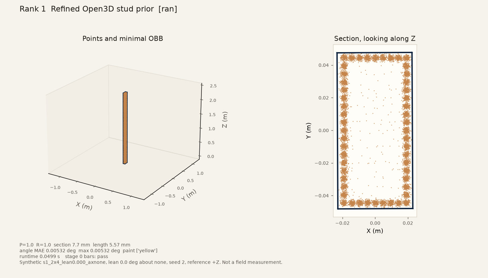

### Rank 1 `s1_2x4_lean0.150_ax+X`

Stage 0 bars: `pass`. Paint: yellow x1.

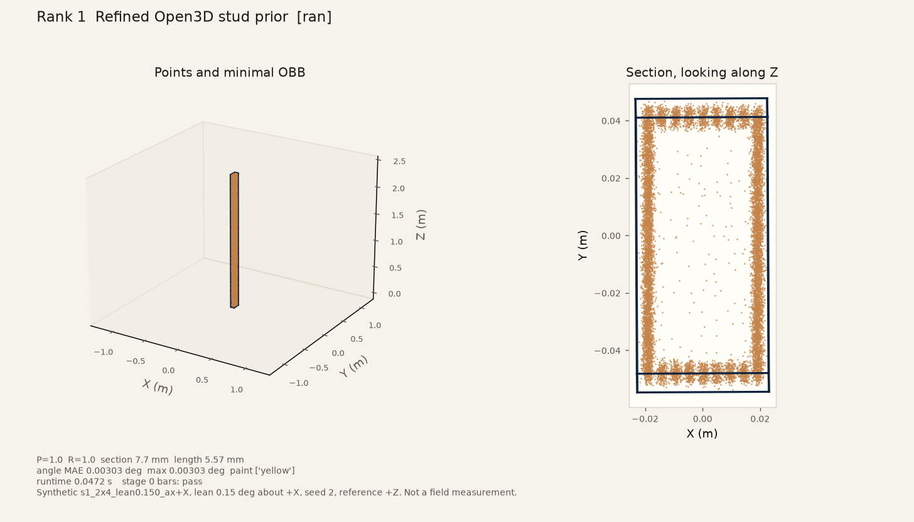

### Rank 1 `s1_2x4_lean4.000_ax+Y`

Stage 0 bars: `pass`. Paint: yellow x1.

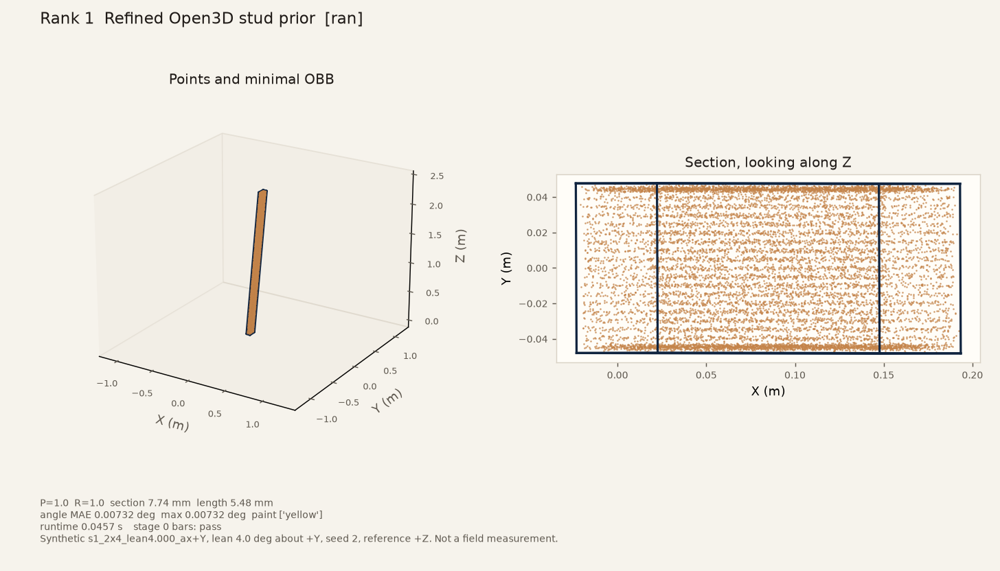

### Rank 2 `s1_2x4_lean0.000_axnone`

Stage 0 bars: `pass`. Paint: yellow x1.

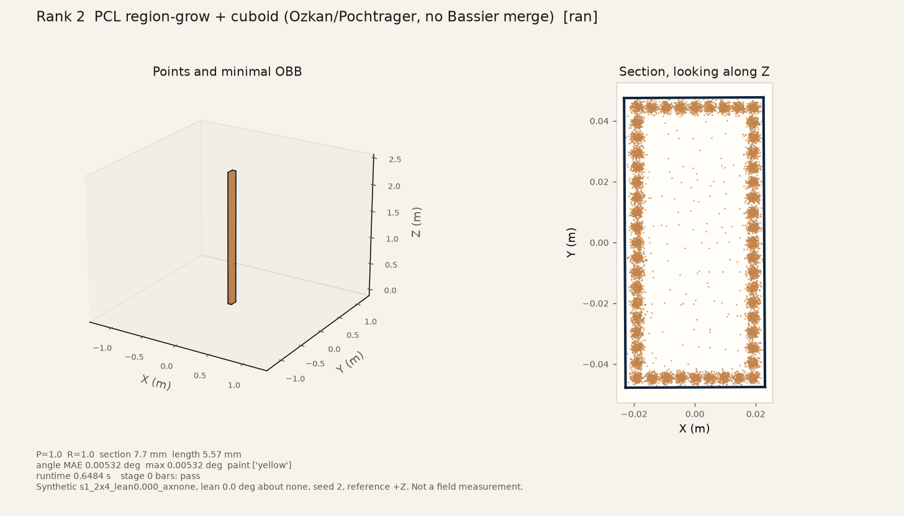

### Rank 2 `s1_2x4_lean0.150_ax+X`

Stage 0 bars: `pass`. Paint: yellow x1.

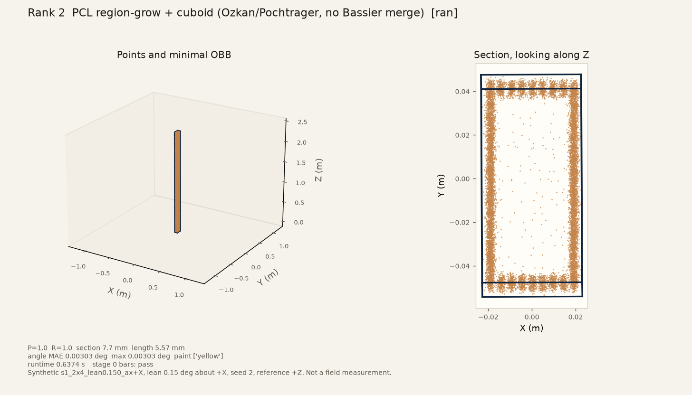

### Rank 2 `s1_2x4_lean4.000_ax+Y`

Stage 0 bars: `pass`. Paint: yellow x1.

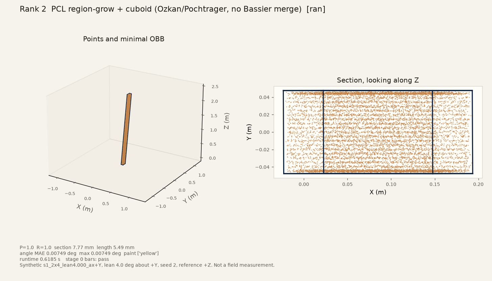

### Rank 3 `s1_2x4_lean0.000_axnone`

Stage 0 bars: `fail`. Paint: yellow x7.

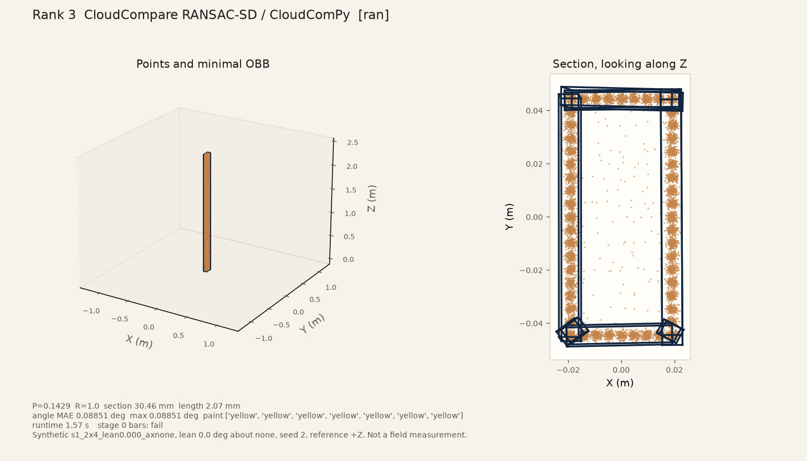

### Rank 3 `s1_2x4_lean0.150_ax+X`

Stage 0 bars: `fail`. Paint: yellow x7.

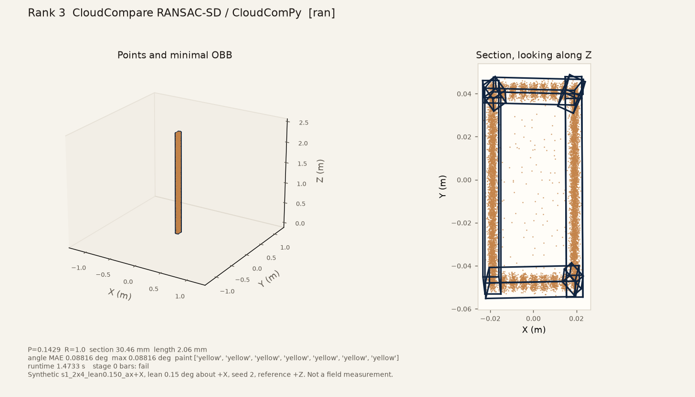

### Rank 3 `s1_2x4_lean4.000_ax+Y`

Stage 0 bars: `fail`. Paint: yellow x6.

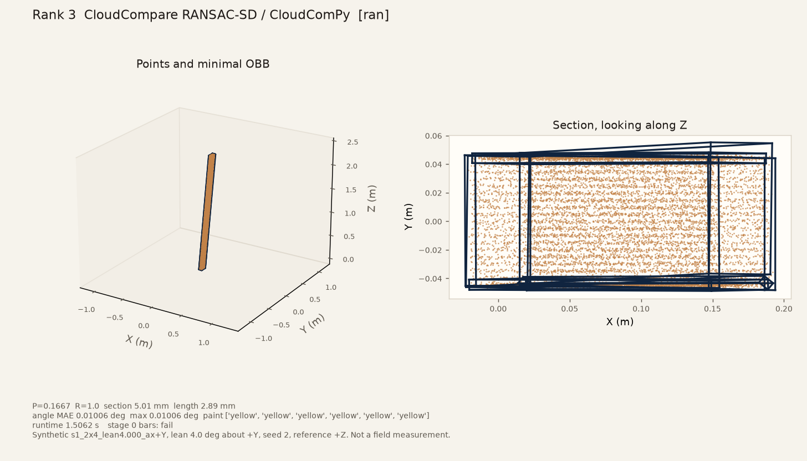

### Rank 6 `s1_2x4_lean0.000_axnone`

Stage 0 bars: `pass`. Paint: yellow x1.

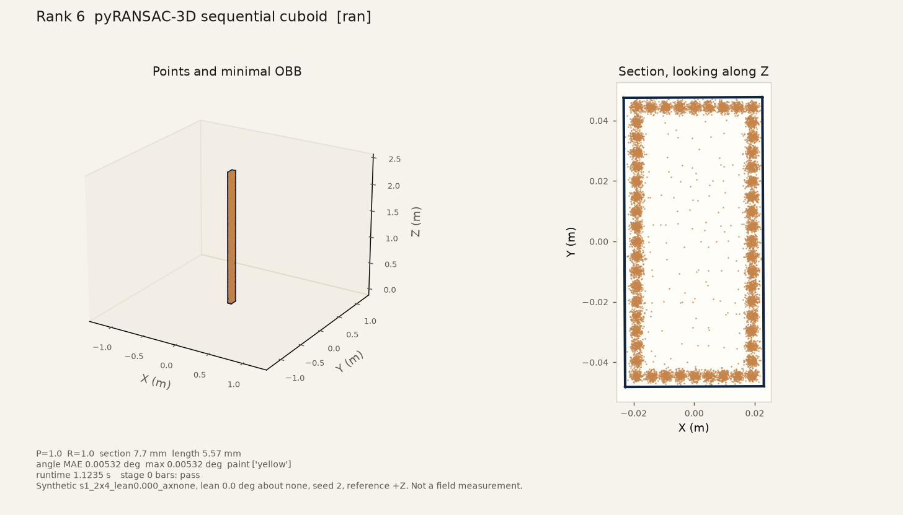

### Rank 6 `s1_2x4_lean0.150_ax+X`

Stage 0 bars: `pass`. Paint: yellow x1.

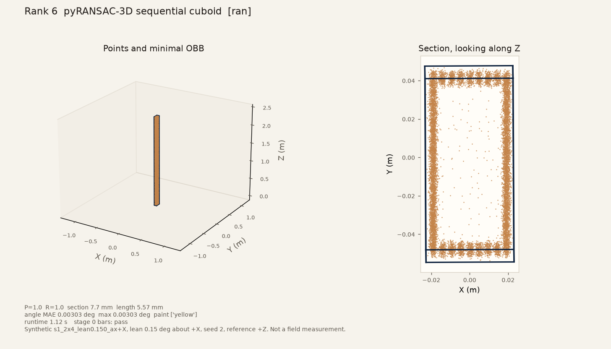

### Rank 6 `s1_2x4_lean4.000_ax+Y`

Stage 0 bars: `pass`. Paint: yellow x1.

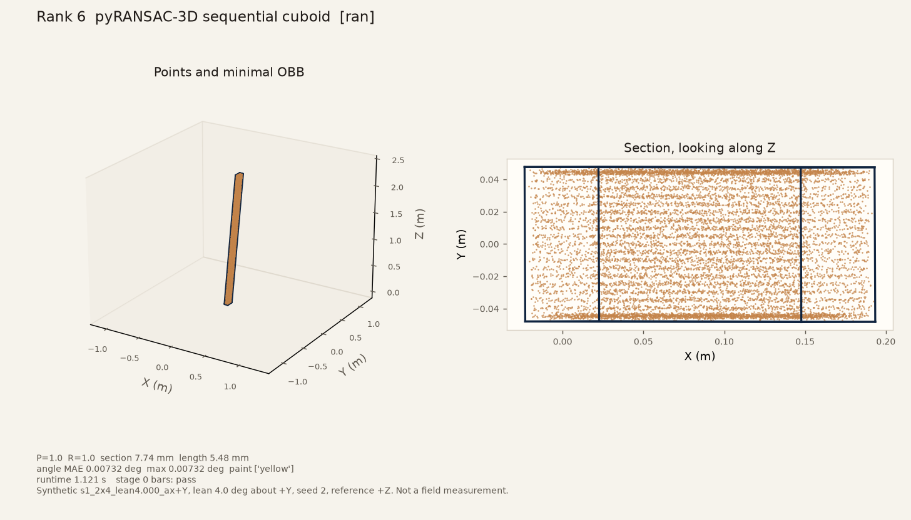

## What this run did not do

No second stud, no plate, no bow (S1b), no stage 2 floor, no stage 3 mini wall, no SAM 2, no YOLO, no RoomPlan, no phone capture, no SKIL reading, and no claim that a synthetic pass is field accuracy. S3DIS mIoU and BIMStruct3D class counts are not stud scores.
