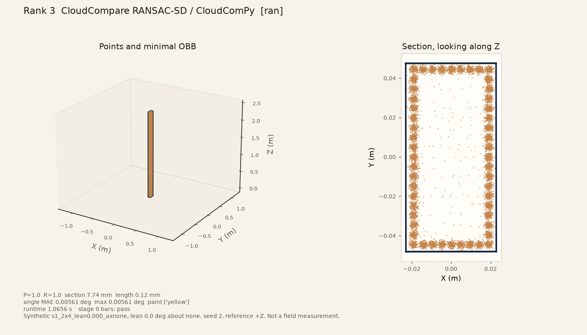
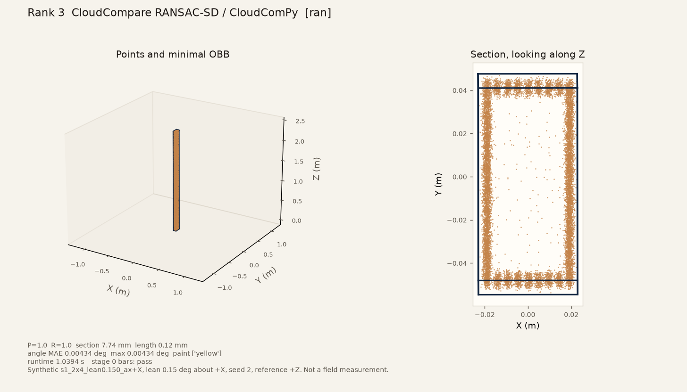
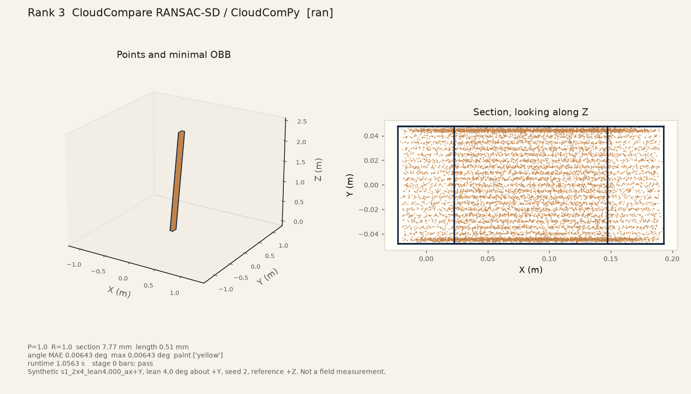

# CloudCompare stud-parameter tune

Date: **2026-09-25**. Machine: Oz_PC. Rank 3 only. CPU. Ranks 1, 2, 4, 5, and 6 were not re-run.

The untuned pass is [19-phase1-s1-lean-sweep.md](19-phase1-s1-lean-sweep.md). Those scorecards stay in `artifacts/scorecards/phase1_s1/r3_cloudcompare__*.json`. This note is the follow-up that asks RANSAC Shape Detection for one stud box.

Not a field measurement. Same 25 synthetic dressed 2×4 clouds: seed 2, 5 mm spacing, 1 mm noise, generator +Z, no floor.

## What changed

QRANSAC-SD has no cuboid. The command-line shapes are plane, sphere, cylinder, cone, and torus (CloudCompare 2.11 and the 2.14.beta plugin on this machine). A dressed 2×4 is four long faces. The untuned command enabled plane and cylinder and scored one box per primitive, so one stud became 4–8 detections.

Two changes:

1. Enable `PLANE` only. A cylinder on a 2×4 is the wrong section, and on the upright stud it also left only two long faces.
2. Merge faces that match a dressed 2×4 (~38 × 89 mm section, ~2.44 m length, long axis near +Z) into one minimal OBB. Adjacent face centers within 120 mm are one stud. Coplanar shards join only when they line up across the face, so the next stud a bay away is not glued on. One scene keeps the single best box. This is not a multi-stud segmenter.

Code: `src/openwall_stud/contenders/cloudcompare_ransac.py`. Grid and full run: `scripts/tune_cloudcompare_stud.py`.

## Knobs

| Knob | Untuned | Tuned | Why |
| --- | --- | --- | --- |
| `ENABLE_PRIMITIVE` | `PLANE`, `CYLINDER` | `PLANE` | No cuboid exists. The cylinder was an extra detection. |
| `EPSILON_ABSOLUTE` | 0.008 m | 0.006 m | Above the 1 mm noise, under half the 38 mm thickness, so the opposite face stays its own plane. |
| `BITMAP_EPSILON_ABSOLUTE` | 0.020 m | 0.012 m | In-plane cell. Just above the 5 mm spacing so one face stays one primitive. 20 mm tied on the grid. |
| `SUPPORT_POINTS` | 400 | 800 | A narrow face is about 3700 points. An end cap is about 135. 800 keeps the four long faces and drops crumbs. Support 400 kept 6–8 primitives. |
| `MAX_NORMAL_DEV` | 25° | 25° | Left at 25°. On the grid, 15° passed but the upright long-axis error was 0.0077° instead of 0.0056°. |
| `PROBABILITY` | 0.01 | 0.01 | Plugin's usual overlooking probability. Not the lever. |
| Post-merge | off | on | Four accepted long faces become one point set and one OBB. |

## Three-scene grid

Scenes: lean 0°, 0.15° about +X, 4° about +Y. Every row below already ran the face merge. "Prim" is how many RANSAC clouds came back on the upright scene.

| Row | Plane only | Epsilon | Bitmap | Support | Normal | Pass | Upright prim | Upright angle |
| --- | --- | --- | --- | --- | --- | --- | --- | --- |
| untuned + cylinder | no | 0.008 | 0.020 | 400 | 25° | 2/3 | 4 | 0.068° fail |
| untuned, plane only | yes | 0.008 | 0.020 | 400 | 25° | 3/3 | 8 | 0.0056° |
| eps 5 mm, support 800, normal 15° | yes | 0.005 | 0.020 | 800 | 15° | 3/3 | 4 | 0.0077° |
| eps 6 mm, support 800, normal 15° | yes | 0.006 | 0.020 | 800 | 15° | 3/3 | 4 | 0.0077° |
| eps 8 mm, support 800, normal 15° | yes | 0.008 | 0.020 | 800 | 15° | 3/3 | 4 | 0.0077° |
| support 1500, normal 15° | yes | 0.006 | 0.020 | 1500 | 15° | 3/3 | 4 | 0.0077° |
| support 2000, normal 15° | yes | 0.006 | 0.020 | 2000 | 15° | 3/3 | 4 | 0.0077° |
| **chosen** | yes | 0.006 | 0.012 | 800 | 25° | 3/3 | 4 | 0.0056° |
| eps 10 mm, support 800, normal 25° | yes | 0.010 | 0.020 | 800 | 25° | 3/3 | 4 | 0.0056° |

Section error sat at about 7.7 mm on every passing scene. That is the minimal OBB of the surface points, the same band as the Open3D stage-0 boxes, and it is inside the 10 mm bar.

The chosen row is the one that tied the best angle and returned exactly four planes. The 10 mm / 20 mm row tied the angle too. The support-400 plane-only row tied the angle as well, with six to eight primitives that the merge then collapsed. `grid.json` names that support-400 row as the sort winner because the angle tied and it was first. The default in code is the four-plane row.

The cylinder row is the one that missed: two long faces on the upright stud, angle 0.068°, which fails the 0.05° bar.

Raw grid: `artifacts/scorecards/phase1_s1_cc_tuned/grid.json`.

## All 25 scenes

Tuned command, same 25 clouds. One box on every scene. Four planes in, one stud group out, on every scene. Stage 0 bars: **pass 25, fail 0**.

| | Untuned | Tuned |
| --- | --- | --- |
| Scenes | 25 | 25 |
| Boxes per scene | 4–8 (two scenes had 4, eleven had 6, nine had 7, three had 8) | 1 |
| Stage-0 pass | 0 | 25 |
| Detection failures | 25 | 0 |
| Section failures (> 10 mm) | 22 | 0 |
| Length failures (> 25 mm) | 0 | 0 |
| Angle failures (> 0.05°) | 11 | 0 |
| Section error | 4.95–30.73 mm | 7.65–7.77 mm |
| Length error | 1.93–7.52 mm | 0.02–0.51 mm |
| Angle error | 0.00123–0.08872° | 0.00079–0.00861° |

Scorecards: `artifacts/scorecards/phase1_s1_cc_tuned/r3_cloudcompare__*.json`. Summary: `artifacts/scorecards/phase1_s1_cc_tuned/summary.json`. The day table was not rewritten, so `docs/research/13-stud-seg-results-by-day.md` still shows the untuned rank 3 rows.

Binary: `C:\Program Files\CloudCompare\CloudCompare.exe`, version 2.14.beta (Aug 29 2026). Separate process. GPL sources were not copied into this repo.

## Command line on this build

`-H` is not a command in CloudCompare 2.14.beta. Passing it opens the command-line window with `Unknown or misplaced command: '-H'`. That probe is not part of the stud fit. The 25 scorecards never used it.

Help on this install is `-HELP`, and only after silent mode is already on:

```
CloudCompare.exe -SILENT -NO_TIMESTAMP -HELP
```

That listing (exit 0) includes `-RANSAC`, `-O`, `-AUTO_SAVE`, `-C_EXPORT_FMT`, `-PLY_EXPORT_FMT`, and `-NO_TIMESTAMP`. It does not include `-H`. `-SILENT` is an early switch, not one of the registered commands. `-H_EXPORT_FMT` is a different command (hierarchy export format).

The stud launch stays:

```
CloudCompare.exe -SILENT -NO_TIMESTAMP -AUTO_SAVE OFF -C_EXPORT_FMT PLY -PLY_EXPORT_FMT ASCII -O <ply> -RANSAC ...
```

`-SILENT` is the first argument so a later bad token cannot open a dialog. The process is started with no console window. A repeat of the upright scene after this check still returned one box.

## Representative views

Section view looks along generator Z. One yellow box. ε is unlocked.

### `s1_2x4_lean0.000_axnone`

Stage 0 bars: `pass`. Section 7.74 mm. Angle 0.00561°.



### `s1_2x4_lean0.150_ax+X`

Stage 0 bars: `pass`. Section 7.74 mm. Angle 0.00434°.



### `s1_2x4_lean4.000_ax+Y`

Stage 0 bars: `pass`. Section 7.77 mm. Angle 0.00643°.



The same three PNGs replace the rank 3 pictures in doc 19. The doc 19 table is still the untuned pass.
