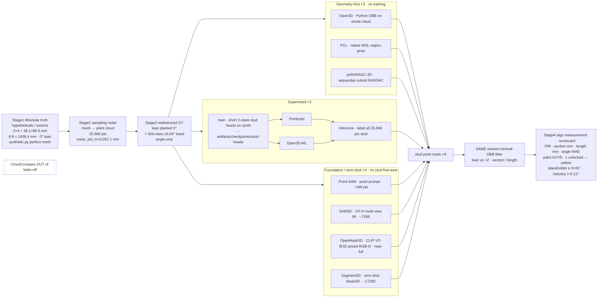

# Bake-off master pipeline diagram

Date (America/Los_Angeles): **2026-09-26**. Companion chart for the all-nine stage0 bake-off. Buckets: [27-four-way-tool-classification.md](27-four-way-tool-classification.md). Stage0 re-run: [30-fix-sam3d-openmask3d-stage0.md](30-fix-sam3d-openmask3d-stage0.md). Four-stage error table: [31-four-stage-error-table.md](31-four-stage-error-table.md). Scorecard table: [`artifacts/phase_neg1/all_nine_stage0.json`](../../artifacts/phase_neg1/all_nine_stage0.json). CloudCompare stays **out**. No fabricated metrics.

One left-to-right flow: planted absolute truth → sampling noise → realisticized GT → three class pipes (geometry-first ×3, supervised ×2, foundation/zero-shot ×4) → stud masks → shared minimal OBB → scorecard (Stage4). Paint yellow while device ε is unlocked; placeholder ε=0.05° column only; industry τ≈0.12° is not paint.

## Diagram

Source: [diagrams/32-pipeline-master.mmd](diagrams/32-pipeline-master.mmd).



Rendered still: [images/32-pipeline-master.png](images/32-pipeline-master.png) (via `@mermaid-js/mermaid-cli`). Regenerate with:

```bash
npx -y @mermaid-js/mermaid-cli -i docs/research/diagrams/32-pipeline-master.mmd -o docs/research/images/32-pipeline-master.png -b white -s 2 -w 2400
```

## Notes

| Item | Lock |
| --- | --- |
| Stage1 | Absolute truth from `synthetic.py`: dressed 2×4 **38.1 × 88.9 mm**, 8 ft ≈ **2438.4 mm**, lean **0°**, perfect mesh/box surface. |
| Stage2 | Mesh → cloud, **25,666** pts, `noise_std_m=0.001` (1 mm). |
| Stage3 | Planted lean 0° plus Skil-class **~±0.05°** device band → realisticized GT (**angle-only**). |
| Stage4 | Algorithm measurement at the scorecard after shared OBB. |
| Class pipes | Geometry-first (3), supervised (2) with train→`artifacts/checkpoints/stud-heads` then infer, foundation/zero-shot (4). Mask sizes from stage0 rounds: Point-SAM 349, SAM3D 7188, OpenMask3D near-full (21488), Segment3D 17282. |
| Converge | Same shared minimal-OBB; lean vs **+Z**; section/length. |
| Paint / ε | Yellow while ε unlocked; placeholder ε=**0.05°** column; industry **τ≈0.12°** is in-band, not paint. |
| CloudCompare | **OUT** of the bake-off (doc 27 interactive GUI). |

See also docs [27](27-four-way-tool-classification.md), [30](30-fix-sam3d-openmask3d-stage0.md), [31](31-four-stage-error-table.md).
