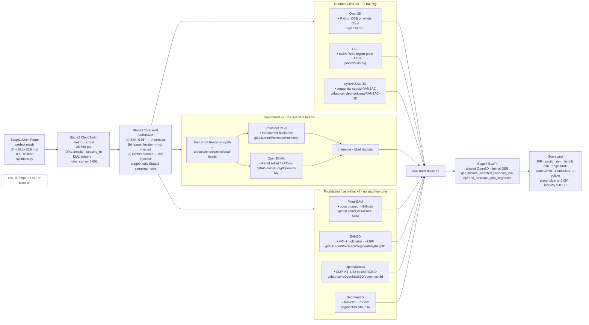

# Bake-off master pipeline diagram v2

Date (America/Los_Angeles): **2026-09-26**. **Supersedes** [32-pipeline-master-diagram.md](32-pipeline-master-diagram.md) (PR #36). Named stage brands (AxiomForge → CloudSmith → TrueLevel → BoxFit) plus CloudSmith dials and TrueLevel error-source honesty. Buckets: [27-four-way-tool-classification.md](27-four-way-tool-classification.md). Stage0 re-run: [30-fix-sam3d-openmask3d-stage0.md](30-fix-sam3d-openmask3d-stage0.md). Four-stage error table: [31-four-stage-error-table.md](31-four-stage-error-table.md). OBB / deformation survey: [33-obb-and-deformation-research.md](33-obb-and-deformation-research.md). Scorecard table: [`artifacts/phase_neg1/all_nine_stage0.json`](../../artifacts/phase_neg1/all_nine_stage0.json). CloudCompare stays **out**. No fabricated metrics.

One left-to-right flow: planted absolute truth → CloudSmith sampling → TrueLevel realisticizer → three class pipes (geometry-first ×3, supervised ×2, foundation/zero-shot ×4) → stud masks → shared BoxFit minimal OBB → scorecard. Paint yellow while device ε is unlocked; placeholder ε=0.05° column only; industry τ≈0.12° is not paint.

## Diagram

Source: [diagrams/34-pipeline-master-v2.mmd](diagrams/34-pipeline-master-v2.mmd).



Rendered still: [images/34-pipeline-master-v2.png](images/34-pipeline-master-v2.png) (via `@mermaid-js/mermaid-cli`). Regenerate with:

```bash
npx -y @mermaid-js/mermaid-cli -i docs/research/diagrams/34-pipeline-master-v2.mmd -o docs/research/images/34-pipeline-master-v2.png -b white -s 3 --size 3200
```

## Named stages

| Stage | Brand | Lock |
| --- | --- | --- |
| 1 | **AxiomForge** | Absolute truth from `synthetic.py`: dressed 2×4 **38.1 × 88.9 mm**, 8 ft ≈ **2438.4 mm**, lean **0°**, perfect mesh/box surface. |
| 2 | **CloudSmith** | Mesh → cloud, **25,666** pts on the bake-off scene. Two experiment dials (for **future** stage sweeps — Stage0 lock unchanged today): **point density / count** ↔ `spacing_m` (stage0 default `0.005`); **Gaussian noise sigma** ↔ `noise_std_m` (stage0 default `0.001` = 1 mm). |
| 3 | **TrueLevel** | Realisticizer. Three *named* error sources; honesty for stage0: **(a)** Skil-class leveler device band **~0.05°** — theoretical / calibrated band, **not injected** into the stage0 cloud; **(b)** human placement error when using a level tool — **not-yet-injected**; **(c)** real lumber surface imperfections vs perfect mesh — **not-yet-injected**. On stage0 data, the only noise present is Stage2 sampling Gaussian. |
| 4 | **BoxFit** | Shared Open3D `PointCloud.get_minimal_oriented_bounding_box()` via `src/openwall_stud/open3d_baseline.py:_obb_segments` (also `poststep.detections_from_clusters`). Lean vs **+Z** (or fitted floor when present); section / length. |

## Class pipes and upstream links

| Pipe | Tool | Role | Upstream |
| --- | --- | --- | --- |
| Geometry | Open3D | Python OBB on whole cloud | [open3d.org](https://www.open3d.org/) |
| Geometry | PCL | Native WSL region-grow, then OBB / cuboid reunite | [pointclouds.org](https://pointclouds.org/) |
| Geometry | pyRANSAC-3D | Sequential cuboid RANSAC (iterative plane-style primitives) | [leomariga/pyRANSAC-3D](https://github.com/leomariga/pyRANSAC-3D) (v0.7.x used in-repo) |
| Supervised | Pointcept PTv3 | 2-class stud head under `artifacts/checkpoints/stud-heads` | [Pointcept/Pointcept](https://github.com/Pointcept/Pointcept) |
| Supervised | Open3D-ML RandLA-Net / KPConv | Same stud-head checkpoint dir | [isl-org/Open3D-ML](https://github.com/isl-org/Open3D-ML) |
| Foundation | Point-SAM | Point prompt; stage0 mask ~349 pts; **not** stud-fine-tuned | [zyc00/Point-SAM](https://github.com/zyc00/Point-SAM) · [OpenReview](https://openreview.net/forum?id=yXCTDhZDh6) |
| Foundation | SAM3D | ViT-H multi-view lift; ~7188; **not** stud-fine-tuned | [Pointcept/SegmentAnything3D](https://github.com/Pointcept/SegmentAnything3D) · [arXiv:2306.03908](https://arxiv.org/abs/2306.03908) |
| Foundation | OpenMask3D | CLIP ViT-B/32 on posed RGB-D; near-full; **not** stud-fine-tuned | [OpenMask3D/openmask3d](https://github.com/OpenMask3D/openmask3d) |
| Foundation | Segment3D | Zero-shot Mask3D; ~17282; **not** stud-fine-tuned | [segment3d.github.io](http://segment3d.github.io) · [arXiv:2312.17232](https://arxiv.org/abs/2312.17232) |

Mask point counts are from stage0 rounds (docs 30 / 32), not new measurements.

### Why keep both supervised heads

Pointcept **PTv3** (transformer) and Open3D-ML **RandLA-Net / KPConv** are different backbones with different failure modes on sparse or partial studs. Both short 2-class stud heads live under `artifacts/checkpoints/stud-heads`. Keep **both** in the bake-off until a later stage shows clear dominance on section / length / lean (and does not regress S1b). Do not drop one on stage0 identity of Stage4 numbers alone — those five full-mask tools already share BoxFit (doc 31).

## Scorecard / paint

| Item | Lock |
| --- | --- |
| Metrics | P/R, section mm, length mm, angle MAE |
| Paint | G/Y/R; **yellow** while device ε is unlocked |
| Placeholder ε | **0.05°** column only |
| Industry τ | **≈0.12°** is in-band context, not paint |
| CloudCompare | **OUT** of the bake-off (doc 27 interactive GUI) |

See also docs [27](27-four-way-tool-classification.md), [30](30-fix-sam3d-openmask3d-stage0.md), [31](31-four-stage-error-table.md), [33](33-obb-and-deformation-research.md).
