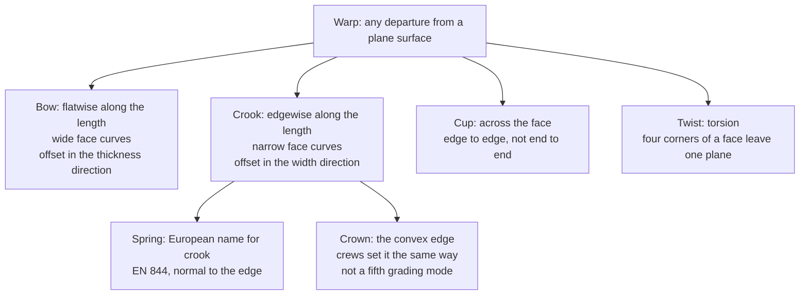

# Framing lumber: warp, site defects, and grain versus mass

Date (America/Los_Angeles): **2026-09-26**. Survey pass only — no scorecard, no generator change, no paint or ε change. Numbers copied from a page opened this pass are labeled with that page. A figure computed here is **derived**. A trade article is not a grading rule.

This note is the wood-characteristics brief behind doc 33 Track B and behind the still-uninjected TrueLevel line “real lumber surface imperfections” in doc 34. It does not edit those locks. Companion: [33-obb-and-deformation-research.md](33-obb-and-deformation-research.md) (Track B centerline, deviation profile, twist slices). S1b scenes: [24-sam2-rank7-and-curriculum.md](24-sam2-rank7-and-curriculum.md), [25-ozpc-sam2-s1b.md](25-ozpc-sam2-s1b.md). Axis diagram source: [diagrams/35-warp-axes.mmd](diagrams/35-warp-axes.mmd). The subsection “Later product: deformation metering” records a later OpenWall offer. It does not claim that offer ships.

## How to read this note

Status words are the same as the [research index](README.md): `known` is in this repo; `surveyed` was checked against a page this pass; `unverified` was not opened or is a secondary retelling. Nothing here is a reinspection of a stamped bundle, an Arizona EMC measurement, or a density calibration of a TruePlank scan.

Dressed size used below is the generator’s 2×4: **38.1 × 88.9 × 2438.4 mm** (1.5 × 3.5 × 96 in). That is a nominal size, not a scanned piece. In `lumber.py`, thickness is the narrow face and is described as running along the wall; width is the 3.5 in face and runs through the wall. Local **X** is thickness, local **Y** is width, local **Z** is length (`synthetic.py`).

---

## 1. Deformations from the mill through the truck into an Arizona job

**Warp** is the umbrella. The National Grading Rule, as printed in the NELMA 2024 grade-rule book (para. 752) and restated by SPIB, is: any deviation from a true or plane surface, including bow, crook, cup, and twist, or any combination. Pieces with two forms are judged on the combined effect. A short kink is not given the full gradual-warp allowance; it is judged by equivalent effect. The USDA Wood Handbook glossary (FPL-GTR-190) uses the same four names. Chapter 13 of the current handbook (FPL-GTR-282) also lists **oval** and **diamond** with those four. The Dry Kiln Operator’s Manual (USDA Agriculture Handbook 188, chapter 8) lists cup, bow, crook, twist, and **diamonding**, and does not treat oval as a stud problem.

### Named modes

| Name | What curves | Where the wood moves | Typical cause | What a framer does with it | Confidence |
| --- | --- | --- | --- | --- | --- |
| **Bow** | Wide face, end to end. NELMA: “deviation flatwise.” WWPA species book: deviation from a flat plane of the **wide** face. | Thickness direction. On a stud in a wall, that is **along the wall**, toward the next stud. | Unequal longitudinal shrinkage on opposite wide faces: juvenile wood, compression wood, or one face drying faster than the other (AH-188; Wood Handbook ch. 13). | Often less visible in the drywall than crook. Severe bow still fights the plates and the bay. | `surveyed` |
| **Crook** | Narrow face (edge), end to end. NELMA: “deviation edgewise.” WWPA: deviation of the **narrow** face. | Width direction. On a stud, that is **in and out of the wall**. | Same longitudinal mismatch, now on opposite edges. Juvenile wood near the pith and compression wood are the usual mill causes (FPL reports on stud warp; OSU EM 8600). Sun on one edge of a pile does it again on site. | This is the wave in the wall. Crews sight it and call the high edge the **crown**. | `surveyed` |
| **Spring** | Same geometry as crook. | Same as crook. | Same as crook. | European sawn-timber word, not the US grade stamp. EN 844-3 (terms still carried on the SRPS adoption page): spring is lengthwise curvature **normal to the edge**; bow is lengthwise curvature **normal to the face**. EN 844:2019 consolidates those parts. | `surveyed` |
| **Crown** | Not a fifth mode. It is the **convex edge** of a crooked (or, in loose crew speech, bowed) piece. | Whichever way the crew sets the high side. | The piece already has crook, or joist crook. | Studs: crowns set the same way so the wall does not snake. Joists and rafters: crown up so load works against the arch. Weyerhaeuser’s Framer Series guide marks the crown on the product and defines bow, crook, and twist in the warranty. That guide is a vendor document. | `surveyed` product doc; crew practice `surveyed` |
| **Cup** | Across the face, edge to edge, not along the length. | The wide face dishes. Bark side of a flat-sawn piece usually becomes the concave face, because tangential shrinkage exceeds radial. | Radial vs tangential shrinkage (Wood Handbook; FPL FAQ: tangential about 7–12% green to oven-dry, radial about 2–6%, longitudinal about 0.1–0.2% in normal wood). | On a 2×4 the face is only 3.5 in, so cup is a small dish, not a lean. FPL Research Paper 102: cup in nominal 2×4 studs is seldom enough to affect grade or use. | `surveyed` |
| **Twist** | All four faces leave one plane. A spiral or torsion. NELMA measures it as the lift of one edge at one end while both edges of the other end sit on a flat surface. | Section heading rotates along the length. Corners will not all touch plates or sheathing. | Spiral grain, diagonal grain, distorted grain, and cross grain (AH-188). Scandinavian mill work (Nyström) ties severe twist after drying to large spiral grain that persists away from the pith; bow and spring there are tied more to compression wood. | A twisted stud will not sit flat on both plates. Crews cull it or split it into blocking. It is not fixed by “crowning” one edge. | `surveyed` |
| **Diamond / oval** | Cross-section, not the long axis. Diamonding: a square’s section goes diamond-shaped when rings run corner to corner (AH-188). | Corners move in the section. | Tangential shrinkage greater than radial. | A framing 2×4 is already rectangular. Crews do not have a separate “diamond” cull the way they have crook and twist. Listed so the Wood Handbook’s six-name list is not collapsed into the four grade-rule names. | `surveyed` |
| **Kink** | A short, sharp crook or bow, not a smooth arc from end to end. | Local. | Handling break, mis-set saw, or a bad sticker. | NGR: do not apply the full-length warp table as if the kink were a gradual bow. | `surveyed` |

**Joist speech versus the grade book.** On a floor joist the wide face is vertical and the narrow face is the top edge. The upward arch a crew calls crown is grading-rule **crook** (edgewise), even when the same person says “crown the bow.” Weyerhaeuser’s warranty text keeps bow = face and crook = edge. TruePlank should store an axis, not the word the crew used.

### Why the shape appears, then grows

Warp in drying has two drivers in the Wood Handbook (ch. 13): (1) radial, tangential, and longitudinal shrinkage are not equal; (2) growth stress. Juvenile wood and reaction wood (compression wood in softwoods) make longitudinal shrinkage much larger than the 0.1–0.2% of normal wood. OSU Extension EM 8600 states that juvenile and reaction wood can reach on the order of 2% longitudinal shrinkage and that the usual warp forms are then bow, crook, and twist. Spiral grain turns that into twist (AH-188; Nyström).

Stacking decides whether the kiln or the yard locks the shape in. Stickers that are not in a straight vertical line, a pile without weight on top, and one face in the sun all dry the piece unevenly. FPL Agriculture Handbook 531: uneven wetting or drying causes warp; green lumber is stickered so both faces dry together; kiln-dried lumber is the opposite problem — it wants to **regain** moisture, so the storage goal is to keep it from picking water back up. Oregon State EM 8612: direct sun dries the exposed layer faster than the interior of the stack.

### Mill, truck, Arizona

Framing softwood is not dried to furniture moisture. The Wood Handbook (FPL-GTR-282, ch. 13) states the usual target as an **average of about 15% moisture content, not to exceed 19%**. That 19% ceiling is the American Softwood Lumber Standard definition of dry lumber under nominal 5 in (NIST PS 20; this pass read the PS 20-25 text). The standardized mark is **S-GRN** if surfaced green, **S-DRY** if surfaced dry, or **KD** if kiln-dried to a maximum of 19% at surfacing. A tighter ceiling such as KD-15 exists only when the certified rules include it; the handbook says a KD 15 mark is generally a 15% maximum. SPIB’s dimension-lumber note: drying to 19% maximum produces an average around 15% at manufacture.

PS 20 also allows size to move after dressing: on the order of 1% shrinkage or expansion for each four points of moisture change (0.7% for redwood and the listed cedars). Warp limits are a grade rule at grading. They are not a promise that the piece is still inside that table after a week in the sun. The stamp identifies mill, agency, species, dry or green, and grade (PS 20 grade-mark clause).

| Leg | Moisture situation | What warp does | Source |
| --- | --- | --- | --- |
| **Dry kiln / planer** | Target about 15% average, 19% max, unless the rules say a lower KD mark. Warp that exceeds the grade is culled or dropped before the stamp. | Bow, crook, and twist from juvenile wood, compression wood, and spiral grain are already in the piece if the sawing put those tissues on one side. Cup is usually minor on a stud (FPL RP 102). | Wood Handbook ch. 13; PS 20-25; SPIB warp note; FPL RP 102. `surveyed` |
| **Yard and truck** | Strapped bundle on dunnage. Handbook jobsite text: supports at least **150 mm (6 in)** off the ground, cover against rain. Kiln-dried stock regains water if the wrap is open in humid air. An open bundle in desert air does the reverse on the outside layers. | Uneven regain or uneven re-drying adds crook, bow, twist, and end checks. A solid (unstickered) bundle that gets rained on holds water (AH-531). | Wood Handbook ch. 13 transit and construction sections; AH-531. `surveyed` |
| **Arizona yard or slab, before the wall** | Outdoor equilibrium moisture content in Phoenix, Wood Handbook Table 13-1 (normals through 2010): monthly cells **8.9, 8.3, 7.4, 6.0, 4.9, 4.4, 6.2, 6.8, 6.5, 6.9, 7.8, 9.0%**. The mean of those twelve cells is **6.9%** (**derived**). June is the low cell (4.4%); December is the high (9.0%). Mitchell’s NCSU compilation of the same normals shows Tucson in a similar band (about 4.5% to about 8.8% by month). | A stud that left the mill near 15–19% is still wet relative to desert air. The top of a broken bundle in direct sun dries first (EM 8612; Weyerhaeuser storage sheet says avoid extended direct sun). The bottom course on a slab can stay wetter. That gradient is a same-week crook and twist machine, especially on pieces that already contain juvenile or compression wood. | Table 13-1 `surveyed`; 6.9% mean `derived`; sun `surveyed` |
| **After the building is closed** | Interior **woodwork** in the dry Southwest is a different target: Table 13-2 in the opened chapter lists about **6% average** (individual pieces about 4–9%) for interior woodwork, flooring, and furniture. That row is not the framing grade. Exterior siding and sheathing in the same table sit higher (the opened text places a 9% / 7–12% dry-Southwest series on that exterior row). The handbook’s framing rule of thumb: if, when finishes go on, framing moisture is within about **5 points** of what it will reach in service, shrinkage damage stays small. Heated houses in cold climates are described as reaching about 6–7% in studs; mild climates stay wetter. | Further crook, twist, and nail-line movement can show up after the wall is straight and before drywall, or as nail pops after close-in if the gap was larger than that 5-point guide. Monsoon rain on an open frame (the Phoenix table’s summer EMC rises off the June low, but rain is not the same as EMC) rewets KD lumber; the following dry-down checks and warps it (AH-531). | Table 13-2 `surveyed` as read from the chapter PDF (row labels in that extract are easy to mis-assign; the interior dry-Southwest 6% / 4–9% pair is the clear one). JLC “Drying Wet Framing” is **trade press**: the author treats occupied-house studs as often near 10–12% and aims for 15% or lower before drywall on kiln-dried stock. Not a code number. `surveyed` as journalism |

Flagstaff’s outdoor EMC in the Mitchell table is higher than Phoenix (annual pattern near 7–11.5% by month). A “Arizona” scan is not one moisture state. Phoenix valley summer is the harsh dry case; the high country and a July storm are different.

### Stud-grade warp numbers (so a scan has a scale)

Stud grade in the NELMA 2024 National Grading Rule text (para. 11.0, all species, 2 to 4 in thick): **warp — 1/2 of medium**, para. 752. Bow, for thickness of 2 in and under 3 in, is **twice the crook allowed for 2 in faces**. Crook and twist come from the framing tables. Cup has its own small table.

For an **8 ft** piece, the framing crook table cell for **medium** at **4 in** width is **1/2 in**. Half of medium is **1/4 in** of crook (**derived** from “1/2 of medium” × that cell). The twist table cell for medium at 8 ft and face width “3 in & 4 in” is **3/4 in**. Half of medium twist is **3/8 in** (**derived**). FPL Research Paper 164 (1971), Table 1, published the then-new stud-grade limits for an 8 ft piece as crook **0–8/32 in (1/4 in)**, bow **0–24/32 in (3/4 in)**, twist **0–12/32 in (3/8 in)**, and footnoted them to the National Grading Rule. Crook and twist match the half-of-medium reading. Bow is the ambiguous cell. The same paragraph says bow is **three times** the crook allowed for 2 in faces when the piece is under 2 in thick, and **twice** that crook when it is 2 in thick and under 3 in. Three times the 1/4 in half-medium crook is **3/4 in** (**derived**), which matches the 1971 table. Twice that crook is **1/2 in** (**derived**). A nominal 2×4 is called 2 in and dresses to 1.5 in, so which sentence applies is a rules question, not a scan result. Do not average 1/2 in and 3/4 in into a new limit. Cup on a 4 in face at medium is **1/16 in** in the NELMA cup table; half of that is **1/32 in** (**derived**). That is why cup rarely decides a stud.

These are grade caps at grading, on nominal measurement (NGR interpretations: splits and warp are based on nominal). They are not TruePlank pass bars. The industry plumb figure used elsewhere in this repo (1/4 in in 10 ft, about 0.12°, about 5 mm of tip on 8 ft) is a **straight-piece** lean. A stud can be inside that chord angle and still be 1/4 in crooked at midspan.

### What this means for TruePlank (doc 33 Track B)

Doc 33 keeps minimal OBB as the Stage0 box and treats bow and twist as **extra fields** (centerline versus chord, then a twist profile). This note only names the shapes those fields would have to separate. It does not add the fields, and it does not change paint or ε.

`_apply_bow` in `synthetic.py` holds the ends and moves midspan on a parabola along local **X or Y**. The default `bow_axis` on `s1b_bowed_stud` is **Y**. Local Y is the **width**. In the wall convention of `lumber.py`, a Y offset is grading-rule **crook** (stud crown, in and out of the wall). A parabola on local X would be grading-rule **bow** (along the wall). The scene name says bow either way. Doc 33’s “midspan bow versus chord” is that geometric offset. A customer sentence should say which axis.

| Industry shape | Track B item that can see it | What a rigid OBB does | In the generator today |
| --- | --- | --- | --- |
| Bow or crook, one smooth arc | B1 slice centerline, midspan versus chord; B2 deviation profile. The report needs the axis (thickness vs width), or the number is unnamed. | Encloses the arc. Section grows. Angle follows the **chord**. Doc 24/25 already show that on S1b. | Default S1b is one parabola on Y (crook axis). Amplitudes used in the curriculum probes include **6.35 mm and 19.05 mm**, which equal **1/4 in and 3/4 in** (**derived**, ×25.4). That match to the stud crook cap and the 1971 bow cap is arithmetic, not proof the generator was cut to the grade table. |
| Twist | B4 per-slice heading. A centerline alone stays almost straight while the section rotates. | Box fattens and yaws. One lean angle is the wrong summary. | Not in the S1b generator. Doc 33 already says so. |
| Cup | A section residual across the face, not a centerline. Doc 33’s phrase “which face is cupped” is this mode. | Slight section inflation. Lean barely moves. | Not generated. Perfect dressed faces. |
| Combined warp, or a kink | NGR combination rule: proportionate amounts, not a full allowance of each. A kink is local. One midspan number under-reports it. | One prism averages them. | One parabola. |
| Wane, checks, knots | Not deformation. Section 2. They bias a surface sample and a minimal box the same way missing faces do. | Box follows visible points. | Not generated. Doc 33 lists them as a future TrueLevel source, still not injected. |

Stage0 remains a straight dressed prism plus sampling noise. Arizona warp is a reason Track B exists. It is not a reason to repaint Stage0.

### Later product: deformation metering

Oz and OpenWall’s later business direction is to offer products that determine twist and the other deformations on a stud, under the grading-rule names in this note: **bow** (flatwise, along the wall), **crook** and its **crown** edge (edgewise, in and out of the wall), **cup** (across the face), and **twist** (torsion along the length). Stage0 today is the lean of a straight piece, from the shared minimal OBB. Deformation metering is doc 33 Track B and later business development. It is not a field on the current scorecard.

The measurement stack for that offer is the Track B order already written there, still unbuilt. B1 and B2 (slice centerline, then a deviation profile) are the bow and crook meters; the report stores the axis, so a local-Y offset stays crook and a local-X offset stays bow. B4 (per-slice heading) is the twist meter; a centerline alone misses a stud whose section rotates while the chord stays straight. Cup is a residual across the face, not a midspan number. Crown is which edge of a crook is high, not a fifth mode and not a fifth product. Combined warp and a kink follow the grade-rule reading above; one midspan scalar under-reports them. Wane, checks, and knots stay the section 2 cull list. They are not warp meters.

No ship date and no price are set here. Paint stays yellow while device ε is unlocked. Minimal OBB stays the Stage0 box. This subsection adds no scorecard field and does not change S1b.

---

## 2. Surface and edge imperfections crews reject or downgrade

Crews on a residential frame are not running a grade stamp. They are asking whether the piece will bear, take a nail, and leave a flat wall. The stamp is the code hook: 2024 IRC **R602.1.1**, as quoted in the ICC hearing document opened this pass, requires sawn lumber to carry a grade mark of an accredited agency with design values certified under DOC PS 20, or a certificate of inspection in lieu of the mark. APA (The Engineered Wood Association) is the panel side of that world — plywood under PS 1 and OSB under PS 2 — not the writer of solid-sawn stud warp rules. Those rules sit with the ALSC-certified agencies (WWPA, SPIB, NELMA, WCLIB, NLGA, and the others) under the National Grading Rule.

Limits below are **Stud** grade from the NELMA 2024 NGR text (para. 11.0) unless noted. Select Structural and No. 1 are tighter. A piece can be inside Stud and still get pulled from a wall by a crew. That is a use decision, not a claim that the stamp was wrong.

| What crews say | What it is | Where it sits | Why it gets pulled or dropped a grade | Stud-grade ceiling (NELMA 2024 para. 11.0) |
| --- | --- | --- | --- | --- |
| **Wane** | Bark, or wood missing from any cause, on an edge or corner. Eased edges do not count (Wood Handbook glossary; WWPA species book). | Corners and edges. Worst for framers when it is on the end that lands on the plate, or on the narrow face that takes sheathing and drywall nails. | Bearing area disappears. There is no wood for the nail. The NGR wane interpretations (SPIB) already treat wane as an equivalent loss of section, including wane that crosses a face. | 1/3 of the thickness and 1/2 of the width for the full length, or equivalent, and not over 1/2 the thickness and 3/4 the width for up to 1/4 the length. |
| **Check** | Separation **across** the growth rings, usually from drying stress (WWPA; NGR). A surface check is open on one face. A through check reaches another face. | Faces and ends. Ends check first because water leaves faster along the grain (EM 8612). | Face seasoning checks are normal on dry studs and are usually left in the wall. A through check at the plate acts like a split: toenails follow the crack. | Seasoning checks not limited. Through checks at ends are limited as splits. |
| **Split** | Separation **through** the piece to the opposite face or an adjoining face, from the wood tearing apart. Usually at the ends (WWPA species book; NELMA glossary). | Ends, then up the length. | The connection is the end. A split under the plate nail or at a toenail means the fastener is wedging the split open. Crews cut back to sound wood or cull. | Length up to **twice the width** of the piece. |
| **Shake** | Separation **along** the grain, mostly between the rings (ring shake), not the across-ring seasoning check. Crews often call every crack a check. The stamp does not. | Along the piece, sometimes through the edge. | A through shake is a plane of weakness and a place a nail escapes. | If through at the ends, limited as splits. Elsewhere, through shakes up to 1/3 the length. |
| **Knot** | A branch buried in the piece. Sound and tight, or loose, or a hole where the branch fell out. A **spike knot** is a branch cut along its length on the edge. | Anywhere. Edge and spike knots land on the nailing face. | A hole or a loose knot at the plate loses bearing and blows a nail through. An edge knot breaks out when the stud is crowned into line. Centerline knots on a stud matter less for a short compression member than they do for a joist in bending, which is why Stud allows larger centerline knots than edge knots. | Quality not restricted, but well spaced. On a **4 in** nominal width: edge of the wide face **1-3/4 in**, centerline **2-1/2 in**, holes **1-1/2 in**, one hole or equivalent per lineal foot. |
| **Grain runout** (slope of grain) | Fibers leave the edge instead of running with it. ASTM D245: a slope of 1 in 15 means the grain drifts 1 in off the edge in 15 in of length. Local swirl around a knot is not the general slope. | One or both edges, often the whole length if the log was sawn across spiral grain. | The piece splits when nailed, and bending strength drops as the slope gets steeper. Studs are mostly compression, so the grade allows more slope than a joist grade. The published Stud design values already assume that limit; the site question is whether this piece is worse than its stamp, not a new engineer’s ratio. | **1 in 4**. Select Structural in the same NELMA NGR text is **1 in 12**. No. 2 structural light framing in that text is **1 in 8**. |

ASTM D245 Table 1 is why slope is limited at all. The PDF of D245-00 (reapproved 2002) opened this pass gives these maximum strength ratios (bending or tension parallel, then compression parallel): **1 in 6 → 40% / 56%**, **1 in 8 → 53% / 66%**, **1 in 10 → 61% / 74%**, **1 in 12 → 69% / 82%**, **1 in 14 → 74% / 87%**. The next contiguous figures in that extract are **1 in 15 → 76%** bending and **100%** compression parallel, and **1 in 20 → 100%** bending. The file was not an ASTM.org download; check a current ASTM copy before using a ratio in design. Stud’s **1 in 4** is steeper than the 1-in-6 row. This note does not invent a ratio for 1 in 4.

Other culls that show up in the same grade paragraph, in crew language:

- **Skip** (hit-and-miss, hit-or-miss, heavy skip): the planer missed. The face is under the dressed size in spots. Stud allows hit-or-miss, with heavy skip on wide faces in up to 10% of the pieces. A skip on the plate end is a rocking stud.
- **Unsound wood, white speck, honeycomb, peck**: soft or pitted wood. Stud allows it only if the nailing edge survives, and only in spots or streaks up to 1/3 of the cross section. If the edge crumbles under a nail, the piece is done regardless of the stamp language.
- **Compression wood**: dark, abrupt latewood, often on one side of a stud sawn from a leaning tree. It is the warp factory in section 1, and it breaks brittle. Crews more often see the crook than the tissue. AH-188 and OSU EM 8600 describe it; it is not a separate NGR “reject name” in the stud paragraph above.
- **Blue stain**: color from fungi in the sapwood. Framing crews rarely cull it for strength. It is not wane and not decay. Listed so a camera pass does not promote it to a structural defect.

A scan of the narrow face (the drywall side) sees the nailing edge, end wane, end splits, and edge knots. A scan of the wide face sees spike knots, cup, and skip. One side of a stud in a sheathed wall is hidden. Doc 33 already notes that a minimal box encloses only the visible points.

---

## 3. Grain texture, density distribution, and center of mass

Question: can the grain a camera sees, or the return a LiDAR records, estimate how density is spread inside the stud, and thus where the center of mass sits?

**Center of mass** here means the balance point of the piece: each bit of volume weighted by its density (including water). If density is uniform, that point is the geometric centroid of the shape. Warp moves the geometric centroid off the end-to-end chord. A density map moves the center of mass off the geometric centroid. Those are different shifts. TruePlank’s lean and doc 33’s centerline are geometric. They are not a mass property.

### What is actually known

| Evidence | What it supports | What it does not support | Confidence |
| --- | --- | --- | --- |
| **Scale weight, species, and moisture** | Whole-piece mass. Moisture content is water mass over oven-dry mass. Dropping from 19% to 8% MC multiplies total mass by 1.08/1.19, about **9% lighter** (**derived** from that definition, not a weighed stud). Species average specific gravity is tabulated in the Wood Handbook. That gives a bundle weight, not a map. | Where along the stud the mass sits. | `surveyed` definition; 9% figure `derived` |
| **X-ray and CT** | A real density image. Macedo and others, *Holzforschung* 2002: a calibration from X-ray and gamma CT to dry bulk density, checked on a second set of species, with a reported linear **R² of 0.94** against gravimetric density. Lindgren (1991) is the earlier medical-CT wood-density line. Freyburger and others, *Annals of Forest Science* 2009, review CT wood density. Internal knots, wet pockets, and earlywood/latewood are in the volume. | A jobsite phone or a framing LiDAR. CT is a lab or mill scanner. | `surveyed` |
| **Latewood fraction versus average specific gravity** | Dense latewood versus lighter earlywood is the main within-ring density contrast. A Forest Service synthesis opened this pass reports Paul (1958) loblolly averages of about **0.31 earlywood and 0.63 latewood**, and Megraw’s observation that latewood specific gravity can exceed **three times** earlywood in a ring. Latewood percentage is a strong predictor of average density in conifers with a clear earlywood/latewood break (Wood and Fiber Science treatments of that identity). Mill and patent methods estimate latewood percent from images of the faces or the end and then specific gravity (example: US patent application 2010/0158309). | A 3D density field from a side photo of a dressed stud. The correlation is for **average** specific gravity after a species calibration. It is ring-specific. It is not a center-of-mass measurement. | `surveyed` |
| **Tracheid-effect laser scattering** | Grain **angle**, which is section 2’s slope of grain and section 1’s twist risk. The laser spot stretches along the fibers. Nyström’s mill work predicted twist from spiral grain on logs (reported coefficient of determination **0.76** in that thesis summary). Brännström, Manninen, and Oja, *BioResources* 2008, use the same effect for strength. Spot size and shape have also been **associated** with density, resin, juvenile wood, and compression wood; the 2008 paper cites Simonaho and Silvennoinen for a density link. That is a calibrated laser instrument, not a glance at RGB grain. | Uncalibrated photogrammetry texture as a density meter. | Grain angle `surveyed`; density-from-spot `surveyed` as cited inside the 2008 paper, not re-read at the Simonaho source (`surveyed; secondary`) |
| **End-grain image to a density mesh** | A Queensland DPI / CLT methods paper builds a virtual panel from an **end-grain** photo: rings, pith, then a logistic map from position in the ring to density, extruded along the board. They are explicit that CT is the density method they are avoiding because of cost and size. | A wall scan. The input is the cut end, which a stud in a plate does not show, and the density law is supplied, not discovered from face grain. | `surveyed` |

### What is a weak analogy

**RGB or photogrammetry grain on the faces.** Flat-sawn versus quarter-sawn figure, knot locations, and sometimes latewood bands are visible. That constrains ring orientation and where a knot breaks the surface. Turning those pixels into a density volume still needs a species model for earlywood, latewood, and knot density, plus an assumption about the wood you cannot see. On a wall, the camera usually sees the **narrow** face (1.5 in). A flat-sawn stud shows more ring contrast on the wide face, which faces the next stud and is often occluded. Texture is a clue to slope of grain and to knots (sections 1 and 2). It is not a calibrated mass distribution.

**LiDAR intensity.** Intensity is a return amplitude. Range, incidence angle, moisture, and the scanner’s own calibration all move it. Forestry papers relate corrected intensity to canopy or fuel moisture more often than to the density difference between earlywood and latewood inside one board. This pass did not find a stud-scale result that turns survey-TLS or phone-LiDAR intensity into a center of mass. Treat intensity-as-density as **open**, not as a method waiting to be turned on. Geometry from the same cloud does give volume and the geometric centroid. Mass still requires a density.

### What is open

No result in this repo, and no paper read this pass, estimates the center of mass of a framing stud from RGB grain or from LiDAR intensity and then checks it on a scale. The honest stack, if anyone built it, would be: CT or a scale as truth, species and moisture as the first variables, tracheid-effect or end-grain latewood as a mill-style average, and face texture only as a prior on knots and ring orientation. That is a research project. It is not a Stage0 feature.

### What construction people actually feel

Weight that changes a crew’s day is **whole-piece and whole-bundle**: species, green versus KD, and rain. A stud that leaves the mill near 19% and dries toward desert EMC loses on the order of a tenth of its mass (**derived** illustration above). A rained-on stud gains more than that and is what people mean by “heavy stock.” Intra-board center of mass is a small shift next to that. A knot that is 1% of the piece mass and 300 mm off mid-length moves the center of mass by about **3 mm** (**derived**: offset ≈ mass fraction × distance). Stud-grade crook at 1/4 in is **6.4 mm**. The plumb tip budget used in this repo is about **5 mm** on 8 ft. Geometry of crook and twist dominates mass offset.

Self-weight plumb of a single stud is not a practical failure mode beside crook. An 8 ft 2×4 is a light column. The wall goes out of plumb because the stud was crooked, twisted, or set that way, not because latewood sat on one edge. Crown-up on joists is a **geometric** camber practice against load, not a density map. Crane picks and scaffold boards are bundle and placement problems; a density image of one stud does not change the pick.

### Hypothetical scan product (not a commitment)

If a later TruePlank pass ever used grain, the parts that match the evidence are:

1. **Axis-labeled warp** — bow versus crook versus twist versus cup — as the doc 33 extra fields, in millimeters against the chord, with the grade-table numbers in this note as a human scale only.
2. **Visible cull hints** — end wane, end split, edge knot, skip on the nailing face — as labels, not as a new grade stamp.
3. **Not** a center-of-mass estimator from RGB or intensity. Average piece weight, if anyone needs it, is a moisture meter plus species, or a scale. Optical latewood or a tracheid-effect scan could be a side study of average specific gravity, validated against that scale, and would still not move lean paint.

Stage0 paint stays yellow while device ε is unlocked. Minimal OBB stays the shared box. This section does not add a metric.

---

## Status summary

| Claim | Status |
| --- | --- |
| Warp names bow, crook, cup, twist, and the measurement sentences | `surveyed` (NELMA 2024 para. 752; SPIB; WWPA species book; Wood Handbook glossary) |
| Spring = crook in EN 844; crown is the convex edge, not a grade mode | `surveyed` |
| Default S1b parabola is on local Y (width) = grading-rule crook under the wall convention in `lumber.py` | `known` (code this pass) |
| Phoenix outdoor EMC monthly cells and the 6.9% mean of those cells | Cells `surveyed` (Wood Handbook Table 13-1); mean `derived` |
| Stud warp “1/2 of medium”; 8 ft crook 1/4 in and twist 3/8 in | Table cells `surveyed`; half-of-medium `derived`; 1971 FPL RP 164 table `surveyed` and agrees on crook and twist. Bow is 3/4 in if the “under 2 in → 3×” sentence applies (matches 1971) and 1/2 in if the “2 in and under 3 in → 2×” sentence applies. Both are **derived**. Not averaged |
| Stud limits for wane, checks, splits, knots, slope 1 in 4 | `surveyed` (NELMA 2024 para. 11.0) |
| ASTM D245 slope-of-grain strength ratios quoted above | `surveyed` from a D245-00 (2002) PDF that was not ASTM.org; confirm before design use |
| CT density maps; latewood vs average SG; tracheid effect for grain angle | `surveyed`. Density-from-laser-spot is `surveyed; secondary` |
| RGB grain or LiDAR intensity → stud center of mass | **Not supported.** Open research. Geometric centroid is not mass |
| Paint, ε, minimal OBB, Stage0 locks | Unchanged. This note does not inject lumber defects into TrueLevel |
| Later offer: meter bow, crook (and crown), cup, and twist on studs | Direction only. Stage0 remains lean via minimal OBB. The meters are doc 33 Track B and are not implemented. No date, no price |

**Bottom line.** Name the axis: bow is flatwise, crook (spring) is edgewise, cup is across the face, twist is torsion, crown is the high edge of crook. Arizona’s outdoor EMC is far below the 15–19% framing mill target, so pieces keep moving after the stamp, especially in the sun on a broken bundle. Crews cull wane, end splits, and bad edge knots because nails and bearing fail, not because the wood looks busy. Grain and intensity are not a center-of-mass instrument; CT and a scale are. For TruePlank the useful extension of doc 33 is still a centerline and a twist profile with the axis labeled, plus an honest list of visible culls — not a density field, and not a new paint rule. The later product direction is to offer that metering beside today’s lean call. It is not on the scorecard.
