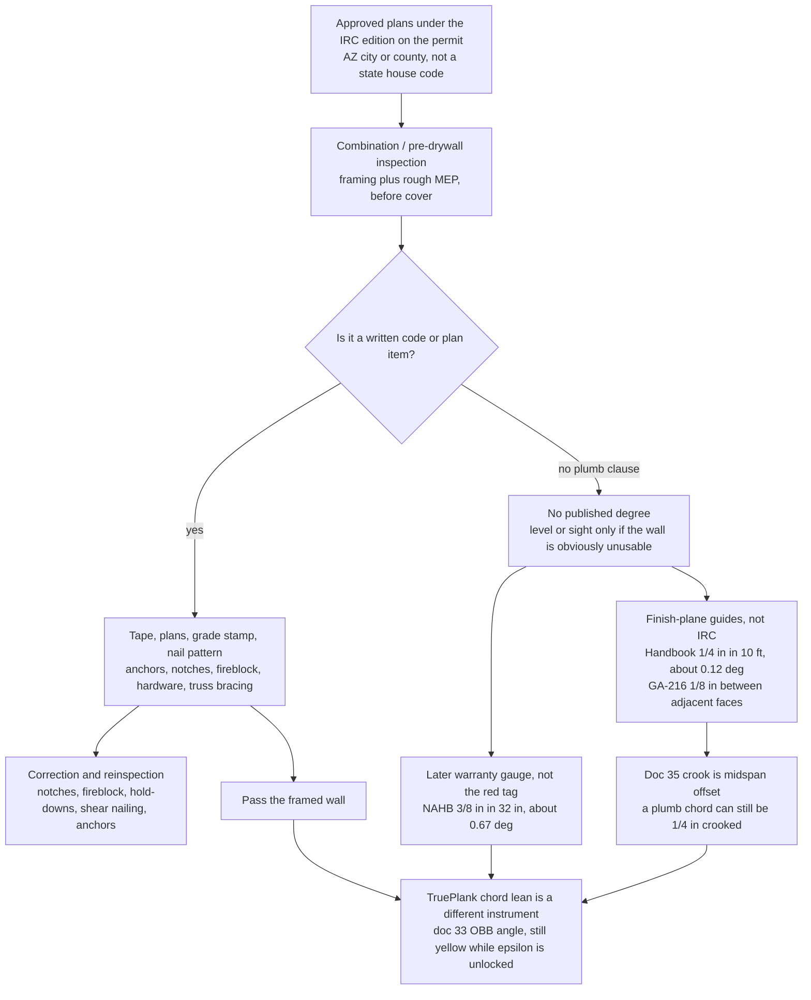

# Arizona residential framing standards and inspector tolerances

Date (America/Los_Angeles): **2026-09-26**. Survey pass only — no scorecard, no generator change, no paint or ε change. A number copied from a page opened this pass is labeled with that page. A figure computed here is **derived**. A trade article is not a code section. A warranty booklet is not an inspection fail.

This note is the code and inspector brief behind the lean question in doc 33 and the warp question in doc 35. It does not edit those locks, and it does not edit docs 31–34. Companions: [33-obb-and-deformation-research.md](33-obb-and-deformation-research.md) (chord lean from a minimal OBB; bow and twist as extra fields), [35-framing-lumber-wood-characteristics.md](35-framing-lumber-wood-characteristics.md) (grade-rule crook, bow, twist; Arizona moisture), [../tolerances.md](../tolerances.md) (the 1/4 inch in 10 feet conversion already used in this repo). Diagram source: [diagrams/36-inspector-tolerance-stack.mmd](diagrams/36-inspector-tolerance-stack.mmd).

## How to read this note

Status words are the same as the [research index](README.md). Nothing here is a ride-along with a Pinal, Maricopa, or Pima inspector, a count of KB Home correction notices, or a new TruePlank pass bar.

The product class is a **1,000–4,000 sq ft, one- or two-story wood stick-frame house**. The IRC has no floor-area cap that moves a house of that size out of the residential code. What moves it is stories and egress: detached one- and two-family dwellings and townhouses not more than three stories above grade plane, with a separate means of egress, are the IRC’s scope (the scope sentence in the Phoenix and Pima adoption texts). A house in that class is not an IBC building unless the local amendment says so.

**Incorporated cities are not the county.** Volume subdivisions in the Phoenix and Tucson metros are usually permitted by the city, not by the unincorporated-county building official. Both are listed below. The county row is the unincorporated area only.

---

## 1. Nationwide baseline

The model code for this house is the **International Residential Code**, published by ICC. The current model edition is **2024**. Jurisdictions adopt an edition by ordinance and then amend it. A house under construction in September 2026 is governed by the edition on its permit, which is often still 2018 or 2021 because Arizona cities vest the code at application. Mesa, Buckeye, the City of Maricopa, and the Maricopa County transition sheet all say that in public.

Related books the IRC points at, and that a stick-frame plan actually uses:

| Book | Role on a wood house | Plumb number inside it? |
| --- | --- | --- |
| **IRC Chapter 6** (wood wall framing), **Chapter 5** (floors), **Chapter 8** (roof and trusses), **R403.1.6** (anchor bolts) | Prescriptive studs, plates, headers, nailing, bracing, notches, fireblocking | No general stud-plumb tolerance. One explicit alignment tolerance is in the single-top-plate exception: rafters or joists centered over the studs within **1 inch**. Opened in the 2024 wall chapter via the New York and Phoenix UpCodes texts. `surveyed` |
| **IRC Chapter 3** climatic table (R301.2) | Wind, seismic, snow, frost, termites. The local ordinance fills the table. Section numbers in Chapter 3 moved between 2018 and 2024; Chapter 6’s R602 numbers used below are the ones that matched in both editions opened this pass. | No |
| **AWC NDS** and **SDPWS** | The IRC allows design by the NDS, and braced-wall capacities track SDPWS nailing. WoodWorks states there is **no** light-frame construction-tolerance requirement in the IBC or the NDS. | No. `surveyed` ([WoodWorks expert tip](https://www.woodworks.org/wp-content/uploads/expert-tips/expert-tips_construction-tolerances-for-light-wood-frame-projects.pdf), ©2026 page) |
| **AWC Wood Frame Construction Manual** | An engineered alternative the IRC permits where wind or seismic takes the house out of the prescriptive tables. Valley speeds below stay inside ordinary prescriptive bracing for a typical Exposure B house. The engineered-wind gate is R301.2.1.1 and is exposure-specific; this pass does not quote a single mph cutoff from it. | No plumb clause found |
| **DOC PS 20** and the grade-mark agencies (WWPA, SPIB, NELMA, and the others) | IRC requires a grade mark or a certificate of inspection. Warp limits are grade rules at the mill, already written up in doc 35. | Warp caps, not a wall-plumb cap |
| **IBC** | Apartments and other buildings outside the IRC scope. Not the book for this house unless a local amendment pulls it in. | Masonry and concrete have their own plumb rules. Wood light-frame still does not, per WoodWorks. |
| **TMS 602 / masonry** | Contrast only. Masonry construction tolerances are on the order of **1/4 inch in 10 feet**, **3/8 inch in 20 feet**, **1/2 inch** maximum. That is a masonry specification, not a stud specification. Listed so the familiar “1/4 inch in 10 feet” sentence is not borrowed into wood by accident. | Masonry text, not wood. This pass did not re-open TMS 602; the figures are the standard statement of that specification (`surveyed; secondary` via the usual TMS 602 Article 3.3 recitation). |

**What Chapter 6 does require, and what an inspector can measure with a tape.** These are code text, not folklore. Wording below follows the 2024 IRC wall chapter as opened on UpCodes (Phoenix and New York texts of that chapter) and the 2018 fastening and notching descriptions in the ICC public PDFs. Local amendments opened in section 2 did not rewrite these limits.

| Item | Code rule (paraphrase, not a substitute for the book) | What “fail” looks like |
| --- | --- | --- |
| **Stud size, height, spacing** | Table R602.3(5). Utility grade is restricted: not more than 16 inches on center, not more than a roof and ceiling, and not over 8 feet for exterior and bearing walls (10 feet for interior nonbearing). | A 2×4 at 24 inches on center under a floor, or a utility stud used as a tall bearing stud. |
| **Grade stamp** | Sawn lumber identified by a grade mark of an accredited agency, or a certificate. Doc 35 cites the 2024 IRC grade-mark section as quoted in an ICC hearing document. | No stamp, or a grade below the plan. |
| **Double top plate** | End joints offset at least **24 inches**. Joints need not land on a stud. A single top plate is allowed only with the listed ties, and with rafters or joists centered over studs within **1 inch**. | Splice offset short of 24 inches and no strap. The 1 inch figure is a real code tolerance. It is about load centering, not about plumb. |
| **Notches and holes** | Bearing studs: notch depth not over **25 percent** of the stud depth. Nonbearing: **40 percent**. Bored holes not over **60 percent** of the depth, edge of the hole not less than **5/8 inch** from the edge, hole not in the same section as a notch. A bearing-stud hole over **40 percent** requires a doubled stud, and not more than two successive doubled studs bored that way. Top plate cut more than 50 percent of its width needs a **16 gage** metal tie, **1-1/2 inches** wide, with eight 10d nails each side, extending at least 6 inches past the opening, unless that side of the wall is covered with wood structural panel. | A plumbing notch through a bearing 2×4. On a dressed 3.5 inch stud, 25 percent is **0.875 inch** and 40 percent is **1.4 inch** (**derived**). |
| **Headers** | Table R602.7 (or the plan’s engineered member) from span, story count, and the snow load in Table R301.2. King and jack (trimmer) studs as the table or the plan requires. | Header depth smaller than the plan. In the valley the published snow load is 0 psf or “N/A”, so the table column is the low-snow / roof-live case, not a mountain snow case. |
| **Nailing** | Table R602.3(1) for stud-to-plate, stud-to-stud, and built-up members. Braced-wall panel nailing is the schedule on the **approved plan** (edge and field spacing, nail diameter). Edge nails that miss the stud (“shiners”) do not count. | Wrong nail, wrong spacing, overdriven heads, missing hold-down nails. |
| **Braced wall** | R602.10. Panel location, length, and method come from wind speed, seismic category, story, and the method (wood structural panel, let-in brace, and the others). Continuously sheathed edges need blocking. | Panel too short, nailed at 6 inches when the plan says 4 inches, missing end-post or hold-down. |
| **Anchor bolts** | R403.1.6. Minimum **1/2 inch** bolts, not more than **6 feet** on center, at least **7 inches** into the concrete, at least **two per plate**, one bolt not more than **12 inches** and not less than **seven bolt diameters** from each end of the plate section, bolt in the middle third of the plate width, nut and washer tightened. Interior braced-wall sole plates on a slab follow the same section. | Bolt past 12 inches from a splice, one bolt on a short plate, nut loose, bolt in the edge of the plate. |
| **Plate washers, 3 × 3 × 0.229 inch** | R602.11.1, in the 2024 text opened this pass: required for buildings in Seismic Design Categories **D0, D1, and D2**, and for **townhouses in SDC C**. | Not a blanket rule for a detached house in SDC B. A plan may still call them out. Do not import them from a Washington or California checklist. |
| **Fireblocking** | R602.8 and R302.11. Concealed stud spaces at ceiling and floor levels, at horizontal intervals not over **10 feet**, and at soffits, stairs, chases, and around pipes and vents, with the listed materials. | Open soffit or dropped ceiling with no block. This is a top national correction item (section 4). |
| **Decay and termites** | R317 and R318. Treated sill where the code requires it. Fasteners in treated wood are hot-dip galvanized, stainless, silicon bronze, or copper (R317.3). Arizona ordinances then add a local termite practice (section 2). | Untreated plate on concrete, bright nails in treated wood, missing soil-treatment certificate where the local amendment requires one. |
| **Trusses** | R802.10 and the truss sheet. Bracing, hangers, bearing, and no field cuts except as the engineer allows. | Missing permanent bracing. National surveys put this at the top of roof-framing misses. |
| **Point load** | R301.1 and the plan. A girder, column, or bearing wall lands on a stud pack, post, or beam that continues to the foundation. | A beam sitting on a single stud with nothing under it. |

**What Chapter 6 does not say.** It does not say a stud must be within 1/4 inch of plumb in 8 feet, or within any degree. WoodWorks says the same for the IBC and the NDS. Stair rise and run **do** have a code tolerance (the variation between the largest and smallest riser or tread is limited; the Cave Creek checklist cites **3/8 inch** under R311.7.5.1 and R311.7.5.2). Inspectors measure stairs because the sentence exists. They do not have an equivalent sentence for a stud.

---

## 2. Arizona adoption, then the three counties

Arizona does not adopt one residential building code for all stick-frame houses. Cities adopt by reference under **A.R.S. § 9-802** (ordinance published, copies on file with the clerk). Counties that have zoning may adopt a building code for the **unincorporated** zoned area under **A.R.S. § 11-861**. The same section bars a county from requiring fire sprinklers in a detached single-family house or a residential building of not more than two dwelling units, with a carve-out for ordinances adopted before 31 December 2009. That is why Pinal and Pima amendments change IRC sprinkler language from “shall” to optional or delete it. Sprinklers are not a plumb rule. They are the amendment people notice first.

The state fire marshal’s fire code is a different book and does not set stud plumb. UpCodes’ Arizona note says the same thing in shorter form: outside a few statewide fire and health-care adoptions, ask the local government.

**Where the amendments live.** County ordinance or city code chapter titled building or construction; a PDF “amendments to the IRC” next to the building-safety page; the climatic table the ordinance inserts into R301.2. The model IRC itself is copyrighted and is usually not hosted in full. ICC’s public digital library is the unamended book. Read the amendment PDF beside it.

### Unincorporated counties

| AHJ | IRC on the books at this survey date | Where to read it | Framing-relevant local text actually opened |
| --- | --- | --- | --- |
| **Maricopa County** (unincorporated) | **2018 IRC**, Board of Supervisors 17 August 2022, with AZBO/MAG amendments. County ordinances page. A transition sheet on ready.maricopa.gov says the Board adopted the **2024** I-codes on **21 October 2026**, effective **20 November 2026**, with 2018 remaining available into 2027 for plans already in process. **That adoption date is after this note’s date.** Until an ordinance dated on or before 26 September 2026 says otherwise, the page that is in force is the 2018 adoption. | [Ordinances, Regulations and Codes](https://www.maricopa.gov/2271/Ordinances-Regulations-and-Codes). The “Local Additions and Addenda (2022 Version)” is linked from that page. The DocumentCenter PDF this pass actually opened is dated **8 October 2014** and amends the **2012** IRC. It has no R602 section. The 2022 file’s framing edits were **not** extracted here. | No stud-plumb amendment found in the 2014 text. Do not treat that file as the 2018 amendment set. `surveyed` for the 2018 adoption date; 2022 addenda contents `unverified` |
| **Pima County** | **2024 IRC**, Ordinance 2025-15 Exhibit B, effective **1 January 2026**, with the 2023 NEC. County building-permits page and [code § 15.04.020](https://codelibrary.amlegal.com/codes/pimacounty/latest/pimacounty_az/0-0-0-9325). | [Building Permits Resources](https://www.pima.gov/1038/Building-Permits-Resources) links the amendment PDFs. Exhibit B text opened: [asset on pima.gov](https://www.pima.gov/asset/2f62bbcc-b366-416d-b40e-848de7a0e479). | Table R301.2: snow **0 psf below 4,000 ft**, then 20/40/60/80 psf in higher bands; wind **105 mph** 3-second gust; **SDC B**; frost **0 below 4,000 ft**, 24 inches above; termite **moderate to heavy**. **R802.11.1 replaced** for “microburst”: either design uplift at **110 mph** in Table R802.11, or a prescriptive path with **500 lb** uplift connectors at not more than **24 inches**, doubled at king/trimmer studs, and continuous sheathing or straps across the rim. Sprinkler mandate deleted. **No Chapter 6 plumb edit.** `surveyed` |
| **Pinal County** | **2018 IRC**, [PCDSC § 6.05.030](https://library.municode.com/az/pinal_county/codes/development_services_code_and_floodplain_management?nodeId=DEVELOPMENT_SERVICES_CODE_TIT6BUCO_CH6.05BUCO_6.05.030BUCO), Exhibit B. Building Safety page lists the same 2018 set. Ordinance text adopted 2019. | [Building Safety](https://www.pinal.gov/189/Building-Safety) and the [2018 ordinance and amendments PDF](https://intranet.pinal.gov/DocumentCenter/View/425/2018-Building-Code-Ordinance-and-Amendments-PDF) (also linked from the applications page). | Exhibit B was read in full this pass. Chapter 6 is **not amended**. Table R301.2(1): snow **0 at 3,500 ft**, wind **115 mph**, topographic effects **No**, **SDC B**, frost **0**, termite **moderate to heavy**, climate zone **2B**. R318.2 adds soil treatment under the slab by a licensed applicator and a certificate when the building official asks. Sprinklers changed from “shall” to “may”. **No plumb sentence.** `surveyed` |

Pima’s microburst connector rule is the framing amendment that matters in the three-county set. It is an uplift load path (clips or sheathing from truss to plate to stud), which is hardware an inspector can see. It is not a lean angle.

### Cities where a 1,000–4,000 sq ft production house is usually permitted

Editions move. The column is what the city’s own page said when opened this pass. A subdivision can still be inspected under an older edition if the permit was issued under it.

| City | County | IRC stated by the city | Effective / vesting note from that page | Framing note |
| --- | --- | --- | --- | --- |
| **Phoenix** | Maricopa | **2024**, Ordinance G-7397 | **1 August 2025**. 2018 was Ordinance G-6463. [Building codes](https://www.phoenix.gov/administration/departments/pdd/tools-resources/codes-ordinance/building-code.html); history sheet [dsd_trt_pdf_00550](https://www.phoenix.gov/content/dam/phoenix/pddsite/documents/trt/external/dsd_trt_pdf_00550.pdf). | Climatic table in the amendment packet: wind **105 mph**, **SDC B**, snow **N/A**, frost line **0**, termite **moderate to heavy**, windborne debris **NO**. The 2024 IRC amendment text opened this pass has **no R602 section**. [2024 IRC amendment PDF](https://www.phoenix.gov/content/dam/phoenix/pddsite/documents/codes-ordinances/amendmentcodes/2024-irc.pdf). |
| **Mesa** | Maricopa | **2024** | **8 January 2026** for applications on or after that date. 2018 standard plans can be updated by addendum; some lots in one subdivision can still be on 2018 while a later lot is on 2024. [Mesa Building Code](https://www.mesaaz.gov/Business-Development/Development-Services/Building-Permit-Plan-Review/Mesa-Building-Code). | Page does not add a plumb tolerance. The vesting sentence is the production-builder fact: repeating plans, two code years on one plat. |
| **Chandler** | Maricopa | **2024** | Plans submitted on or after **1 July 2025**. [Building safety page](https://www.chandleraz.gov/government/departments/development-services/building-safety-plan-review-permits-and-inspections); [amendments PDF](https://www.chandleraz.gov/sites/default/files/departments/development-services/City-of-Chandler-Amendments-to-the-2024-International-Codes.pdf). | Chapter 29 adopts the 2024 IRC. This pass did not find a stud-plumb insert in the portion read. |
| **Gilbert** | Maricopa | **2018** | City page: codes effective **1 January 2020**. [Plan review](https://www.gilbertaz.gov/departments/development-services/plan-review-inspection). Adoption history PDF ends at Ordinance 2739 (2018 codes) and a 2021 marijuana amendment. | Still the 2018 book on the official page. No 2024 adoption found this pass. |
| **Scottsdale** | Maricopa | **2021** | IRC amendments effective **7 January 2023**. [Building codes](https://www.scottsdaleaz.gov/codes-and-ordinances/building-codes). | Page still presents 2021. No plumb amendment in the amendment PDF’s opening sections. |
| **Queen Creek** | Maricopa (and a Pinal slice) | **2021** | Town page: adopted with effective date 1 January 2023; applications from **1 April 2023** use 2021. [Building codes](https://www.queencreekaz.gov/government/development-services/building-safety/building-codes). | Page may be stale relative to neighbors who moved to 2024. Treated as what the page says, not as a guess that they have since updated. |
| **Peoria** | Maricopa | **2018** | City code [§ 18-25](https://codelibrary.amlegal.com/codes/peoriaaz/latest/peoria_az/0-0-0-55679), Ordinance 2019-12. [Codes page](https://www.peoriaaz.gov/business/development-services/city-codes-and-regulations) still lists 2018 IRC. | 2018 book. |
| **Surprise** | Maricopa | **2024** | Local-amendment compilation titled **1 January 2026**. [PDF](https://content.civicplus.com/api/assets/az-surprise/344d569f-02e5-4c61-a40d-31dbc21580a3). | 2024 IRC amendments start in that packet. No plumb clause extracted. |
| **Goodyear** | Maricopa | **2024** | Council 23 March 2026; IRC effective **23 June 2026**. [Adopted codes](https://www.goodyearaz.gov/government/departments/engineering-development-services/development-services/building-safety-division/currently-adopted-building-codes). | 2024 book in force on this note’s date. |
| **Buckeye** | Maricopa | **2024** | **1 January 2025** for new submittals. Home-builder standard plans had a published window to update; small subdivisions could keep 2018 plans through the end of 2026 by the city’s own notice. [Building safety](https://www.buckeyeaz.gov/business/development-services/building-safety). | Direct evidence that production plans are a repeating standard-plan set, inspected under one code year until the city forces an update. |
| **Tucson** | Pima | **2024** | **1 January 2026** (energy code 1 July 2026). [Building codes](https://www.tucsonaz.gov/Departments/Planning-Development-Services/Codes/Building-Codes). | Amendment draft inserts wind **105 mph**, **SDC B**, frost **0**, termite **moderate to heavy**, snow **0 psf**. Same family of edits as Pima County. [Draft amendments PDF](https://www.tucsonaz.gov/files/sharedassets/public/v/1/pdsd/documents/boards-committees-commissions/tpcjcc/32725/cot_2024-irc-amendments_redline-2025.03.27.pdf). The wind line in that draft shows both 115 and 105; the adopted Exhibit should be the one on the building-codes page. This pass treats **105 mph** as the figure the draft’s replacement line settles on, and flags the struck 115 as the previous number. |
| **Oro Valley** | Pima | **2024** | Adopted 3 September 2025, effective **1 January 2026**. [Codes and amendments](https://www.orovalleyaz.gov/Government/Departments/Community-and-Economic-Development/Building-Codes-and-Amendments). | Aligns with Tucson / Pima. |
| **Marana** | Pima | **2024** | [Ordinance 2025-013](https://www.maranaaz.gov/files/assets/cityofmarana/v/1/development-services/documents/building-code/ordinance-2025.013-building-code-adoption.pdf) adopts the 2024 IRC and local amendments. | Ordinance text `surveyed`. A separate effective-date sentence was not cleanly extracted from the OCR. |
| **Sahuarita** | Pima | **2024** | Effective **1 July 2026**, Ordinance 2026-197. Until 30 June 2026 the town accepted 2018 or 2024. [Building codes](https://sahuaritaaz.gov/789/Building-Codes). | Climatic line in the amendment draft: wind **105 mph**, **SDC B**, snow **0**, frost **0**, termite **moderate to heavy**. |
| **Casa Grande** | Pinal | **2018** | [Quick Codes sheet](https://casagrandeaz.gov/DocumentCenter/View/6236/Quick-Codes). | IRC Table R301.2(1) filled on that sheet (snow 0 psf). No plumb line on the sheet. |
| **Maricopa** (the city, not the county) | Pinal | **2024** | Council 20 January 2026, effective **20 February 2026**. 2018 residential standard plans remained valid until **1 September 2026** per the city’s notice. [Implementation notice](https://www.maricopa-az.gov/Maricopa-eNews/PUBLIC-NOTICE-City-of-Maricopa-Building-Codes-Implementation). | Same standard-plan pattern as Buckeye and Mesa. As of this note, that 1 September 2026 date has passed; vesting depends on the permit, not on this sentence. |

**Shared climatic picture for this house, valley floor.** Seismic Design Category **B**. Frost line **0**. Termite **moderate to heavy**. Ultimate wind about **105 mph** (Phoenix, Pima, Tucson, Sahuarita) or **115 mph** (Pinal County’s 2018 table). Ground snow **0 psf** or N/A below roughly 3,500–4,000 feet. A house in the Catalina foothills or on the Pinal County line above those elevations picks up snow and frost from the Pima table and is not the valley case. None of these tables add a plumb tolerance.

Cave Creek (Maricopa County, incorporated) publishes a framing checklist headed **“2021 IRC: Residential Framing.”** That is evidence the town’s checklist is written to the 2021 book. The adopted-edition ordinance was not separately opened. Checklist cited in section 3.

---

## 3. What inspectors look at, and what they flag

The inspection that sees the studs is the **framing / pre-drywall / combination** inspection, before insulation and gypsum. Phoenix calls it pre-drywall inspection 625 and says, in the September 2025 checklist, that rough framing, plumbing, mechanical, and electrical are checked together and must not be covered until approved. The inspector is not on site to measure every stud to a tenth of a degree. The written lists are code items.

### Checklists opened this pass

| Checklist | What it tells the framer to have right | Plumb, level, or bow of studs on the list? |
| --- | --- | --- |
| **Phoenix** residential inspection checklist, rev. 09/25, [dsd_trt_pdf_00081](https://www.phoenix.gov/content/dam/phoenix/pddsite/documents/trt/external/dsd_trt_pdf_00081.pdf). Header lists the 2024 IRC. | Nailing per the IRC schedule. Studs continuous, not spliced, from floor to roof or ceiling. Gable-end bracing. Firestop. Graded and stamped lumber. Bracing “at corners and every 25 linear feet.” Attic ventilation. Holes and notches within IRC limits. Metal anchors at truss and rafter bearings. Headers over exterior and bearing openings. Anchor bolts within 12 inches of plate ends or splices, 6 feet on center, minimum two per plate. Engineered truss repairs. | **No.** The “every 25 linear feet” bracing sentence is coarser than R602.10. It reads like the older end-and-25-foot rule. The same PDF says the 2024 IRC is the code. On a production plan, the braced-wall **schedule on the approved drawings** is the check, not that one sentence. |
| **Cave Creek** framing list, headed 2021 IRC, [Inspections-Framing](https://cavecreekaz.gov/DocumentCenter/View/6606/Inspections-Framing). | Plans, fasteners per Table R602.3(1), straps and hold-downs per the manufacturer, galvanized hardware in treated wood, full-height studs at hold-downs, anchor bolts per R403.1.6, sheathing joints over framing, lumber grades per plan, top-plate straps, point loads to the foundation, trimmers under headers, studs per Table R602.3(5), notches per R602.6, truss bracing per the truss engineer. Also: “no significant moisture remaining in the wood framing.” | **No plumb line.** Moisture is qualitative. No percent and no meter model. |
| **Yavapai County** residential checklist written to the 2024 code (outside the three counties; same state practice), [PDF](https://www.yavapaiaz.gov/files/sharedassets/public/v/2/development-and-permits/permits/development-services/documents/residential-inspections-checklist-2024-code.pdf). | Grade and size, spacing and height, double top plate offset 24 inches, anchor bolts, holes and notches, headers per plan, fireblocking, top-plate ties. | **No plumb line.** |
| **Mohave County** single-family checklist (outside the three counties; county states 2018 IRC), [page](https://www.mohave.gov/departments/development-services/building-division/documents/single-family-dwelling-inspection-checklist/). | Approved plans, grade marks, treated plates, bolt spacing, notches, firestopping including the 10-foot concealed space, hold-downs and tight nuts, double top plate continuity. | **No plumb line.** |

Phoenix also tells the job site to have the permit, the address, and the **reviewed plans** posted, and to provide safe access. Maricopa County’s inspection section (in the 2014 addenda text, and restated on the county residential page as the permit holder’s duties) refuses the inspection if plans are not on site, the card is not posted, or the work is covered, and it charges a reinspection fee. Those are process fails. They are not lean fails.

### National picture of what gets the correction notice

ICC and NAHB surveyed code officials in 2006, 2012, and 2018. The 2018 results are the [2019 Common Code Noncompliance Report](https://cdn-web.iccsafe.org/wp-content/uploads/2019-Common-Code-Noncompliance-Report.pdf). Respondents picked from a list. Wall-framing choices and the share who put that item in their top four:

| Wall-framing item on the survey list | 2018 | 2012 | 2006 |
| --- | --- | --- | --- |
| Stud cut or notched too deep | 64% | 57% | 77% |
| Missing fireblocking | 60% | 63% | 75% |
| Missing hold-downs, straps, and similar hardware | 53% | 51% | 59% |
| Installation of braced or shear walls | 48% | 12% | (not asked) |

Sample size in that table is 1,169 officials for 2018. The report is national, not Maricopa-specific. Floor items in the same report: notches in the wrong place (62%), missing anchor bolts (43%), sheathing nails missing the joist (33%). Truss bracing was the leading roof miss in the 2013 write-up of the 2012 survey (68% “bracing not installed”), [ICC/NAHB 2013 PDF](https://www.iccsafe.org/wp-content/uploads/13-07557_ICC-NAHB_Research_Survey_FINAL4_LORES.pdf). The Journal of Light Construction’s summary of that survey is secondary: [Top Ten Code Violations](https://www.jlconline.com/how-to/framing/top-ten-code-violations_o). JLC quotes the 2013 survey’s overall line that about **45%** of residential field inspections resulted in a violation. That is all inspection types, not framing only, and it is not an Arizona rate.

**Plumb was not one of the listed wall-framing choices** in the tables opened this pass. Absence from a prompted list is not proof that no inspector has ever written “straighten this wall.” It is evidence that, when officials are asked for the violations they see, they name notches, fireblocking, hardware, and braced-wall installation.

### Flag versus pass, for this product class

| Condition | What the written record supports | What it does not support |
| --- | --- | --- |
| Missing or wrong nails on a braced-wall panel, overdriven heads, shiners | Plan schedule plus Table R602.3(1). APA TT-012 (section 5) is the capacity guidance officials and engineers use when heads are buried. National survey: shear-wall installation is now a top-four wall item. | A claim that Arizona production houses fail this at 48%. That percent is national officials naming the item, not a local fail rate. |
| Over-notched stud, missing fireblock, missing strap or hold-down, anchor bolt out of the 12-inch / 6-foot pattern | Checklists and the survey agree. These get corrections. | — |
| Stud lean of a few tenths of a degree, or a 1/4 inch bow on an 8 foot stud | Not a line on the Phoenix, Cave Creek, Yavapai, or Mohave lists. Not an IRC sentence. Inside the grade-rule crook cap in doc 35 (1/4 inch on 8 feet for Stud grade, half-of-medium, **derived** there). | A sourced Arizona reinspection rate for plumb. **Unknown.** A verbal “straighten that bay” on a wall that will not take drywall is plausible and **unverified** as a counted practice. |
| Wall out of plumb by an inch in a story, doors that cannot be set, a beam with no stud under it | Point-load and header lines are on the checklists. Extreme lean can be reached through “work shall conform to the approved plans” if the plan says plumb, or through a judgment that the wall is not the structure that was reviewed. This pass found **no ordinance** that sets the inch. | A degree at which every valley inspector must fail the wall. |

---

## 4. Tolerances: code, warranty, finish, folklore

Three different questions get mixed into one “1/4 inch” sentence.

1. **Is the stud’s chord out of plumb** (the whole piece leaning)? That is doc 33’s OBB long-axis angle.
2. **Is the face bowed or crooked between the plates** (ends on the plates, middle off the line)? That is doc 35’s bow or crook. NAHB’s wall-bow guideline is this shape, not the chord.
3. **Are neighboring studs in one plane** so gypsum lies flat? That is GA-216 / ASTM C840. It is a local offset, not a lean.

| Source | Figure as published | Class | Angle if the offset is a straight lean (**derived**) | Same slope carried over a 96 inch stud (**derived**) |
| --- | --- | --- | --- | --- |
| **IRC / NDS / local amendments opened above** | No general wood-stud plumb number | Code | — | — |
| **IRC single-top-plate exception** | Rafters or joists within **1 inch** of centered on the stud | Code. Alignment, not plumb | — | — |
| **NAHB Residential Construction Performance Guidelines, 6th ed. (2023)**, guideline 4–1–1. Text from the edition PDF opened this pass. | Interior face of a wood-framed wall not more than **3/8 inch out of plumb in any 32 inches** vertically | **Warranty / consumer performance.** NAHB’s own page calls the book a warranty-period guide, not a code. [Builder Books note](https://www.nahb.org/blog/2023/09/deliver-high-performance-homes-builder-books). | **0.671°** | **1.125 inch** (28.6 mm) **only if** the wall leans at that slope for the whole 8 feet. The guideline does not say to do that. It says any 32 inches. |
| **NAHB 4–1–2** (same edition) | Walls and ceilings not bowed more than **1/2 inch in any 32 inch horizontal** measurement, or **1/2 inch in any 8 foot vertical** measurement, taken at least 16 inches from a corner or opening | Warranty. This is bow, closer to doc 35 crook/bow than to chord lean. | 1/2 inch in 96 inches is **0.298°** if treated as end-to-end lean. As a midspan bow it is a sagitta, and the chord angle can be near zero. | 1/2 inch is already the 8 foot number |
| **Handbook of Construction Tolerances** (Ballast), as summarized by WoodWorks | **1/4 inch in 10 feet** when gypsum or plaster is used | Finish-driven guideline. **This is the figure behind the repo’s ~0.12°.** [tolerances.md](../tolerances.md) | **0.119°** | **0.200 inch** (5.1 mm) |
| **UFGS 06 10 00 rough carpentry**, as summarized by WoodWorks | **1/4 inch in 8 feet** stud plumb for wallboard, plaster, or mortar-bed tile. **1/8 inch in 8 feet** for dry-set or adhesive tile | Federal guide specification, used when the project spec cites it. Not an Arizona IRC amendment. | **0.149°** and **0.075°** | 1/4 inch and 1/8 inch |
| **Residential and Light Commercial Construction Standards** (RSMeans), as summarized by WoodWorks | **1/4 inch in 32 inches** vertically | Industry standard book, not code | **0.448°** | **0.75 inch** if extended at constant slope |
| **GA-216 and ASTM C840**, as quoted by WoodWorks | Attachment surface of any framing member not more than **1/8 inch** from the plane of the faces of **adjacent** framing members | Gypsum installation standard. Flatness between neighbors. | Treating 1/8 inch across a 16 inch stud spacing as an angle gives **0.448°**. That conversion is the wrong use of the sentence. The check is a straightedge across two studs. | — |
| **Stud grade warp** (doc 35) | On the order of **1/4 inch crook** and **3/8 inch twist** on 8 feet, half of the NGR “medium” cell; bow 1/2 inch or 3/4 inch depending on which thickness sentence applies | Grade cap at the mill, not a wall-plumb cap, and not a promise after a week in the sun | A 1/4 inch midspan crook is not a chord angle | — |
| **“A bubble off is fine” / “within an inch is code”** | Not found in an ordinance or checklist this pass | Folklore | — | — |

The NAHB book tells the person doing the warranty check how to measure: use a **32-inch level**, or shorten a **4-foot** carpenter’s level by cutting 8 inches off each end (introduction, “Adapting a Carpenter’s Level,” in the contractor PDFs of the guidelines opened this pass). That method matches the 32-inch gauge. It is not a laser scan of the stud, and it is not an AHJ requirement.

**How these sit next to TruePlank’s existing 0.12° sketch.** The Handbook row and the repo sketch are the same geometry. The NAHB plumb row is about **5.6 times** that angle (**derived**: 0.671 / 0.119). A stud can miss the Handbook line, miss a 0.12° paint threshold, and still be inside the warranty gauge the production builder will be held to after the buyer moves in. It can also be inside 0.12° on the chord and outside NAHB on a short local kink, or outside the gypsum 1/8 inch neighbor rule because of crook. One number does not decide all three.

---

## 5. Tools

What the **written AHJ material** supports:

| Tool | Evidence | What it is used for |
| --- | --- | --- |
| **Approved plans and a tape** | Every checklist above. Bolt spacing, plate-splice offset, notch depth, header depth, panel length, and egress openings are inch dimensions. | The actual pass/fail measurements. |
| **Eyes, looking at a pattern** | Nail spacing, shiners, grade stamps, fireblock in a soffit, a missing clip. The lists are visual. Phoenix and Cave Creek never name an instrument for those items. | Pattern checks. A counted nail schedule is still a look, sometimes with a tape on the spacing. |
| **4-foot or 32-inch spirit level** | NAHB’s own measurement instructions for the **warranty** gauge, not for the red tag. | Plumb and bow **if** someone is scoring the NAHB guideline. Quality carpenter levels are sensitive enough that 3/8 inch in 32 inches is not a subtle bubble. The limit is the gauge, not the vial. |
| **No laser, no app, no degree readout** | Not required by the Phoenix, Cave Creek, Yavapai, or Mohave framing lists. Phoenix inspection requests are a phone tree at (602) 495-0800 or the city’s online inspection form. Maricopa County schedules through Permit Center. Those systems record the inspection. They do not measure a stud. | Scheduling and photos of corrections are normal. A plumb app is not part of the adopted checklist. |

What this pass did **not** find, and will not invent: an Arizona building-safety bulletin that tells the residential inspector to shoot studs with a rotary laser, a string line, or a phone inclinometer. Framers do use string lines and line lasers to set plates and to crown studs. That is trade layout practice, described constantly in carpenter manuals, and it was not an AHJ framing-checklist requirement in the documents opened here. Treat “the inspector lasers every stud” as **unverified**. Treat “the inspector has a tape, the plans, and a short level in the truck” as the practice consistent with the lists and with the NAHB method.

Cave Creek’s moisture line (“no significant moisture remaining”) does not name a moisture meter. A meter is common in the trade before drywall. The checklist does not make a percent a fail item. Doc 35’s equilibrium-moisture discussion is the wood science; it is not an inspection threshold.

---

## 6. Volume builders: what “pass” means

KB Home, Lennar, D.R. Horton, Taylor Morrison, Meritage, Pulte, and Shea are the names people use for Phoenix- and Tucson-area production housing. This pass did **not** open a correction-notice log for any of them. Naming them is context for who pulls repeating permits. It is not a finding that any one of them fails or passes plumb.

What the cities have published about that business model:

- **Repeating standard plans.** Buckeye, Mesa, and the City of Maricopa each describe subdivision standard plans, a window to update them when the IRC edition changes, and the fact that different lots can sit on different editions. The inspector sees the same shear schedule many times.
- **The fail items are the code items.** There is no public Arizona dataset in this pass that shows production framing being failed for a 1/4 inch lean and custom homes being failed differently. The national official survey and the local checklists point at the same list: **notches, fireblocking, hold-downs and straps, braced-wall nailing, anchor bolts, truss bracing, grade, headers versus the plan.**
- **Arizona extras on that list.** Pinal’s soil-treatment certificate under the slab. Phoenix’s final checklist asks for certificates including **termite**. Pima’s **500 lb / 24 inch** uplift connectors (or the 110 mph uplift design) at the roof-to-wall joint. Treated-plate fasteners. Those are local. Plumb is not the local extra.
- **Reinspection versus a note.** Phoenix published the checklist to cut reinspections. Maricopa County’s inspection rules assess a reinspection fee when the work is not ready, is covered, or deviates from the plans enough to need a revision. A formal fail is a correction and a second trip. This pass found **no** count of how often that correction says “plumb.” The honest reading of the lists is that a wall inside the NAHB gauge and on the plan’s stud layout does not, by itself, create that second trip. A missing row of shear nails does.
- **Uncertainty, kept visible.** Some inspectors tell a framer to straighten a snaking wall without writing a code section. That is consistent with jobsite practice and was **not** counted here. Do not turn it into “inspectors ignore plumb” or into “inspectors fail minor lean.” Both of those sentences overclaim.

Imprecise framing **can** pass. The imprecision that passes is the kind with no code sentence: chord lean and crook inside warranty and grade limits. The imprecision that gets cited is a missed connection, a cut stud, or a short braced panel. “Within or near tolerance” only helps the builder if the tolerance is the warranty gauge or the grade rule. It does not help if the nail schedule is wrong. There is no IRC tolerance that makes a 6-inch edge nailing pattern acceptable on a panel scheduled at 4 inches.

---

## 7. Seasonal and climate effects, greater Phoenix metro

This section is the valley floor of the Sonoran Desert: Phoenix and the production cities around it (Mesa, Chandler, Gilbert, Glendale, Goodyear, Buckeye, Surprise, Queen Creek, San Tan Valley, and the City of Maricopa on the Pinal fringe). The climate station is **Phoenix Sky Harbor** (NOAA/NCEI `USW00023183`, elevation 1,107 ft). Numbers below are the **1991–2020 monthly normals** pulled from NCEI this pass. A lot in Casa Grande or the far Buckeye fringe is not this station. Air temperature changes less across that fringe than the soil does. Tucson’s monsoon is wetter; this section is not Tucson. Doc 35 already has the wood-moisture path. This section only places four framing months on that path and then asks what the slab does under the wall.

Outdoor equilibrium moisture content is Wood Handbook Table 13-1 (FPL-GTR-282, chapter 13), Phoenix, normals through 2010: January **8.9%**, March **7.4%**, June **4.4%**, October **6.9%**. The same row is July **6.2%**, August **6.8%**, December **9.0%** (the high for the year). The handbook builds those cells from long-term NOAA temperature and relative humidity (morning and afternoon averages). Rain or condensation can put the **surface** above the cell. Doc 35’s mill target is still about **15% average, 19% maximum**. Every month in this table is drier than that stamp.

| Month | Mean high / low / average (°F) | Day–night span (**derived**, high minus low) | Normal rain (inches) | Outdoor EMC |
| --- | --- | --- | --- | --- |
| **January** | 67.6 / 46.0 / 56.8 | 21.6 | 0.87 | 8.9% |
| **March** | 78.1 / 54.5 / 66.3 | 23.6 | 0.83 | 7.4% |
| **June** | 104.2 / 78.6 / 91.4 | 25.6 | 0.02 | 4.4% |
| **October** | 89.2 / 65.6 / 77.4 | 23.6 | 0.56 | 6.9% |

Temperature and rain: [NCEI monthly normals, USW00023183](https://www.ncei.noaa.gov/access/services/data/v1?dataset=normals-monthly-1991-2020&stations=USW00023183&dataTypes=MLY-TMAX-NORMAL,MLY-TMIN-NORMAL,MLY-TAVG-NORMAL,MLY-PRCP-NORMAL&format=json). EMC: Wood Handbook chapter 13 PDF, Table 13-1, Phoenix row, opened this pass. The code frost line on the valley floor is **0** (Phoenix and Pinal tables in section 2). January’s mean low of 46°F is why. This is not a frost-heave climate.

**Monsoon is not June.** National Weather Service offices in Arizona fixed the season at **15 June through 30 September** (NWS Phoenix newsletter, May 2011, stating the statewide date rule). Sky Harbor’s June rain normal is **0.02 inch**. July is **0.91**, August **0.93**, September **0.57**. Those three months sum to **2.41 inches** (**derived**). The twelve monthly normals sum to **7.22 inches** (**derived**), so July–September is about a third of the year’s rain, delivered in short storms rather than a soak. June is the heat and the driest air. The moisture pulse that hits an open frame is July through September. October’s 0.56 inch is after the official end date. EMC follows with a lag: June **4.4%**, July **6.2%**, August **6.8%**, then October **6.9%** on the way back toward December’s **9.0%**.

A same-day temperature swing does not imitate a plumb error. Along the grain, wood’s thermal expansion is a few millionths per degree Fahrenheit. Using **3×10⁻⁶ /°F** as an order-of-magnitude coefficient (not a species test opened this pass), a 26°F swing on a 96 inch stud changes length by about **0.007 inch** (**derived**). That is far under the 1/4 inch finish line and under the NAHB 3/8 inch in 32 inches. The movement that shows up between a morning framing check and a drywall check is **moisture and sun on one face** (doc 35), or the slab under the plate, not the afternoon air temperature.

### January

Cool, dry-winter rain, the higher outdoor EMC of the four months. Mean high is the upper 60s. Crews can work a full day. An open bundle is closer to desert EMC than it will be in June, and still about 6 to 10 points below a 15–19% mill stamp (**derived** from 15 and 19 minus 8.9). Winter rain (under an inch in a normal January, but one storm can exceed the monthly normal) wets the top of a broken bundle and the sill. Doc 35’s point stands: uneven rewet, then sun, crooks and checks the piece. The IRC plumb sentence does not change because January is mild. Anchor bolts, treated plates, and the termite certificate are the same checks as in June. Frost heave of the slab is not the valley failure mode; the published frost line is zero.

### March

The busy framing month. Highs in the upper 70s, rain still on the winter pattern (0.83 inch), EMC already down to 7.4% and falling toward May and June. Lumber delivered in March and stood in the wall will keep drying for the next three months. A stud crowned straight on the plate can take on crook before drywall if one edge faces the sun (doc 35; Oregon State EM 8612, cited there). The crook cap in doc 35 is on the order of **1/4 inch in 8 feet** for Stud grade. That midspan offset is the shape NAHB’s bow guideline measures (**1/2 inch in 8 feet** is the warranty line, twice the grade cap). It is not the chord angle. A March wall can pass the Phoenix checklist, sit inside 0.12° of chord plumb, and still wave 1/4 inch at mid-height by June. Inspectors are not required to come back for that wave.

### June

Extreme heat and the annual EMC low (**4.4%**). Mean high **104°F**, and the nights stay in the upper 70s, so lumber stacked in the open does not recover overnight the way it would in a humid climate. This is the month a KD stud is farthest from the air. Warp, end checks, and twist show up fastest on a broken bundle in direct sun. The official monsoon has started on the calendar (15 June) and has not started in the rain gauge (0.02 inch). Treating June as “monsoon-wet framing” is the wrong picture. The wet framing months are July and August, which are hotter still (mean highs **106.5°F** and **105.1°F**) and carry the rain. A July storm on an open frame, then a return to baking sun, is the check-and-crook cycle doc 35 describes. Cave Creek’s only moisture line — “no significant moisture remaining” — has no percent. A framer who calls for pre-drywall the day after a storm can be turned away for wet wood. A framer who calls in a dry June is not failed for heat. Neither call is a plumb call.

Hot-weather concrete is a slab problem (plastic shrinkage, curing), not a stud-angle problem. It is mentioned so a crack in a June pour is not read as a framing lean.

### October

The second comfortable window. Mean high about 89°F, EMC **6.9%**, up 2.5 points from June (**derived**). The monsoon season has ended. Lumber that sat through July and August may still be wetter than a June delivery, then dries again toward December’s higher EMC and toward the next June low. A wall closed in during October locks in whatever crook the summer made. Grade stamps were applied at the mill, not after the monsoon.

Soils are the other October story. Summer rain and irrigation have wet the slab edge. As the surface dries, expansive clay that swelled can shrink. Doors and drywall that move in October are often this cycle, or wood shrinkage, or both. The framing inspection, if it already passed in June or July, does not remeasure plumb in October.

### Caliche, expansive clay, and the slab under the wall

These are three different ground problems. Production marketing often says “caliche” for all of them.

| Material | What it is | What the season does | What the frame does |
| --- | --- | --- | --- |
| **Caliche** | Carbonate-cemented hardpan (calcrete). USDA Agricultural Research Service: a shallow cemented layer common in the arid Southwest, including Arizona; the cement is usually calcium carbonate; the layer blocks drainage. [ARS note](https://aglab.ars.usda.gov/let-s-get-to-work/plant-growth-and-root-development-resource-material). | It does not swell like a clay. It sheds or perches water. A monsoon storm or irrigation can sit on the hardpan instead of draining. | Excavation and drainage. A perched wet layer can then swell a clay above the hardpan, or collapse a loose dry soil. The hardpan itself is not a racking engine. |
| **Expansive clay** | IRC treats soil as expansive when the plasticity index is **15 or greater** (with the fines criteria) or the expansion index is **greater than 20** (ASTM D4829). Foundations and slabs then go to IBC 1808.6 (IRC **R403.1.8**), unless the building official accepts a local system that has performed. Phoenix UpCodes text of that section, opened this pass. | Wetting swells it (monsoon, irrigation). Drying shrinks it (May–June). The cycle is the edge of the slab, not the center of a wide house, which stays covered. | Edge lift or edge drop. Doors stick, drywall cracks, a corner goes out of level. The studs can still be straight relative to a plate that has tilted. |
| **Collapsible soil** | Dry, low-density soil that densifies when wetted. Phoenix’s geotechnical interpretation names this beside expansive clay as the local concern, and says the concern is **not** a lack of ordinary bearing pressure. [TRT/DOC/00878](https://www.phoenix.gov/content/dam/phoenix/pddsite/documents/trt/external/dsd_trt_pdf_00878.pdf), rev. 05/26. | The first good wetting — often a monsoon or the first heavy irrigation — is the drop. Later seasons move it less if the collapse already happened. | A sudden settlement, usually at a wet edge or a poorly compacted fill. Again a slab and bearing problem, then a racked wall. |

Phoenix practice for the houses in this note:

- **New subdivisions always require a geotechnical investigation report** (same TRT document). That is the production-builder case. Presumptive bearing without a report is for minor work that meets a list of limits, not for a subdivision.
- A **structural post-tensioned slab** needs that report, and the drawings have to carry the PTI soil parameters, including **em** and **ym** where the soil is expansive (Phoenix Building Code section **1803.5.13**, UpCodes text opened this pass). Phoenix’s plan-review policy asks for the soils firm on the sheet and a sealed letter when a standard plan moves to a new subdivision ([post-tension slab policy](https://www.phoenix.gov/pddsite/Documents/TRT/dsd_trt_pdf_00111.pdf)). The final inspection checklist already asks for a post-tension certificate.
- Houston, Dye, Zapata, Walsh, and Houston, *Journal of Performance of Constructed Facilities* **25**(1), 2011: Phoenix-area forensic files they mapped sat mostly on clays labeled **high to moderately high** expansion potential, with a few in medium. Site **drainage** mattered more than whether the landscape was turf or desert. [ASU record](https://asu.elsevierpure.com/en/publications/study-of-expansive-soils-and-residential-foundations-on-expansive/). That is a serviceability and litigation literature, not a collapse census.

**Severity, kept separate from stud plumb.** A slab edge that rises or settles by a fraction of an inch can rack a wall through the NAHB gauge (3/8 inch in 32 inches, about 0.67°) at one corner and leave the IRC nail schedule untouched. The framing inspection does not have a sentence for that rack. The distress people live with — cracked drywall, a door that scrapes, a tile crack — is the common outcome on a slab that was designed for the soils report and then watered at the edge. It is real, and it is usually not a loss of the gravity load path.

The case that is a structural problem is narrower: high-expansion clay or collapsible fill, water held against the footing by bad drainage or by caliche, and a foundation that was not built to the soils report. Then a corner can drop or heave enough to crack a stem, open a sill connection, or lean a braced-wall panel as a unit. That lean is a rigid tilt of a straight wall, which a chord measurement will see, and it is still uncommon next to the drywall cracks. This pass did not find a Phoenix series in which seasonal slab movement collapsed a one- or two-story wood house. Houston and the city’s own geotechnical note describe damage, repairs, and drainage, not a valley-wide failure rate. Do not read “caliche” on a listing as a prediction that the frame will fail. Read the soils report’s expansion index and the drainage at the stem.

**What this does to the tolerances in this paper.** No month rewrites the IRC. A June crook of 1/4 inch is a grade-scale warp (doc 35) and a drywall-plane problem (1/8 inch between adjacent faces). It can pass pre-drywall. A January or July rain wets the lumber; the checklist that mentions moisture does so without a number. A slab-driven rack can look like “the wall is out of plumb” and be the plate, not the stud. TruePlank’s chord angle cannot tell those apart by itself.

---

## 8. Structural integrity versus a wavy wall

**Cosmetic and code-tolerance lean is not a collapse mechanism** on a sheathed one- or two-story house. **A missed load path is.** Those are different errors, and they do not occur equally often. The national correction list is almost entirely the second kind. The plumb debate is almost entirely the first kind.

### Out-of-plumb and crooked studs

A straight stud in a wall that leans 1/4 inch in 8 feet (0.149°, the UFGS figure) is still a straight column along its own axis. The story has shifted by 1/4 inch. For a gravity load on the order of a couple of thousand pounds per stud — a valley roof live load of 20 psf plus ordinary dead load, on a stud spacing of 16 inches, is in that neighborhood; this is an **illustration**, not a design load from a stamped calc — an eccentricity of 1/4 inch is a moment of a few hundred pound-inches. The section modulus of a dressed 2×4 is about **3.06 in³** (**derived**, \(bd^2/6\) with 1.5 and 3.5). The bending stress from that moment is on the order of **160 psi** (**derived**). Stud-grade bending values are several times that. Secondary P-delta growth stays small while the axial load is well below the buckling load of a **braced** stud.

NDS commentary section **C3.6.7** (2018 NDS with Commentary, AWC) states the long-standing practice: wood structural panels, gypsum, and the other sheathings, when fastened, provide lateral support of the stud across its thickness, so the depth rather than the thickness is used in the slenderness ratio. An **unbraced** 8 foot 2×4 has \(L/d = 96/1.5 = 64\) (**derived**), which is past the NDS slenderness limit of 50. The sheathing nails are what make the stud a legal column. A 0.15° lean does not remove that bracing. Missing edge nails can.

Crook, as doc 35 defines it, puts a midspan offset between plumb plates. The same order of moment applies at mid-height if the axial load times the 1/4 inch sagitta is the eccentricity. Stud grade already allows that 1/4 inch. The NDS column formulas were fit to real lumber, which is not perfectly straight. A piece inside the grade cap is the member the allowable load assumes. A piece far outside it — an inch of crook, a twist that will not sit on both plates — is a bad stud. The usual result is a wavy wall and a fight with the drywall, not a buckled story. This pass did not find a forensic series in which code-tolerance plumb or grade-legal crook was the cause of residential collapse.

### Errors that do remove capacity

| Error | Why it is structural | What “long term” usually looks like | Collapse? |
| --- | --- | --- | --- |
| **Braced-wall nailing wrong or overdriven** | Allowable shear is tabulated by nail size and edge spacing (IRC Table R602.3(1) / R602.3(3) and SDPWS). A panel nailed at 6 inches when the plan says 4 inches is a **lower rated wall**, not a sloppy version of the same wall. APA Technical Topic **TT-012**: if more than 20 percent of perimeter fasteners are overdriven by more than 1/16 inch, or any are overdriven by more than 1/8 inch, add one fastener for every two overdriven. No reduction is taken when all nails are within 1/16 inch under dry conditions (panel moisture under 16 percent), or when not more than 20 percent are overdriven up to 1/8 inch. [TT-012 text as republished](https://osb.westfraser.com/wp-content/uploads/2017/07/TT-012.pdf). | In SDC B and 105–115 mph wind, the demand is modest compared with a California or hurricane wall. The wall can be under-nailed and still stand through decades of ordinary wind. The rated capacity is still wrong, and a monsoon microburst is why Pima wrote the 500 lb clip rule. | Whole-house collapse from a moderately under-nailed SDC B wall is uncommon. Local sheathing tear-out and a soft panel in a real high-wind or seismic event are the tested failure modes (APA and the CUREE-Caltech woodframe work after Northridge). Northridge houses were not SDC B Phoenix houses. The transferable fact is that reconnaissance counted **connections**, cripple walls, and soft stories, not stud plumb. |
| **Missed hold-down, strap, or anchor bolt** | The shear wall’s overturning restraint, or the sill’s attachment. R403.1.6 and the plan. Top national miss. | The house stands. The load path is incomplete for the lateral case the brace was there to resist. | The failure mode in earthquakes is this connection, not a stud that leans 1/4 inch. Frequency in the Phoenix valley is not a Northridge frequency. SDC B is a lower design category. Do not quote a California collapse rate as an Arizona one. |
| **Over-notched bearing stud** | The code percents are the remaining section. A notch past 25 percent on a bearing stud removes both area and the grade’s assumptions. Survey: the single most named wall violation in 2018. | Often one stud, sistered after the inspection. If left, it is a local weak member in a wall that still has neighbors. | A single over-notched stud in a sheathed wall is a repair item. It is not, by itself, the usual way a two-story house falls down. A row of them under a point load is a different problem. |
| **Wrong grade** | Utility grade is height-, spacing-, and load-limited by the stud table footnote. No. 3 or an unstamped piece used where the plan says Stud or No. 2 is a smaller allowable stress. | Local crush or a split at a knot under a beam. | Rare as a collapse of the whole house. Real as a failed member at a point load. The stamp is how the inspector checks it. |
| **Overspanned header** | Bending and shear versus Table R602.7 or the engineered calc. Valley snow is ~0, so the load is dead plus roof live (20 psf in the IRC) or a floor. A header one size small on a window often **deflects and creeps**. | Sticking doors, cracked drywall, a sagging garage header over 16–18 feet if the member was badly undersized. Deflection limits in the IBC serviceability table (L/240, L/360) are the family of checks WoodWorks points at. They are serviceability, not strength collapse. | Sudden collapse of a slightly overspanned valley header is not the common story. Gross undersize, decay, or a removed bearing is. |
| **Termites and a wet sill** | Pima, Pinal, Phoenix, Tucson, and Sahuarita all publish termite hazard as **moderate to heavy**. Pinal requires soil treatment and a certificate. Phoenix asks for the termite certificate at final. Doc 35 is the moisture path: desert EMC far below the mill’s 15–19 percent, then monsoon rewet. | Long-term loss of the sill and the ends of the studs. The wall goes out of level because the wood is gone, not because it was framed 0.2° out. | This is the Arizona durability failure that belongs in the same paragraph as “structural.” It is independent of lean paint. |

**Frequency, stated only as far as the sources go.** Officials fail notches, fireblocking, hardware, and shear nailing often enough to put those items above 48 percent on a national prompted list. This pass found no equivalent list, and no forensic case series, for “stud 1/4 inch out of plumb.” Collapse of a code-plausible one- or two-story wood house from that lean, in SDC B, with sheathing on, is not a described failure mode in the NDS commentary or the WoodWorks tolerance note. Collapse and serious damage in the wood-frame literature are connection failures, soft stories, decay, and overloads. Those are less common in ordinary Phoenix wind than in a design-level earthquake, and they are still the errors worth a correction notice.

---

## 9. What this means for TruePlank

Doc 33 fits a minimal OBB and reports a **chord** angle. Doc 35 separates that chord from **crook, bow, and twist**, and records that Arizona sun moves the piece after the grade stamp. This note adds the enforcement layer, and it does not add a metric.

| Question a scan might be asked | Honest answer from the documents above |
| --- | --- |
| Does a red lean at 0.12° mean the wall would fail inspection? | **No.** 0.12° is the Handbook’s 1/4 inch in 10 feet, **derived**, and it is not an IRC or Arizona amendment number. The warranty gauge is about 0.67° measured on 32 inches. |
| Does a green lean mean the wall would pass? | **No.** Inspectors fail nails, notches, fireblock, anchors, hold-downs, grade, and truss bracing. None of those are the OBB angle. A plumb stud with a plumbing notch is still a correction. |
| Should paint thresholds move to the NAHB 3/8 inch? | **Not from this note.** That gauge is a 32-inch warranty check on the face of the wall. It is a different measurement than an 8 foot chord. Changing ε or the paint locks would mix a consumer booklet into a device-error budget that doc 33 still treats as unlocked. |
| What would a later field display be allowed to say? | Three labeled comparisons, if the numbers are computed: chord lean against the Handbook 0.119° sketch; midspan offset against the doc 35 grade crook and the NAHB 1/2 inch bow; and a separate, non-angle list for things the inspector actually cites. The third list is not a lean color. |
| Human level error (doc 33’s future TrueLevel source) | The level in the warranty booklet is a **32-inch or shortened 4-foot** spirit level. That is the human instrument. It is coarse next to 0.12°, and it is still finer than “eyeball,” which no checklist in this pass defined. |

Stage0 paint stays yellow while device ε is unlocked. Minimal OBB stays the shared box. Arizona inspectors are not running that box. A June crook or an October slab-edge rack (section 7) can move the chord or the midspan number without being an inspection fail, and without being a reason to repaint Stage0.

---

## Status summary

| Claim | Status |
| --- | --- |
| No statewide Arizona residential stick-frame code; cities under A.R.S. § 9-802, counties under § 11-861 | `surveyed` |
| Unincorporated Maricopa: 2018 IRC adopted 17 August 2022. A 2024 transition sheet dates Board adoption **21 October 2026**, which is after this note | 2018 adoption `surveyed`. 2024 sheet `surveyed` as a published plan; not in force on 26 September 2026 |
| Unincorporated Pima: 2024 IRC, Ordinance 2025-15, effective 1 January 2026. Wind 105 mph, SDC B, microburst uplift amendment, no plumb edit | `surveyed` (Exhibit B) |
| Unincorporated Pinal: 2018 IRC Exhibit B read in full. Wind 115 mph, SDC B, Chapter 6 not amended, termite certificate added, sprinklers optional | `surveyed` |
| Phoenix 2024 IRC effective 1 August 2025; wind 105 mph, SDC B; amendment text has no R602 plumb section | `surveyed` |
| City edition table (Mesa, Chandler, Gilbert, Scottsdale, Queen Creek, Peoria, Surprise, Goodyear, Buckeye, Tucson, Oro Valley, Marana, Sahuarita, Casa Grande, City of Maricopa) | `surveyed` from each linked page. Queen Creek’s page may be stale. Marana’s effective date not cleanly extracted |
| IRC has no general wood-stud plumb tolerance; WoodWorks says the same for IBC and NDS | `surveyed` |
| Measurable code items: notches, 24 inch plate offset, 1 inch single-plate centering, anchor-bolt geometry, fireblock at 10 feet, grade, header and brace per plan | `surveyed` |
| 3×3×0.229 inch plate washer is R602.11.1 for SDC D0–D2 and townhouses in SDC C, not a blanket SDC B detached-house rule | `surveyed` (2024 text) |
| Phoenix, Cave Creek, Yavapai, and Mohave framing checklists do not list stud plumb | `surveyed` |
| ICC/NAHB 2018 wall misses: notch 64%, fireblock 60%, hardware 53%, braced wall 48%. National prompted list. Plumb not a listed choice | `surveyed` |
| NAHB 3/8 inch in 32 inches and 1/2 inch bow; 32-inch level method | `surveyed`. Angles **derived** |
| Handbook 1/4 inch in 10 feet = 0.119°; UFGS and GA-216 via WoodWorks | WoodWorks summary `surveyed`. Angles **derived**. UFGS and GA-216 primary clauses not re-opened |
| APA TT-012 overdriven-nail rule | `surveyed` from a republished TT-012 text |
| NDS C3.6.7 sheathing braces the stud across its thickness | `surveyed` (2018 NDS commentary PDF) |
| 160 psi illustration for a 1/4 inch eccentricity | **derived**. Not a design result |
| Production builders pass near-tolerance lean and get cited on connections | Lean half is an **inference** from checklists and the absence of a code sentence (`surveyed` inputs, rate `unverified`). Connection half matches the survey and the checklists (`surveyed`) |
| KB Home or any named builder’s plumb fail rate | **Not found.** Not claimed |
| Phoenix Sky Harbor 1991–2020 normals for January, March, June, October, and the July–September rain sum | Temperature and rain `surveyed` (NCEI). Diurnal spans and 2.41 / 7.22 inch sums **derived** |
| Wood Handbook Phoenix EMC: Jan 8.9%, Mar 7.4%, Jun 4.4%, Oct 6.9%; June is the low, December 9.0% is the high | `surveyed` (FPL-GTR-282 Table 13-1). Same cells as doc 35 |
| Monsoon dates 15 June–30 September; June rain normal is 0.02 inch | `surveyed` (NWS Phoenix newsletter; NCEI June precip) |
| Caliche is cemented hardpan, not swell clay. Expansive soil is the IRC PI / expansion-index test. Phoenix: subdivisions need a soils report; local concern stated as expansive or collapsible soil | `surveyed` (USDA ARS caliche note; IRC R403.1.8; Phoenix TRT/DOC/00878) |
| Forensic Phoenix cases clustered on high to moderately high expansion clays; drainage dominated landscape type | `surveyed` (Houston et al. 2011, abstract) |
| Seasonal slab movement usually shows as cracks, doors, and a racked corner, not house collapse | Inference from those sources. No Phoenix collapse series found. Rate `unverified` |
| Along-grain length change ~0.007 inch for a 26°F swing on 96 inches | **derived** from an order-of-magnitude coefficient (3×10⁻⁶ /°F), not a species test |
| Paint, ε, minimal OBB, docs 31–34 locks | Unchanged |

**Bottom line.** In Pinal, Maricopa, and Pima, a one- or two-story stick-frame house is inspected under whichever IRC edition the city or the unincorporated county has adopted, almost always with wind near 105–115 mph, Seismic Design Category B, no frost on the valley floor, and a real termite rule. The framing sentences an inspector can enforce with a tape are notches, nails, anchors, fireblocking, grade stamps, headers, braced-wall panels, and uplift hardware. None of those sentences is a stud angle. The 1/4 inch in 10 feet figure (~0.12°) is a finish guideline. The figure a warranty booklet will actually argue about is 3/8 inch in 32 inches (~0.67°), checked with a short level. Out-of-plumb inside those gauges is a drywall and door problem, not a collapse mechanism, on a sheathed house. The errors that change strength are missed nails, cut studs, missing hardware, a bad header, and, in this climate, termites at the sill. TruePlank’s chord angle can inform the first problem and cannot see the second. It should not be painted as if it were the inspection. On the Phoenix valley floor, June is the dry, hot crook month (outdoor EMC about 4.4%) and the monsoon’s rain arrives in July–September, not in the June normal. January and March are mild framing weather with winter rain; October is the dry-down after that rain. Caliche is a drainage hardpan. Expansive clay and collapsible soil move the slab edge with water, which racks finishes and, on a bad drainage detail, a corner. That movement is a serviceability problem far more often than a collapse.
